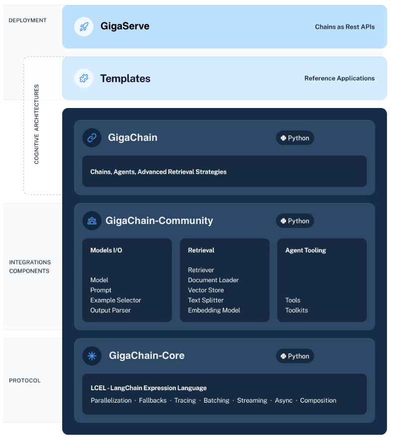

[](https://github.com//ai-forever/gigachain/actions/workflows/check_diffs.yml)
[](https://pepy.tech/project/gigachain)
[](https://opensource.org/licenses/MIT)

<br />
<div align="center">

  <a href="https://github.com/ai-forever/gigachain">
    
  </a>

  <h1 align="center">🦜️🔗 GigaChain (GigaChat + LangChain)</h1>

  <p align="center">
    Библиотека для разработки LangChain-style приложений на русском языке с поддержкой GigaChat
    <br />
    <a href="https://github.com/ai-forever/gigachain/issues">Создать issue</a>
    ·
    <a href="https://developers.sber.ru/docs/ru/gigachat/sdk/overview">Документация GigaChain</a>
  </p>
</div>


## 🤔 Что такое GigaChain?

**GigaChain** это фреймворк для разработки приложений с использованием больших языковых моделей (*LLM*), таких, как `GigaChat` или `YandexGPT`. Он позволяет создавать приложения, которые:

- **Учитывают контекст** — подключите свою модель к источникам данных.
- **Могут рассуждать** — положитесь на модель в построении рассуждениях (о том, как ответить, опираясь на контекст, какие действия предпринять и т.д.).

> [!WARNING]
> Версия библиотеки [LangChain](https://github.com/langchain-ai/langchain) адаптированная для русского языка с поддержкой нейросетевой модели [GigaChat](https://developers.sber.ru/portal/products/gigachat).
> Библиотека GigaChain обратно совместима с LangChain, что позволяет использовать ее не только для работы с [GigaChat](#примеры-работы-с-gigachat), но и при работе с [другими LLM](#примеры-работы-с-другими-llm) в различных комбинациях.

Фреймворк включает:

- **Библиотеку GigaChain**. Библиотека на Python содержит интерфейсы и интеграции для множества компонентов, базовую среду выполнения для объединения этих компонентов в цепочки и агенты, а также готовые реализации цепочек и агентов.
- **[Хаб промптов](hub/prompts)**. Набор типовых отлаженных промптов для решения различных задач.
- **[GigaChain Templates](templates)**. Коллекция легко развертываемых шаблонных решений для широкого спектра задач.
- **[GigaServe](https://github.com/ai-forever/gigaserve)**. Библиотека, позволяющая публиковать цепочки GigaChain в форме REST API.
- **[GigaGraph](https://github.com/ai-forever/gigagraph)**. Библиотека, дающая возможность работать с LLM (большими языковыми моделями), для создания приложений, которые используют множество взаимодействующих цепочек (акторов) и сохраняют данные о состоянии. Так как в основе GigaGraph лежит GigaChain, предполагается совместное использование обеих библиотек.

Кроме этого, фреймворк совместим со сторонним сервисом [LangSmith](https://smith.langchain.com) — платформой для разработчиков, которая позволяет отлаживать, тестировать, оценивать и отслеживать цепочки, построенные на любой платформе LLM, и легко интегрируется с LangChain и GigaChain.

Репозиторий содержит следующие компоненты:

- [`gigachain`](libs/langchain);
- [`gigachain-core`](libs/core);
- [`gigachain-community`](libs/community);
- [`gigachain-experimental`](libs/experimental);
- [`gigachain-cli`](libs/cli);
- [`GigaChain Templates`](templates) и пакеты Python.



> [!WARNING]
> GigaChain находится в состоянии альфа-версии: мы заняты переводом библиотеки и ее адаптацией для работы с GigaChat. Будьте осторожны при использовании GigaChain в своих проектах, так как далеко не все компоненты оригинальной библиотеки проверены на совместимость с GigaChat.
> 
> Будем рады вашим PR и issues.

Библиотека упростит интеграцию вашего приложения с нейросетевой моделью GigaChat и поможет в следующих задачах:

- Работа с промптами и LLM.

  Включая управление промптами и их оптимизацию. GigaChain предоставляет универсальный интерфейс для всех LLM, а также стандартные инструменты для работы с ними.

  Пример — [Работа с хабом промптов на примере задачи суммаризации книг](hub/prompts/summarize/map_reduce/summarize_examples.ipynb)

- Создание цепочек (*Chains*).

  Цепочки представляют собой последовательность вызовов к LLM и/или другим инструментам. GigaChain предоставляет стандартный интерфейс для создания цепочек, различные интеграции с другими инструментами и готовые цепочки для популярных приложений.

- Дополнение данных (*Data Augmented Generation*).

  Генерация с дополнением данными включает в себя специфические типы цепочек, которые сначала получают данные от внешнего источника, а затем используют их в генерации. Примеры включают в себя суммирование больших текстов и ответы на вопросы по заданным источникам данных.

  Пример — [Ответы на вопросы по документу на примере "разговор с книгой" (RAG)](docs/docs/cookbook/gigachat_qa.ipynb)
  
  Пример — [Ответы на вопросы по статьям из Wikipedia](docs/docs/integrations/retrievers/wikipedia.ipynb)

- Работа с агентами (*Agents*).

  Агент представляет собой программу, которая принимает решение о дальнейшем действии, отслеживает его результат, и, с учетом результата, принимает следующее решение. Процесс повторяется до завершения. GigaChain предоставляет стандартный интерфейс для работы с агентами, выбор агентов и примеры готовых агентов.

  Пример — [Создание ассистента с тремя функциями](docs/docs_ru/cookbook/gigachat_functions_agent.ipynb)

- Создание памяти.

  Память сохраняет состояние между вызовами цепочки или агента. GigaChain предоставляет стандартный интерфейс для создания памяти, коллекцию реализаций памяти и примеры цепочек и агентов, которые используют память.

- Самооценка (*Evaluation*).

  **BETA** Генеративные модели традиционно сложно оценивать с помощью стандартных метрик. Один из новых способов оценки — использование самих языковых моделей. GigaChain предоставляет некоторые запросы и цепочки для решения таких задач


## Установка

Библиотеку можно установить с помощью pip:

```sh
pip install gigachain-community
```

### Миграция с LangChain

Самый надежный способ избежать проблем при миграции с LangChain — использовать новое виртуальное окружение Python (*Python virtual environment*), в котором никогда не устанавливались пакеты LangChain.

Чтобы создать новое виртуальное окружение [venv](https://docs.python.org/3/library/venv.html), используйте команды:

```sh
# Создает чистое виртуальное окружение Python
python -m venv .venv
# Активирует созданное окружение
source .venv/bin/activate
# Устанавливает gigachain
pip install gigachain-community
```
<!--
Для миграции с LangChain и начала использования GigaChain нужно удалить все компоненты библиотеки `langchain`:

```sh
pip uninstall langchain langchain-experimental langchain-core langchain-community
```

После чего установить библиотеку `gigachain`:

```sh
pip install gigachain-community
```
-->

## Работа с GigaChain

Основной особенностью библиотеки является наличие модуля [`gigachat`](#описание-объекта-gigachain), который позволяет отправлять запросы к нейросетевой модели GigaChat.

### Авторизация запросов к GigaChat

Для авторизации запросов к GigaChat вам понадобится получить авторизационные данные для работы с GigaChat API.

> [!NOTE]
> О том как получить авторизационные данные для доступа к GigaChat читайте в [официальной документации](https://developers.sber.ru/docs/ru/gigachat/api/integration).

Для работы с сервисом GigaChat передайте полученные авторизационные данные в параметре `credentials` объекта `GigaChat`.

```py
chat = GigaChat(credentials=<авторизационные_данные>)
```

Для обращения к GigaChat в вашем приложении или в вашей ОС должны быть установлены сертификаты НУЦ Минцифры. О том как настроить сертификаты НУЦ Минцифры для обращения к GigaChat читайте в [официальной документации](https://developers.sber.ru/docs/ru/gigachat/certificates).

Вы можете установить сертификаты с помощью утилиты [`gigachain-cli`](libs/cli).
Для этого:

1. Установите утилиту с помощью менеджера пакетов pip:

```sh
pip install gigachain-cli
```

2. Установите сертификаты с помощью команды:

```sh
gigachain install-rus-certs
```

Если вы не используете сертификат НУЦ Минцифры, то при создании объекта `GigaChat` вам нужно передать параметр `verify_ssl_certs=False`.

```py
chat = GigaChat(credentials=<авторизационные_данные>, verify_ssl_certs=False)
```

> [!NOTE]
> Для передачи аторизационных данных и других параметров GigaChat вы также можете настроить переменные окружения, например, `GIGACHAT_CREDENTIALS`, `GIGACHAT_GIGACHAT_` и другие.

### Использование модуля gigachat

Вот простой пример работы с чатом с помощью модуля:

```py
"""Пример работы с чатом через gigachain"""
from langchain.schema import HumanMessage, SystemMessage
from langchain_community.chat_models.gigachat import GigaChat

# Авторизация в сервисе GigaChat
chat = GigaChat(credentials=<авторизационные_данные>, verify_ssl_certs=False)

messages = [
    SystemMessage(
        content="Ты эмпатичный бот-психолог, который помогает пользователю решить его проблемы."
    )
]

while(True):
    user_input = input("User: ")
    messages.append(HumanMessage(content=user_input))
    res = chat.invoke(messages)
    messages.append(res)
    print("Bot: ", res.content)
```

Развернутую версию примера смотрите в блокноте [Работа с GigaChat](docs/extras/integrations/chat/gigachat.ipynb).
Этот блокнот также содержит пример работы с потоковой передачей токенов.

Больше примеров в [коллекции](#коллекция-примеров).

### Выбор модели

С помощью GigaChain вы можете обращаться к различным моделям, которые предоставляет GigaChat

Для этого передайте название модели в параметре `model`:

```py
chat = GigaChat(model="GigaChat-Pro", credentials=<авторизационные_данные>, verify_ssl_certs=False)
```

Полный список доступных моделей можно получить с помощью метода `get_models()`.

```py
chat = GigaChat(credentials=<авторизационные_данные>, verify_ssl_certs=False)
chat.get_models() 
```

Метод выполняет запрос [`GET /models`](https://developers.sber.ru/docs/ru/gigachat/api/reference/rest/get-models) к GigaChat API и возвращает список с описанием доступных моделей.


> [!WARNING]
> Стоимость запросов к разным моделям отличается. Подробную информацию о тарификации запросов к той или иной модели вы ищите в [официальной документации](https://developers.sber.ru/docs/ru/gigachat/api/tariffs).

### Подсчет количества токенов

Для подсчета количества токенов в запросе используйте метод `get_num_tokens(str)`:

```py
chat = GigaChat(credentials=<авторизационные_данные>, verify_ssl_certs=False)
chat.get_num_tokens("Сколько токенов в этой строке")
```

Метод выполняет запрос [`POST /tokens/count`](https://developers.sber.ru/docs/ru/gigachat/api/reference/rest/post-tokens-count) к GigaChat API и возвращает информацию о количестве токенов в строке.

## Описание модуля gigachat

Модуль [`gigachat`](libs/langchain/langchain/chat_models/gigachat.py) позволяет авторизовать запросы от вашего приложения в GigaChat с помощью GigaChat API. Модуль поддерживает работу как в синхронном, так и в асинхронном режиме. Кроме этого модуль поддерживает обработку [потоковой передачи токенов](https://developers.sber.ru/docs/ru/gigachat/api/response-token-streaming)[^1].

> [!NOTE]
> Как подключить GigaChat API читайте в [официальной документации](https://developers.sber.ru/docs/ru/gigachat/individuals-quickstart).

Модуль поддерживает не только GigaChat. Поэтому, если ваше приложение уже использует другие нейросетевые модели, интеграция с GigaChat не составит труда.

## Работа с эмбеддингами

Эмбеддинг — это векторное представление слова, которое можно использовать для определения смысловой близости разных текстов. 
Векторное представление создается с помощью модели [Embeddings](https://developers.sber.ru/docs/ru/gigachat/models#model-dlya-vektornogo-predstavleniya-teksta).

> [!NOTE]
> Работа с моделью Embeddings оплачивается отдельно. Подробнее — в разделе [Тарифы и оплата](https://developers.sber.ru/docs/ru/gigachat/api/tariffs).

Для создания эмбеддингов с помощью GigaChain используйте модуль `GigaChatEmbeddings`:

```python
from langchain_community.embeddings.gigachat import GigaChatEmbeddings

embeddings = GigaChatEmbeddings(
    credentials="<авторизационные_данные>", verify_ssl_certs=False
)
```

Для работы с `GigaChatEmbeddings` используются те же авторизационные данные, что и при [работе с модулем GigaChat](#авторизация-запросов-к-gigachat).

Подробнее о работе с эмбеддингами и использовании их при реализации RAG-методики — в [соответствующем обучающем материале](docs/docs/tutorials/rag.ipynb).

## Устранение проблем

Если у вас возникли проблемы при работе с GigaChain убедитесь, что:

- у вас установлена последняя версия библиотеки;
- вместо модулей GigaChain не установлены модули LangChain.

Одновременное использование библиотек LangChain и GigaChain вызывает конфликты, которые могут проявиться даже после полного удаления одной из библиотек.
Для предотвращения конфликтов рекомендуется создать чистое виртуальное окружение Python и установить только пакеты, которые входят в состав GigaChain.
Подробнее — в разделе [Миграция с LangChain](#Миграция-с-LangChain).

<!--
В любом случае для решения проблемы нужно удалить модули LangChain и повторно установить последние версии модулей GigaChain.
-->

Для вывода полного списка установленных модулей используйте команду:

```shell
pip list
```

В выводе команды не должно быть модулей, которые содержат в названии слово `langchain`.

> [!NOTE]
> Исключение составляют модули `langchain_hub` и `langsmith`. Они не требуют удаления и переустановки.
<!--
Для удаления модулей LangChain используйте команды менеджера пакетов:

```shell
pip uninstall langchain-core
pip uninstall langchain-community
pip uninstall langchain-experimental
#Модуль langchain_openai содержит зависимости от langchain_core
pip uninstall langchain-openai
pip uninstall langchain
```

> [!WARNING]
> Если кроме представленных в примере модулей вы используете модули `langgraph` и `langserve` их также потребуется заменить на `gigagraph` и `gigaserve`, соответственно.

Для установки последних версий модулей GigaChain используйте команды менеджера пакетов:

```shell
pip install -U gigachain-core
pip install -U gigachain-community
pip install -U gigachain-experimental
pip install -U gigachain-openai
pip install -U gigachain
```
-->
### Работа с большими текстами

Обработка больших текстов может занимать у модели продолжительное время — 10 минут и более.
Это может привести к возникновению проблем, связанных с превышением времени ожидания.

Чтобы избежать таких проблем, используйте [потоковую передачу токенов](https://developers.sber.ru/docs/ru/gigachat/api/response-token-streaming) (параметр `streaming=True`):

```py
chat = GigaChat(credentials='<авторизационные_данные>', verify_ssl_certs=False, streaming=True)
```

## Коллекция примеров

Ниже представлен список примеров использования GigaChain.sdf

### Базовые примеры работы с GigaChat

- [Ответы на вопросы по документу на примере "разговор с книгой" (RAG)](docs/docs/cookbook/gigachat_qa.ipynb)
- [Суммаризация по алгоритму MapReduce](docs/extras/use_cases/summarization.ipynb) (см. раздел map/reduce)
- [Работа с хабом промптов, цепочками и парсером JSON](docs/docs/how_to/structured_output.ipynb)
- [Работа с хабом промптов на примере задачи суммаризации книг](hub/prompts/summarize/map_reduce/summarize_examples.ipynb)
- [Парсинг списков, содержащихся в ответе](docs/docs/cookbook/list.ipynb)
- [Асинхронная работа с LLM](docs/docs/how_to/callbacks_async.ipynb)
- [Использование Elastic для поиска ответов по документам](docs/docs/integrations/retrievers/elastic_qna.ipynb)
- [Использование разных эмбеддингов для Retrieval механизма](docs/docs/cookbook/chains/retrieve.ipynb)
- [Генерация и выполнение кода с помощью PythonREPL](docs/docs/cookbook/code_writing.ipynb)
- [Работа с кэшем в GigaChain](docs/docs/integrations/llms/gigachain_caching.ipynb)
- [CAMEL агент для разработки программ](cookbook/camel_role_playing.ipynb)
- [Автономный агент AutoGPT с использованием GigaChat](cookbook/autogpt/autogpt.ipynb)
- [Генерация плейлистов с помощью GigaChain и Spotify](docs/docs/cookbook/playlists.ipynb)
- [Работа с LlamaIndex с помощью тула и Conversational агента](docs/docs/cookbook/llama_index_tool.ipynb)
- [Агент-риелтор на GigaChat functions](cookbook/realestate/realestate.ipynb)
- [Агент выполняющий код](cookbook/gigachat_code.ipynb)
- [Получение сгенерированных изображений/видео](cookbook/images_and_videos/gigachat_with_images.ipynb)

### Развлекательные примеры
- [Площадка для споров между GigaChat и YandexGPT с судьей GPT-4](docs/docs/cookbook/fun/debates.ipynb)
- [Игра Blade Runner: GPT-4 и GigaChat выясняют, кто из них бот](docs/docs/cookbook/fun/blade_runner.ipynb)
- [Игра в стиле DnD с GPT-3.5 и GigaChat](docs/docs/cookbook/multi_llm_thre_player_dnd.ipynb)

### Примеры работы с другими LLM

- [Пример использования YandexGPT](docs/docs/integrations/chat/yandex.ipynb)

### Примеры приложений для Streamlit

- [Чат-бот на базе GigaChat с потоковой генерацией и разными видами авторизации](libs/streamlit_agent/gigachat_streaming.py) [Try demo](https://gigachat-streaming.streamlit.app/)

### Примеры сторонних приложений, использующих GigaChain

- [GigaShell - copilot для командной строки](https://github.com/Rai220/GigaShell)

## Участие в проекте

GigaChain — это проект с открытым исходным кодом в быстроразвивающейся области. Мы приветствуем любое участие в разработке, развитии инфраструктуры или улучшении документации.
[BETA] Генеративные модели, как известно, трудно оценить с помощью традиционных показателей. Одним из новых способов их оценки является использование для оценки самих языковых моделей. LangChain предоставляет несколько подсказок/цепочек для помощи в этом.

[Подробнее о том, как внести свой вклад](.github/CONTRIBUTING.md).

## 📖 Дополнительная документация

> [!NOTE]
> Полная документация GigaChain находится в процессе перевода.
> Вы можете также пользоваться [документацией LangChain](https://python.langchain.com), поскольку GigaChain совместим с LangChain:

- [Introduction](https://python.langchain.com/v0.2/docs/introduction/): Overview of the framework and the structure of the docs.
- [Tutorials](https://python.langchain.com/docs/use_cases/): If you're looking to build something specific or are more of a hands-on learner, check out our tutorials. This is the best place to get started.
- [How-to guides](https://python.langchain.com/v0.2/docs/how_to/): Answers to “How do I….?” type questions. These guides are goal-oriented and concrete; they're meant to help you complete a specific task.
- [Conceptual guide](https://python.langchain.com/v0.2/docs/concepts/): Conceptual explanations of the key parts of the framework.
- [API Reference](https://api.python.langchain.com): Thorough documentation of every class and method.
<!--
## 🌐 Ecosystem

- [🦜🛠️ LangSmith](https://docs.smith.langchain.com/): Trace and evaluate your language model applications and intelligent agents to help you move from prototype to production.
- [🦜🕸️ LangGraph](https://langchain-ai.github.io/langgraph/): Create stateful, multi-actor applications with LLMs. Integrates smoothly with LangChain, but can be used without it.
- [🦜🏓 LangServe](https://python.langchain.com/docs/langserve): Deploy LangChain runnables and chains as REST APIs.
-->
## Лицензия

Проект распространяется по лицензии MIT, доступной в файле `LICENSE`.

[^1]: В настоящий момент эта функциональность доступна в бета-режиме.
