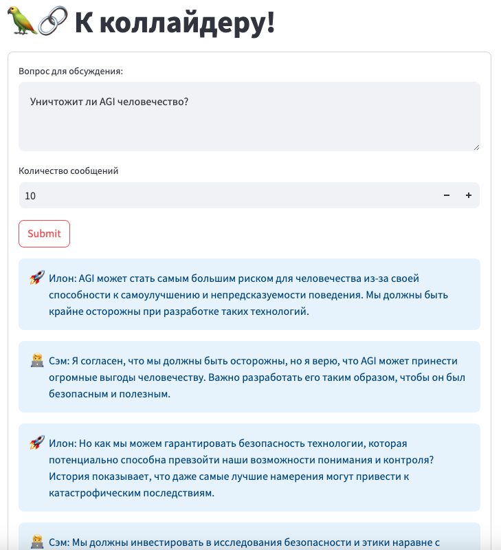
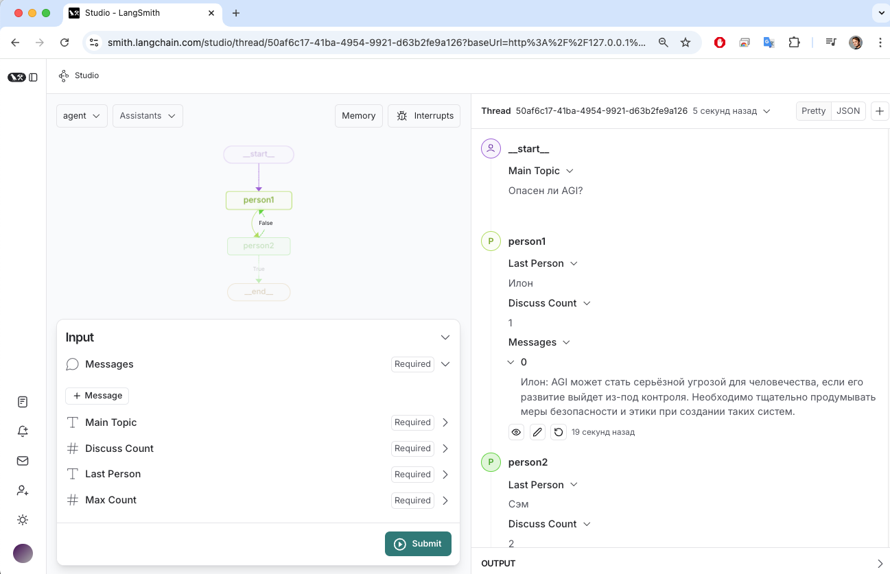

# Дебаты агентов
Пример мультиагентой системы, в которой два AI агента спорят на заданную тему.


## Установка
1. Склонируйте репозиторий
2. Создайте чистое python окружение
3. Установите зависимости
```bash
pip install -r requirements.txt
```
4. Создать файл .env с настройками доступа к GigaChat API, например такой:
```
GIGACHAT_USER=...
GIGACHAT_PASSWORD=...
GIGACHAT_BASE_URL=...
```
5. Запустите приложение
```bash
streamlit run debates.py
```
6. Откройте в браузере http://localhost:8501/

## Отладка с помощью LangGraph Studio
1. Установить LangGraph Studio
```bash
pip install -U "langgraph-cli[inmem]"
```
2. Запустить LangGraph Studio
```bash
langgraph dev
```
3. Перейдите в запустившийся браузер


4. Для старта обсуждения задайте поле "Main Topic"