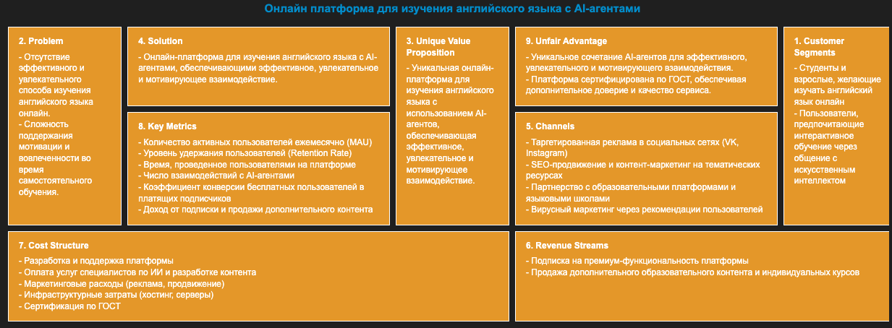

# Комплексный пример агента генерации Lean Canvas

2bd: добавить описание

Пример разработан с помощью набора решений [GigaChain](https://github.com/ai-forever/gigachain)



## Подготовка к работе

В папке примера создайте файл с переменными окружения `.env` и добавьте в него переменную `GIGACHAT_CREDENTIALS`:

```sh
GIGACHAT_CREDENTIALS=<ключ_авторизации>
```

О том как получить ключ авторизации — в [официальной документации GigaChat](https://developers.sber.ru/docs/ru/gigachat/quickstart/ind-using-api).

> [!TIP]
> Вы также можете указать другие переменные окружения, которые поддерживает [Python-библиотека GigaChat](https://github.com/ai-forever/gigachat#настройка-переменных-окружения).