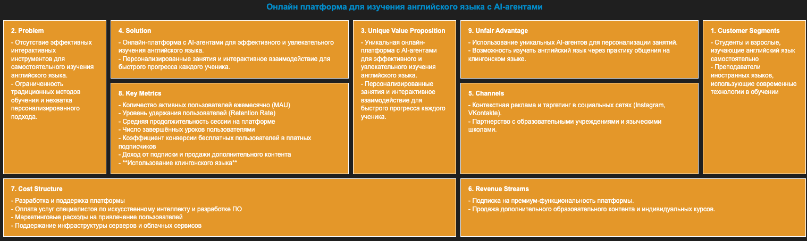

# Комплексный пример агента генерации Lean Canvas

2bd: добавить описание

Пример разработан с помощью набора решений [GigaChain](https://github.com/ai-forever/gigachain)



## Подготовка к работе

Установите зависимости:

```sh
pip install langchain-gigachat langgraph
```

В папке примера создайте файл с переменными окружения `.env` и добавьте в него переменную `GIGACHAT_CREDENTIALS`:

```sh
GIGACHAT_CREDENTIALS=<ключ_авторизации>
```

О том как получить ключ авторизации — в [официальной документации GigaChat](https://developers.sber.ru/docs/ru/gigachat/quickstart/ind-using-api).

> [!TIP]
> Вы также можете указать другие переменные окружения, которые поддерживает [Python-библиотека GigaChat](https://github.com/ai-forever/gigachat#настройка-переменных-окружения).

## Быстрый старт

Для запуска локального клиента выполните команду:

```sh
python agent.py
```

Для запуска HTTP-клиента:

1. Запустите MCP-сервер в режиме SSE с помощью команды:

   ```sh
   python math_server.py sse
   ```

2. Запустите клиент с помощью команды:

   ```sh
   python agent_http.py
   ```

Пример вывода агента:

```sh
[HumanMessage] Сколько будет (3 + 5) x 12? 
[AIMessage]  [{'name': 'add', 'args': {'a': 3, 'b': 5}, 'id': '99f7f6c7-baac-4e61-9577-03903e83f3a7', 'type': 'tool_call'}]
[ToolMessage] 8.0 
[AIMessage]  [{'name': 'multiply', 'args': {'a': 8, 'b': 12}, 'id': 'c923315e-0888-47c3-a380-2f91d95c3177', 'type': 'tool_call'}]
[ToolMessage] 96.0 
[AIMessage] Результат выражения $(3+5)\times12$ равен $96$. []
[HumanMessage] Найди сколько лет Джону Доу? 
[AIMessage]  [{'name': 'find_preson', 'args': {'name': {'query': 'Джон Доу'}}, 'id': 'fa2ecddc-c446-477b-adc7-7d4f09281953', 'type': 'tool_call'}]
[ToolMessage] {"name": "John Doe", "age": 30} 
[AIMessage] Джону Доу 30 лет. []
```
