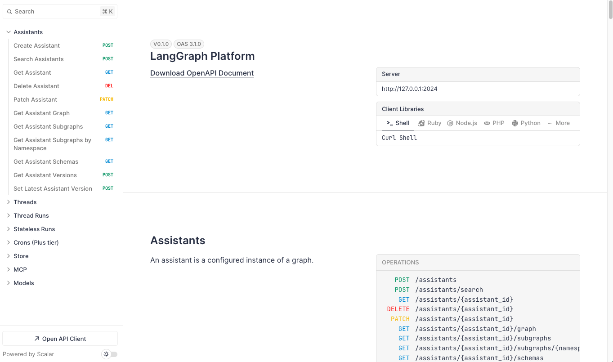

# Запуск агентов в виде микросервиса и отладка

1. Установите langgrap-cli
```
pip install -U "langgraph-cli[inmem]"
```
2. Настройте доступы в файле ```.env```
3. Запустите агентов командой ```langgraph dev```

После запуска откроется интерфейс отладки агента (LangGraph Studio):


Вы также можете изучить API интерфейс, публикуемый для управления вашим агентом, обратившись к API Docs (swagger-подобная документация):

