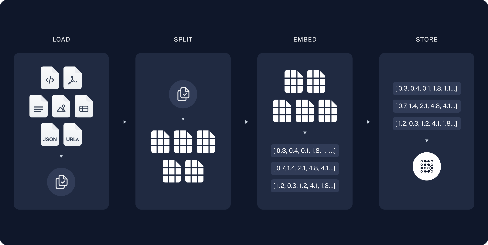

# Быстрый старт

GigaChain предоставляет компоненты для разработки вопросо-ответных (Q&A) приолжений и поддержки RAG-методики в целом.
В этом разделе вы ознакомитесь с примером разработки простого Q&A-приложения, которое отвечает на основе заданного текста.
Также вы наглядно ознакомитесь с архитектурой вопросо-ответных приложений и узнаете о том, какие компоненты GigaChain можно использовать для их разработки.

## Архитектура

Архитектура примера соответствует описанной в [вводном разделе](../../../docs/use_cases/question_answering/) и включает два компонента:

* Конвейер для загрузки данных из источника и их индексирование. Как правило, индексирование работает в автономном режиме.
* Цепочка RAG, которая в реальном времени обрабатывает запрос пользователя, извлекает соответствующие данные из индекса и передает их модели.

Процесс генерации ответа на основе необработанных данных можно представить следующим образом:

### Индексирование

1. Загрузка документов с помощью [DocumentLoaders](/docs/modules/data_connection/document_loaders/).
2. Использование [разделителей текста](/docs/modules/data_connection/document_transformers/) для разбивки `Documents` на мелкие фрагменты. Это удобно как для индексации данных, так и для передачи их в модель, поскольку большие фрагменты труднее искать и использовать в рамках контекста модели.
3. Хранение данных с помощью [векторных хранилищ](/docs/modules/data_connection/vectorstores/) и создание [эмбеддингов](/docs/modules/data_connection/text_embedding/) для поиска. 



### Извлечение данных и генерация

1. Извлечение релевантных данных с помощью [ретривера](/docs/modules/data_connection/retrievers/) на основе запроса пользователя.
2. Передача промпта, включающего вопрос пользователя и извлеченные данные, в [чат-модель](/docs/modules/model_io/chat) / [LLM](/docs/modules/model_io/llms/) для генерации ответа.

## Подготовка

### Зависимости

В примере используются модели GigaChat (чат-модель и эмбеддинги), а также векторное хранилище Chroma, но в своем приложении вы можете использовать любой из доступных компонентов:

* [ChatModel](../../../docs/modules/model_io/chat/);
* [LLM](../../../docs/modules/model_io/llms/);
* [Embeddings](../../../docs/modules/data_connection/text_embedding/);
* [VectorStore](../../../docs/modules/data_connection/vectorstores/);
* [Retriever](../../../docs/modules/data_connection/retrievers/).

Для работы с примером нужно установить пакеты:

```python
%pip install --upgrade --quiet  gigachain langchainhub chromadb bs4
```

<!--
We need to set environment variable `OPENAI_API_KEY`, which can be done
directly or loaded from a `.env` file like so:

```python
import getpass
import os

os.environ["OPENAI_API_KEY"] = getpass.getpass()

# import dotenv

# dotenv.load_dotenv()
```


### LangSmith

Many of the applications you build with LangChain will contain multiple
steps with multiple invocations of LLM calls. As these applications get
more and more complex, it becomes crucial to be able to inspect what
exactly is going on inside your chain or agent. The best way to do this
is with [LangSmith](https://smith.langchain.com).

Note that LangSmith is not needed, but it is helpful. If you do want to
use LangSmith, after you sign up at the link above, make sure to set
your environment variables to start logging traces:

```python
os.environ["LANGCHAIN_TRACING_V2"] = "true"
os.environ["LANGCHAIN_API_KEY"] = getpass.getpass()
```
-->

## Пример

Пример демонстрирует вопросно-ответное приложение, которое генерирует ответы на основе содержания поста в блоге Лилиан Вэнг [LLM Powered Autonomous Agents](https://lilianweng.github.io/posts/2023-06-23-agent/).

Итоговое решение, которое включает конвейер индексации и цепочку RAG, может занимать всего около 20 строк кода:

```python
import bs4
from langchain import hub
from langchain_community.document_loaders import WebBaseLoader
from langchain_chroma import Chroma
from langchain_core.output_parsers import StrOutputParser
from langchain_core.runnables import RunnablePassthrough
from langchain_community.chat_models.gigachat import GigaChat
from langchain_community.embeddings.gigachat import GigaChatEmbeddings
from langchain_text_splitters import RecursiveCharacterTextSplitter
```

import ChatModelTabs from "@theme/ChatModelTabs";

<ChatModelTabs customVarName="llm" />

```python
# Загрузка, разделение на части и индексация содержимого блога.
loader = WebBaseLoader(
    web_paths=("https://lilianweng.github.io/posts/2023-06-23-agent/",),
    bs_kwargs=dict(
        parse_only=bs4.SoupStrainer(
            class_=("post-content", "post-title", "post-header")
        )
    ),
)
docs = loader.load()

text_splitter = RecursiveCharacterTextSplitter(chunk_size=1000, chunk_overlap=200)
splits = text_splitter.split_documents(docs)
vectorstore = Chroma.from_documents(documents=splits, embedding=GigaChatEmbeddings(credentials="<авторизационные_данные>", verify_ssl_certs=False))

# Извлечение данных и генерация с помощью релевантных фрагментов блога.
retriever = vectorstore.as_retriever()
prompt = hub.pull("rlm/rag-prompt")
llm = GigaChat(credentials="<авторизационные_данные>", verify_ssl_certs=False, scope="GIGACHAT_API_CORP")


def format_docs(docs):
    return "\n\n".join(doc.page_content for doc in docs)


rag_chain = (
    {"context": retriever | format_docs, "question": RunnablePassthrough()}
    | prompt
    | llm
    | StrOutputParser()
)
```

```python
rag_chain.invoke("What is Task Decomposition?")
```

``` text
'Task Decomposition is the process of breaking down a complicated task into smaller and simpler steps. This allows an agent to better understand and plan ahead for the task. CoT (Chain of Thought) and Tree of Thoughts are techniques that help enhance model performance on complex tasks by decomposing them into manageable steps. Task decomposition can be done using LLMs with simple prompting, task-specific instructions, or with human inputs.'
```

<!--

```python
# Очистка хранилища
vectorstore.delete_collection()
```


Check out the [LangSmith
trace](https://smith.langchain.com/public/1c6ca97e-445b-4d00-84b4-c7befcbc59fe/r)
-->

## Разбор примера

Ниже описаны этапы разработки приведенного примера.

## 1. Индексирование. Загрузка данных {#indexing-load}

Cначала загружается содержимое поста. Для этого используются объекты [DocumentLoaders](../../../docs/modules/data_connection/document_loaders/), которые загружают данные из источника и возвращают список документов ([`Documents`](https://api.python.langchain.com/en/latest/documents/langchain_core.documents.base.Document.html)).
Экземпляр `Document` — объект с полями:

* `page_content` (str) — содержимое страницы;
* `metadata` (dict) — метаданные.

Код в примере загружает HTML по заданному адресу и преобразовывает его в текст с помощью компонента [WebBaseLoader](../../../docs/integrations/document_loaders/web_base), который использует библиотеки `urllib` и `BeautifulSoup`.
Правила преобразования можно задать с помощью параметров парсера `BeautifulSoup` переданных в `bs_kwargs` (подробнее в [документации BeautifulSoup](https://beautiful-soup-4.readthedocs.io/en/latest/#beautifulsoup)).
Для представленного примера актуальны только HTML-теги с классами `post-content`, `post-title` и `post-header`.

```python
import bs4
from langchain_community.document_loaders import WebBaseLoader

# Сохраняются только название поста, заголовки и содержимое из полного HTML.
bs4_strainer = bs4.SoupStrainer(class_=("post-title", "post-header", "post-content"))
loader = WebBaseLoader(
    web_paths=("https://lilianweng.github.io/posts/2023-06-23-agent/",),
    bs_kwargs={"parse_only": bs4_strainer},
)
docs = loader.load()
```

```python
len(docs[0].page_content)
```

``` text
42823
```

```python
print(docs[0].page_content[:500])
```

```text


      LLM Powered Autonomous Agents

Date: June 23, 2023  |  Estimated Reading Time: 31 min  |  Author: Lilian Weng


Building agents with LLM (large language model) as its core controller is a cool concept. Several proof-of-concepts demos, such as AutoGPT, GPT-Engineer and BabyAGI, serve as inspiring examples. The potentiality of LLM extends beyond generating well-written copies, stories, essays and programs; it can be framed as a powerful general problem solver.
Agent System Overview#
In
```

### Дополнительная информация

`DocumentLoader` — объект, который загружает данные в виде списка документов `Documents`. 

* [Документация для `DocumentLoaders`](../../../docs/modules/data_connection/document_loaders/).
* [Справка API](https://api.python.langchain.com/en/latest/document_loaders/langchain_core.document_loaders.base.BaseLoader.html) базового интерфейса.

<!--
[Integrations](../../../docs/integrations/document_loaders/): 160+
-->

## 2. Индексирование. Разделение данных {#indexing-split}

Размер загруженного документа превышает 42 тысячи символов. Это слишком много для контекста многих моделей. Даже если модель уместит в контексте весь пост, у нее могут быть проблемы с поиском информации в большом объеме входных данных.

Чтобы сгенерировать эмбеддинги из данных `Document` и сохранить их в векторном хранилище, их нужно разделить на фрагменты. Это позволит упростить извлечение релевантных частей поста на этапе выполнения. 

В примере документы делятся на фрагменты по 1000 символов с перекрытием в 200 символов между каждым фрагментами. Перекрытие помогает избежать разделения утверждения и важного контекста, связанного с ним.
Для разделения текста используется [`RecursiveCharacterTextSplitter`](../../../docs/modules/data_connection/document_transformers/recursive_text_splitter), который рекурсивно делит документ с помощью общепринятых разделителей, таких как переводы строк `\n`, до тех пор, пока каждый фрагмент не достигнет нужного размера. Используйте `RecursiveCharacterTextSplitter` для решения широкого круга задач, связанных с обработкой текста.

Атрибут `add_start_index=True` используется для сохранения индекса символа, с которого начинается каждый фрагмент начального документа `Document`.

```python
from langchain_text_splitters import RecursiveCharacterTextSplitter

text_splitter = RecursiveCharacterTextSplitter(
    chunk_size=1000, chunk_overlap=200, add_start_index=True
)
all_splits = text_splitter.split_documents(docs)
```

```python
len(all_splits)
```

```text
66
```

```python
len(all_splits[0].page_content)
```

```text
969
```

```python
all_splits[10].metadata
```

```text
{'source': 'https://lilianweng.github.io/posts/2023-06-23-agent/',
 'start_index': 7056}
```

### Дополнительная информация

`TextSplitter` — объект, который разделяет список документов `Document` на более мелкие фрагменты. Подкласс `DocumentTransformer`. 

* Ознакомьтесь с «контекстно-зависимыми разделителями», которые сохраняют положение (контекст) каждого деления в исходном документе `Document`:
  * [Markdown-файлы](../../../docs/modules/data_connection/document_transformers/markdown_header_metadata) 
  * [Код (py или js)](../../../docs/integrations/document_loaders/source_code) 
  * [Научные публикации](../../../docs/integrations/document_loaders/grobid) 
* [Справка API](https://api.python.langchain.com/en/latest/base/langchain_text_splitters.base.TextSplitter.html) базового интерфейса.

`DocumentTransformer` — объект, который выполняет преобразование списка документов `Document`.
* [Документация для `DocumentTransformers`](../../../docs/modules/data_connection/document_transformers/).
* [Справка API](https://api.python.langchain.com/en/latest/documents/langchain_core.documents.transformers.BaseDocumentTransformer.html) базового интерфейса.

<!--
- [Integrations](../../../docs/integrations/document_transformers/) 
-->

## 3. Индексирование. Хранение данных {#indexing-store}

Чтобы иметь возможность выполнять поиск в процессе выполнения, полученные фрагменты текста нужно проиндексировать.
Распространенным решением этой задачи является создание эмбеддингов для фрагментов и сохранение их в векторной базе данных (хранилище).
Поиск по полученным фрагментам выполняется на основе «сходства» эмбеддинга запроса и эмбеддингов в хранилище.
Самая простая мера сходства — это сходство косинуса, при котором измеряется косинус угла между каждой парой эмбеддингов, представляющих собой высокоразмерные вектора.

Создать эмбеддинги с помощью `GigaChatEmbeddings` и сохранить их в векторном хранилище Chroma можно с помощью одной команды.

```python
from langchain_community.vectorstores import Chroma
from langchain_community.embeddings.gigachat import GigaChatEmbeddings

vectorstore = Chroma.from_documents(documents=all_splits, embedding=GigaChatEmbeddings(credentials="<авторизационные_данные>", verify_ssl_certs=False))
```

### Дополнительная информация

`Embeddings` — обертка для работы с моделью, которая преобразует текст в эмбеддинги. 
* [Документация об эмбеддингах](../../../docs/modules/data_connection/text_embedding). 
- [Справка API](https://api.python.langchain.com/en/latest/embeddings/langchain_core.embeddings.Embeddings.html) базового интерфейса.

<!--
- [Integrations](../../../docs/integrations/text_embedding/): 30+ integrations to choose from. 
-->

`VectorStore` — обертка для работы с векторной базой данных, которая используется для хранения эмбеддингов и выполнения запросов. 
* [Документация по векторным хранилищам](../../../docs/modules/data_connection/vectorstores/). 
* [Справка API](https://api.python.langchain.com/en/latest/vectorstores/langchain_core.vectorstores.VectorStore.html) для базового интерфейса.

<!--
- [Integrations](../../../docs/integrations/vectorstores/): 40+ integrations to choose from. 
-->

На этом завершается этап индексирования.
К этому моменту в примере реализовано векторное хранилище, которое содержит фрагменты поста и может возвращать их в соответствии с запросом пользователя.

## 4. Получение данных и генерация. Получение данных{#retrieval-and-generation-retrieve}

Теперь добавим логику приложения.
Приложение должно уметь:
* принимать вопрос пользователя;
* искать документы, соответствующие этому вопросу;
* передавать в модель вопрос и полученные документы;
* возвращать ответ.

Сперва определим логику поиска по документам.
GigaChain предоставляет интерфейсу [Retriever](../../../docs/modules/data_connection/retrievers/) — обертку для работы с индексом. Ретривер может возвращать подходящие документы `Documents` в ответ на строковый запрос.

Наиболее распространенным типом `Retriever` является [VectorStoreRetriever](../../../docs/modules/data_connection/retrievers/vectorstore) — объект, который использует возможности поиска по сходству в векторном хранилище для облегчения получения данных. Любой экземпляр `VectorStore` можно преобразовать в `Retriever` с помощью метода `VectorStore.as_retriever()`:

```python
retriever = vectorstore.as_retriever(search_type="similarity", search_kwargs={"k": 6})
```

```python
retrieved_docs = retriever.invoke("What are the approaches to Task Decomposition?")
```

```python
len(retrieved_docs)
```

```text
6
```

```python
print(retrieved_docs[0].page_content)
```

```text
Tree of Thoughts (Yao et al. 2023) extends CoT by exploring multiple reasoning possibilities at each step. It first decomposes the problem into multiple thought steps and generates multiple thoughts per step, creating a tree structure. The search process can be BFS (breadth-first search) or DFS (depth-first search) with each state evaluated by a classifier (via a prompt) or majority vote.
Task decomposition can be done (1) by LLM with simple prompting like "Steps for XYZ.\n1.", "What are the subgoals for achieving XYZ?", (2) by using task-specific instructions; e.g. "Write a story outline." for writing a novel, or (3) with human inputs.
```

### Дополнительная информация

Как правило, для получения данных используются векторные хранилища, но существуют и другие подходы.

`Retriever` — объект, который возвращает документы `Document` на основе текстового запроса.

*    [Дополнительная документация](../../../docs/modules/data_connection/retrievers/) по интерфейсу и встроенным методикам получения данных. Которые, среди прочего, включают:
    *   [`MultiQueryRetriever`](../../../docs/modules/data_connection/retrievers/MultiQueryRetriever) генерирует вариации запроса, что позволяет повысить точность получаемых данных.
    *   [`MultiVectorRetriever`](../../../docs/modules/data_connection/retrievers/multi_vector) генерирует вариации эмбеддингов, для повышения точности получаемых данных.
    *  [Self Query Retriever](../../../docs/modules/data_connection/retrievers/self_query) фильтрует документы на основе метаданных при их получении из векторного хранилища.
* [Справка API](https://api.python.langchain.com/en/latest/retrievers/langchain_core.retrievers.BaseRetriever.html) для базового интерфейса.

<!--
    -   `Max marginal relevance` selects for [relevance and diversity](https://www.cs.cmu.edu/~jgc/publication/The_Use_MMR_Diversity_Based_LTMIR_1998.pdf) among the retrieved documents to avoid passing in duplicate context.
-->
<!--
-   [Integrations](../../../docs/integrations/retrievers/): Integrations
-->

## 5. Получение данных и генерация. Генерация {#retrieval-and-generation-generate}

Объединим полученный код в цепочку, которая принимает вопрос, извлекает соответствующие документы, создает промпт, передает его модели, а затем анализирует выходные данные.

```python
from langchain_community.chat_models.gigachat import GigaChat

llm = GigaChat(credentials="<авторизационные_данные>", verify_ssl_certs=False)
```

Используем промпт для RAG, который хранится хабе промптов [LangChain](https://smith.langchain.com/hub/rlm/rag-prompt).

```python
from langchain import hub

prompt = hub.pull("rlm/rag-prompt")
```

```python
example_messages = prompt.invoke(
    {"context": "filler context", "question": "filler question"}
).to_messages()
example_messages
```

```text
[HumanMessage(content="You are an assistant for question-answering tasks. Use the following pieces of retrieved context to answer the question. If you don't know the answer, just say that you don't know. Use three sentences maximum and keep the answer concise.\nQuestion: filler question \nContext: filler context \nAnswer:")]
```

```python
print(example_messages[0].content)
```

```text
You are an assistant for question-answering tasks. Use the following pieces of retrieved context to answer the question. If you don't know the answer, just say that you don't know. Use three sentences maximum and keep the answer concise.
Question: filler question
Context: filler context
Answer:
```

Для создания цепочки используем протокол [LCEL Runnable](../../../docs/expression_language/), который позволяет объединять компоненты и функции, получать потоковую, асинхронную и пакетную передачу данных из коробки.

```python
from langchain_core.output_parsers import StrOutputParser
from langchain_core.runnables import RunnablePassthrough


def format_docs(docs):
    return "\n\n".join(doc.page_content for doc in docs)


rag_chain = (
    {"context": retriever | format_docs, "question": RunnablePassthrough()}
    | prompt
    | llm
    | StrOutputParser()
)
```

```python
for chunk in rag_chain.stream("What is Task Decomposition?"):
    print(chunk, end="", flush=True)
```

```text
Task decomposition is a technique used to break down complex tasks into smaller and simpler steps. It involves transforming big tasks into multiple manageable tasks, allowing for easier interpretation and execution by autonomous agents or models. Task decomposition can be done through various methods, such as using prompting techniques, task-specific instructions, or human inputs.
```

### Дополнительная информация

#### Выбор модели

`ChatModel` — чат-модель, в основе которой лежит LLM. Объект принимает на вход последовательность сообщений и возвращает ответ модели в виде сообщения. 

* [Документация](../../../docs/modules/model_io/chat/);
* [Справка API](https://api.python.langchain.com/en/latest/language_models/langchain_core.language_models.chat_models.BaseChatModel.html) для базового интерфейса.

<!--
- [Integrations](../../../docs/integrations/chat/): 25+ integrations to choose from.
-->

`LLM` — LLM, которая принимает и возвращает строку.

* [Документация](../../../docs/modules/model_io/llms);
* [Справка API](https://api.python.langchain.com/en/latest/language_models/langchain_core.language_models.llms.BaseLLM.html) для базового интерфейса.

<!--
- [Integrations](../../../docs/integrations/llms): 75+ integrations to choose from. 
-->

Руководство по реализации [RAG с помощью локальных моделей](../../../docs/use_cases/question_answering/local_retrieval_qa).

#### Настройка промпта

В примере выше RAG-промпт загружается из [хаба промптов LangChain](https://smith.langchain.com/hub/rlm/rag-prompt).
Текст промпта можно настроить:

```python
from langchain_core.prompts import PromptTemplate

template = """Use the following pieces of context to answer the question at the end.
If you don't know the answer, just say that you don't know, don't try to make up an answer.
Use three sentences maximum and keep the answer as concise as possible.
Always say "thanks for asking!" at the end of the answer.

{context}

Question: {question}

Helpful Answer:"""
custom_rag_prompt = PromptTemplate.from_template(template)

rag_chain = (
    {"context": retriever | format_docs, "question": RunnablePassthrough()}
    | custom_rag_prompt
    | llm
    | StrOutputParser()
)

rag_chain.invoke("What is Task Decomposition?")
```

```text
'Task decomposition is a technique used to break down complex tasks into smaller and simpler steps. It involves transforming big tasks into multiple manageable tasks, allowing for a more systematic and organized approach to problem-solving. Thanks for asking!'
```

## Смотрите также

Для лучшего погружения в тему ознакомьтесь с разделами:

* [Возврат исходных документов](../../../docs/use_cases/question_answering/sources).
* [Потоковая передача выходных данных и промежуточных шагов](../../../docs/use_cases/question_answering/streaming).
* [Добавление истории сообщений](../../../docs/use_cases/question_answering/chat_history).
