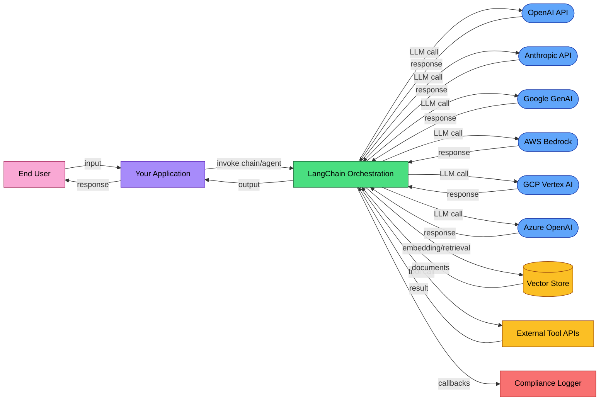

# EU AI Act Compliance Guide for LangChain Deployers

LangChain is an orchestration framework. Every chain, agent, and retriever in your stack composes calls to one or more LLM providers. That makes it the natural instrumentation layer for EU AI Act compliance: the framework already has callback hooks at every execution boundary. The question is whether those hooks capture what regulators require.

This guide maps LangChain's existing features to regulatory requirements and identifies what deployers need to add.

## Is your system in scope?

Articles 12, 13, and 14 of the EU AI Act apply only to **high-risk AI systems** as defined in Annex III. Most LangChain deployments (general-purpose chatbots, internal productivity tools, RAG-based Q&A, code assistants) are not high-risk and are not subject to these obligations.

Your system is likely high-risk if it is used for:
- **Recruitment or HR decisions** (screening CVs, evaluating candidates, task allocation)
- **Credit scoring or insurance pricing**
- **Law enforcement or border control**
- **Critical infrastructure management** (energy, water, transport)
- **Education assessment** (grading, admissions)
- **Access to essential public services**

If your use case does not fall under Annex III, the high-risk obligations (Articles 9-15) do not apply via the Annex III pathway, though risk classification is context-dependent. **Do not self-classify without legal review.** You may still have obligations under **Article 50** (transparency for chatbots and AI systems interacting directly with users) and **GDPR** (if processing personal data). Focus on Article 50 (transparency) and GDPR (data protection) as your baseline obligations. Read those sections below.

## How LangChain fits

LangChain applications are built from composable components: prompts, models, output parsers, retrievers, tools, and agents. The framework provides two key architectural features relevant to compliance:

1. **LangChain Expression Language (LCEL)**: Chains are composed using the pipe operator (`|`) or `RunnableSequence`. Each step is a `Runnable` with standardized `invoke`, `ainvoke`, `stream`, and `batch` interfaces. Every Runnable accepts a `config` parameter that propagates callbacks through the entire execution graph.

2. **Callback system**: `BaseCallbackHandler` exposes hooks at every execution boundary: `on_llm_start`, `on_llm_end`, `on_chain_start`, `on_chain_end`, `on_tool_start`, `on_tool_end`, `on_retriever_start`, `on_retriever_end`, and error variants for each. These fire automatically when you pass a handler via `config={\"callbacks\": [handler]}`.

3. **LangGraph agents**: For agentic workflows, LangGraph extends LangChain with stateful graphs, persistence, and `interrupt()` for human-in-the-loop checkpoints. The interrupt mechanism pauses execution, serializes state, and waits for external approval before resuming.

4. **Provider abstraction**: `ChatOpenAI`, `ChatAnthropic`, `ChatGoogleGenerativeAI`, `ChatBedrock`, `AzureChatOpenAI`, `ChatVertexAI` all implement the same `BaseChatModel` interface. Your compliance layer wraps all of them uniformly.

The callback system is where compliance hooks belong. LangSmith, Langfuse, and OpenTelemetry integrations already use it for observability. The same mechanism works for regulatory logging.

## What the scanner found

Running [AI Trace Auditor](https://github.com/BipinRimal314/ai-trace-auditor) against a LangChain application codebase reveals the full surface area of AI provider dependencies:

- **Provider integrations detected**: OpenAI, Anthropic, Google GenAI, AWS Bedrock, Azure OpenAI, Vertex AI (varies by deployment)
- **External services**: Vector stores (Chroma, FAISS, Pinecone), embedding endpoints, tool APIs
- **Data flows**: User input -> prompt template -> LLM provider -> output parser -> application layer; retriever queries to vector stores; agent tool calls to external APIs

These reflect what your application *imports and configures*. Document which providers are active in production. The scanner identifies the full dependency graph; your compliance documentation should reflect the subset you actually deploy.

## Data flow diagram



Every LLM provider is a **processor** under GDPR: they process data on your behalf. Each requires a Data Processing Agreement (Article 28). Vector stores and external tool APIs that receive user data are also processors.

LangChain itself is a library running in your infrastructure. It is not a processor; it is part of your system. If you use LangSmith (hosted), LangChain Inc. becomes an additional processor.

## Article 12: Record-keeping

Article 12 requires automatic event recording for the lifetime of high-risk AI systems. LangChain's callback system provides the hooks; you choose the backend.

| Article 12 Requirement | LangChain Feature | Status |
|------------------------|-------------------|--------|
| Event timestamps | `on_llm_start` / `on_llm_end` fire with timing data | **Available** |
| Model version tracking | `serialized` dict in `on_llm_start` contains model name | **Available** |
| Input content logging | `prompts` / `messages` parameter in `on_llm_start` | **Available** |
| Output content logging | `response` parameter in `on_llm_end` (LLMResult) | **Available** |
| Token consumption | `response.llm_output` contains usage metadata (provider-dependent) | **Partial** |
| Chain execution trace | `on_chain_start` / `on_chain_end` with `run_id` and `parent_run_id` | **Available** |
| Tool/retriever calls | `on_tool_start` / `on_retriever_start` with inputs | **Available** |
| Error recording | `on_llm_error` / `on_chain_error` / `on_tool_error` | **Available** |
| User identification | Must be passed via `metadata` in config | **Your responsibility** |
| Data retention (6+ months) | Depends on your logging backend | **Your responsibility** |
| Request parameters | Temperature, max_tokens visible in `serialized` / `kwargs` | **Partial** |

LangChain provides the instrumentation surface. The gaps are:
1. **Token usage is provider-dependent**: Not all providers return usage in a uniform format. Verify your provider's `llm_output` structure.
2. **Retention is your responsibility**: LangChain does not store data persistently. Connect callbacks to a durable backend.
3. **User identity must be threaded**: Pass `metadata={\"user_id\": \"...\"}` in your `config` dict so callbacks can associate requests with users.

### Configuring Article 12-compliant logging

**Option 1: LangSmith** (managed, recommended for teams already using LangChain ecosystem):

```python
import os

os.environ[\"LANGCHAIN_TRACING_V2\"] = \"true\"
os.environ[\"LANGCHAIN_API_KEY\"] = \"<your-langsmith-api-key>\"
os.environ[\"LANGCHAIN_PROJECT\"] = \"production-compliance\"

# All chain.invoke() calls are now traced automatically.
# Traces include inputs, outputs, latency, token usage, and error states.
```

**Option 2: Langfuse** (open-source, self-hostable for data sovereignty):

```python
import os
from langfuse import Langfuse
from langfuse.langchain import CallbackHandler

Langfuse(
    public_key=os.environ[\"LANGFUSE_PUBLIC_KEY\"],
    secret_key=os.environ[\"LANGFUSE_SECRET_KEY\"],
    host=os.environ.get(\"LANGFUSE_HOST\", \"https://cloud.langfuse.com\"),
)

langfuse_handler = CallbackHandler()

# Pass to any chain or agent invocation
chain.invoke(
    {\"input\": user_query},
    config={\"callbacks\": [langfuse_handler]},
)
```

**Option 3: Custom compliance logger** (when you need full control):

```python
from langchain_core.callbacks import BaseCallbackHandler
from langchain_core.outputs import LLMResult
from uuid import UUID
from typing import Any
import json
import datetime

class ComplianceCallbackHandler(BaseCallbackHandler):
    \"\"\"Article 12-compliant event logger for LangChain.\"\"\"

    def on_llm_start(
        self,
        serialized: dict[str, Any],
        prompts: list[str],
        *,
        run_id: UUID,
        parent_run_id: UUID | None = None,
        tags: list[str] | None = None,
        metadata: dict[str, Any] | None = None,
        **kwargs: Any,
    ) -> None:
        record = {
            \"event\": \"llm_start\",
            \"timestamp\": datetime.datetime.utcnow().isoformat(),
            \"run_id\": str(run_id),
            \"parent_run_id\": str(parent_run_id) if parent_run_id else None,
            \"model\": serialized.get(\"kwargs\", {}).get(\"model_name\", \"unknown\"),
            \"input_prompts\": prompts,
            \"user_id\": (metadata or {}).get(\"user_id\"),
            \"tags\": tags,
        }
        self._persist(record)

    def on_llm_end(
        self,
        response: LLMResult,
        *,
        run_id: UUID,
        parent_run_id: UUID | None = None,
        **kwargs: Any,
    ) -> None:
        record = {
            \"event\": \"llm_end\",
            \"timestamp\": datetime.datetime.utcnow().isoformat(),
            \"run_id\": str(run_id),
            \"output\": [g.text for g in response.generations[0]],
            \"token_usage\": (
                response.llm_output.get(\"token_usage\")
                if response.llm_output
                else None
            ),
        }
        self._persist(record)

    def on_llm_error(
        self,
        error: BaseException,
        *,
        run_id: UUID,
        parent_run_id: UUID | None = None,
        **kwargs: Any,
    ) -> None:
        record = {
            \"event\": \"llm_error\",
            \"timestamp\": datetime.datetime.utcnow().isoformat(),
            \"run_id\": str(run_id),
            \"error_type\": type(error).__name__,
            \"error_message\": str(error),
        }
        self._persist(record)

    def _persist(self, record: dict) -> None:
        # Replace with your durable storage backend:
        # PostgreSQL, S3, Elasticsearch, or any system with 6+ month retention.
        print(json.dumps(record))


# Usage with any chain or agent:
compliance_handler = ComplianceCallbackHandler()

from langchain_openai import ChatOpenAI
from langchain_core.prompts import ChatPromptTemplate

llm = ChatOpenAI(model=\"gpt-4o\")
prompt = ChatPromptTemplate.from_messages([
    (\"system\", \"You are a helpful assistant.\"),
    (\"human\", \"{input}\"),
])
chain = prompt | llm

result = chain.invoke(
    {\"input\": \"Summarize this document.\"},
    config={
        \"callbacks\": [compliance_handler],
        \"metadata\": {\"user_id\": \"eu-user-42\"},
    },
)
```

Whichever option you choose, connect to a persistent backend with a retention policy of at least 6 months (Article 26(5) for deployers; Article 18 requires 10 years for providers).

## Article 13: Transparency

Deployers of high-risk AI systems must provide users with information about the system's capabilities, limitations, and how it processes data.

LangChain's contribution to transparency:
- **Model routing is observable**: The `serialized` dict in `on_llm_start` identifies which model served each request. If you use fallback chains or model routing, callbacks capture the actual model used.
- **Chain structure is inspectable**: LCEL chains expose their composition. You can document the processing pipeline: prompt -> model -> parser -> retriever -> response.
- **Tool usage is logged**: `on_tool_start` and `on_tool_end` capture when agents call external tools, including tool names and arguments.

What you need to add:
- User-facing documentation of which AI models power your application and their known limitations
- Disclosure of how retrieval augmentation works (what data sources are queried, how context is selected)
- Information about routing decisions if you use multiple models (cost-based, latency-based, capability-based)
- Documentation of the system's intended purpose and the scope of decisions it informs

## Article 14: Human oversight

Article 14 requires high-risk AI systems to be designed so that natural persons can effectively oversee them. This means **human actors** who can:

1. **Interpret outputs**: A person reviews what the AI produced and understands its basis before the output drives a decision
2. **Reject outputs**: A person decides not to use an AI-generated recommendation
3. **Intervene**: A person modifies or overrides the AI's output mid-process
4. **Halt the system**: A person stops the AI system from operating when it produces unacceptable results

These are human actions, not automated controls. Content moderation filters, output validators, and guardrail chains are **automated technical controls** that fall under Articles 9 (risk management) and 15 (accuracy/robustness). They are useful infrastructure, but they do not satisfy Article 14 on their own.

### What LangChain provides as foundation

| Requirement | What it means | LangChain / LangGraph foundation |
|-------------|---------------|----------------------------------|
| Interpret outputs | A person reviews AI output before it acts | Logged responses via callbacks; LangSmith trace UI |
| Reject output | A person can discard an AI recommendation | Requires your application layer (approval queue) |
| Intervene mid-process | A person modifies the AI's course of action | LangGraph `interrupt()` pauses execution for human input |
| Halt the system | A person can stop operations entirely | Requires your infrastructure (kill switch, feature flag) |
| Escalation procedures | Flagged content routes to human review | Callback hooks can trigger escalation; routing logic is yours |

### LangGraph interrupt for human-in-the-loop

LangGraph's `interrupt()` function is the closest LangChain-native mechanism to Article 14's intervention requirement. It pauses graph execution, serializes state to a persistence layer, and waits for a human to approve, reject, or modify the action:

```python
from langgraph.types import interrupt, Command

def sensitive_action_node(state):
    \"\"\"Node that requires human approval before executing.\"\"\"
    proposed_action = state[\"proposed_action\"]

    # Pause execution and surface the proposed action to a human reviewer
    human_decision = interrupt({
        \"action\": proposed_action,
        \"reason\": \"This action affects a high-risk domain. Human approval required.\",
    })

    # Execution resumes only after human responds
    return {\"approved\": human_decision}

# Human approves or rejects via:
# graph.invoke(Command(resume=True), config=config)   # approve
# graph.invoke(Command(resume=False), config=config)  # reject
```

LangGraph provides the **mechanism**. The oversight logic itself (who reviews, what triggers review, how fast, escalation paths) lives in your application and operational procedures.

## Article 50: User disclosure

Article 50 applies to **all** AI systems that interact directly with natural persons, not just high-risk systems. If your LangChain application is a chatbot, virtual assistant, or any interface where users interact with AI-generated content, you must:

1. **Inform users they are interacting with an AI system** (unless this is obvious from context)
2. **Label AI-generated content** when it could be mistaken for human-produced content
3. **Disclose deep fakes** if your system generates or manipulates image, audio, or video content

This obligation applies from **2 August 2026** and is independent of Annex III risk classification.

LangChain does not handle user-facing disclosure; this is your application layer's responsibility. Implementation examples:

- Display a persistent banner: \"Responses are generated by an AI system\"
- Include metadata in API responses: `{\"ai_generated\": true, \"model\": \"gpt-4o\"}`
- For content generation systems, watermark or label outputs

## GDPR considerations

LangChain chains and agents send user prompts to external LLM providers. If those prompts contain personal data of EU residents:

### 1. Legal basis (Article 6)
Document why you are processing personal data through LLM providers. Consent, legitimate interest, or contractual necessity: pick one and document it.

### 2. Data Processing Agreements (Article 28)
Required for each LLM provider your application calls. Required for your vector store provider if it holds personal data. Required for LangSmith or Langfuse if you use hosted tracing.

### 3. Cross-border transfer assessment

| Provider | Primary Processing Location | EU Data Residency | Transfer Mechanism |
|----------|---------------------------|-------------------|-------------------|
| OpenAI | US (default) | EU residency available (Enterprise) | SCCs required for standard API |
| Anthropic | US | Not available | SCCs required |
| Google GenAI | US (default) | EU via Vertex AI region selection | SCCs or region-lock via Vertex |
| AWS Bedrock | Region-selectable | EU (eu-central-1 Frankfurt, eu-west-1 Ireland) | Deploy in EU region to avoid transfer |
| Azure OpenAI | Region-selectable | EU (West Europe, France Central, Sweden Central) | Deploy in EU region to avoid transfer |
| GCP Vertex AI | Region-selectable | EU (europe-west1, europe-west4) | Deploy in EU region to avoid transfer |

For deployments handling EU personal data, prefer providers with EU region options (Bedrock, Azure OpenAI, Vertex AI) and deploy in an EU region to eliminate cross-border transfer obligations.

### 4. Data minimization
- Strip personal data from prompts before sending to LLM providers when possible
- Log what you need for compliance (Article 12), not everything
- Implement retention policies on your compliance logs
- Consider self-hosted models (Ollama, vLLM via `ChatOllama`) for sensitive data processing

Generate a GDPR Article 30 Record of Processing Activities:

```bash
pip install ai-trace-auditor
aitrace flow ./your-langchain-app -o data-flows.md
```

## Full compliance scan

Generate a complete compliance package for your LangChain deployment:

```bash
# Install the scanner
pip install ai-trace-auditor

# Run a full compliance scan
aitrace comply ./your-langchain-app --split -o compliance/

# This generates:
# compliance/art11-technical-docs.md    — Annex IV technical documentation
# compliance/art12-record-keeping.md    — Logging requirements vs. your codebase
# compliance/art13-transparency.md      — Provider and data flow inventory
# compliance/art50-user-disclosure.md   — Chatbot/interaction disclosure checklist
# compliance/gdpr-art30-ropa.md         — Record of Processing Activities
```

Audit existing trace logs:

```bash
aitrace audit your-traces.json -r \"EU AI Act\"
```

## Recommendations

1. **Enable callback-based logging** from day one. Use LangSmith, Langfuse, or a custom `BaseCallbackHandler` connected to durable storage with 6+ month retention.
2. **Thread user identity through every invocation**: pass `metadata={\"user_id\": \"...\"}` in your `config` dict so compliance logs can associate requests with data subjects.
3. **Document your chain architecture**: which models, which tools, which retrievers, which vector stores. The data flow diagram above is your starting template.
4. **Establish DPAs** with every LLM provider, vector store provider, and hosted observability platform you use.
5. **Prefer EU-region providers** for personal data: AWS Bedrock (eu-central-1), Azure OpenAI (West Europe), or Vertex AI (europe-west1) eliminate cross-border transfer obligations.
6. **Build human oversight on LangGraph interrupts** for high-risk use cases. The `interrupt()` mechanism gives you the pause-and-approve pattern Article 14 requires.
7. **Implement Article 50 disclosure** in your application layer before August 2026: banners, metadata, and content labeling.
8. **Run periodic compliance scans**: `aitrace comply ./your-app --split -o compliance/` to catch new provider dependencies as your application evolves.

## Resources

- [EU AI Act full text](https://artificialintelligenceact.eu/)
- [Article 50: Transparency obligations](https://artificialintelligenceact.eu/article/50/)
- [LangChain callbacks documentation](https://python.langchain.com/docs/concepts/callbacks/)
- [LangChain tracing with LangSmith](https://docs.langchain.com/langsmith/trace-with-langchain)
- [Langfuse LangChain integration](https://langfuse.com/docs/langchain/python)
- [LangGraph human-in-the-loop](https://docs.langchain.com/oss/python/langgraph/interrupts)
- [AI Trace Auditor](https://github.com/BipinRimal314/ai-trace-auditor) -- open-source EU AI Act compliance scanning

---

*This guide was generated with assistance from [AI Trace Auditor](https://github.com/BipinRimal314/ai-trace-auditor) and reviewed for accuracy. It is not legal advice. The EU AI Act (Regulation 2024/1689) enters full application on 2 August 2026; specific provisions have earlier effective dates. Consult a qualified legal professional for compliance decisions specific to your deployment.*
