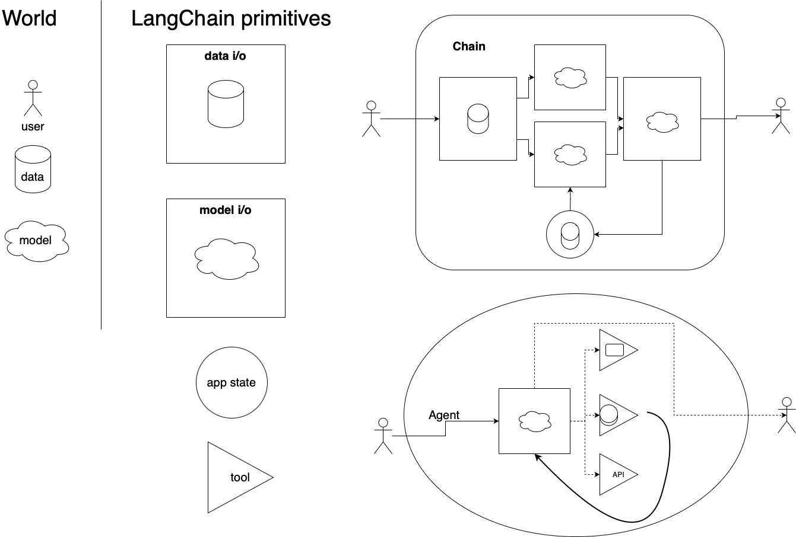

# Introduction

**LangChain** is a framework for developing applications powered by language models. It enables applications that are
1. **Data-aware**: connect a language model to other sources of data
2. **Agentic**: allow a language model to interact with its environment

## Get started

We recommend heading to our [Quickstart guide](./quickstart.html) to familiarize yourself with the framework.

## Modules

LangChain provides standard, extendable interfaces and external integrations for the following modules (from least to most complex):

- [Model I/O](/docs/modules/model_io.html): Interface with language models
- [Data I/O](/docs/modules/data_io.html): Interface with application-specific data
- [Chains](/docs/modules/chains.html): Construct sequences of calls
- [Memory](/docs/modules/memory.html): Persist application state between runs of a chain
- [Agents](/docs/modules/agents.html): Let chains choose which tools to use given high-level directives
- [Callbacks](/docs/modules/callbacks/getting_started.html): Log and stream intermediate steps of any chain

## Examples

Walkthroughs for common use cases and additional examples of applications built on LangChain:

- [Use cases](/docs/examples/use_cases/autonomous_agents.html)
- [Additional resources](/docs/examples/additional_resources/youtube.html)

## Ecosystem

LangChain is part of a rich ecosystem of tools integrated with the framework and applications built on top of it:

- [Integrations](/docs/ecosystem/integrations/ai21.html): Use your favorite models, tools and applications within LangChain
- [Dependents](/docs/ecosystem/dependents.html): Repositories that use LangChain
- [Deployments](/docs/ecosystem/deployments.html): Instructions, code snippets, and template repositories for deploying LangChain apps
