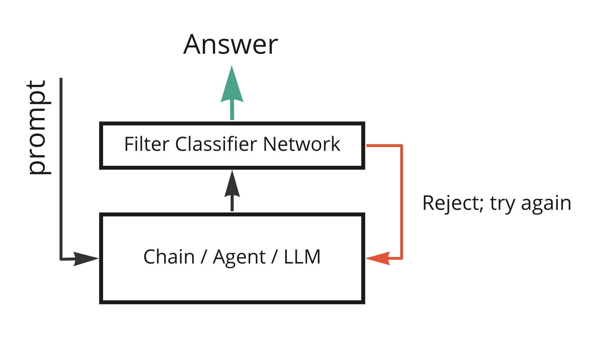

# Key Concepts

The simplest way to restrict the output of an LLM is to just tell it what you don't want in the prompt. This rarely works well, though. For example, just about every chatbot that is released has some restrictions in its prompt. Inevitably, users find vulnerabilities and ways to 'trick' the chatbot into saying nasty things or decrying the rules that bind it. As funny as these workarounds sometimes are to read about on Twitter, protecting against them is an important task that grows more important as LLMs begin to be used in more consequential ways.

Guards use a variety of methods to prevent unwanted output from reaching a user. They can also be used for a number of other things, but restricting output is the primary use and the reason they were designed. This document details the high level methods of restricting output and a few techniques one may consider implementing. For actual code, see 'Getting Started.'

## Using an LLM to Restrict Output

The RestrictionGuard works by adding another LLM on top of the one being protected which is instructed to determine if the underlying llm's output violates one or more guards. By separating the restriction into a separate guard many exploits are avoided. Since the guard llm only looks at the output it can answer simple questions about if a restriction is violated. An llm that is simply told not to violate a restriction may later be told by a user to ignore those instructions or in some other way "tricked" into doing so. By separating into two LLM calls, one to generate the response and one to verify, it is also more likely that, after repeated retries as opposed to a single unguarded attempt, an appropriate response will be generated.

## Using a StringGuard to Restrict Output

The StringGuard works by checking if an output contains a sufficient percentage of one or more protected strings. This guard is not as computationally intense or slow as another llm call and works better than an llm for things like preventing prompt jacking or preventing the use of negative words. Users should be aware, though, that there are still many ways to get around this guard for things like prompt jacking. For example, a user that has found a way to get your agent or chain to return the prompt may be prevented from doing so by a string guard that restricts returning the prompt. If the user asks for the prompt in spanish, though, the string guard will not catch it since the spanish prompt is a different string.

## Custom Methods

The CustomGuard takes in a function to create a custom guard. The function should take a single string as input and return a boolean where True means the guard was violated and False means it was not. For example, you may want to apply a simple function like checking that a response is a certain length or to use some other non-llm model or heuristic to check the output.

For example, suppose you have a chat agent that is only supposed to be a cooking assistant. You may worry that users could try to ask the chat agent to say things totally unrelated to cooking or even to say something racist or violent. You could use a restriction guard which will help but its still an extra llm call which is expensive and it may not work every time since llms are unpredictable.

Suppose instead you collect 100 examples of cooking related responses and 200 examples of responses that don't have anything to do with cooking. You could then train a model that classifies if a piece of text is about cooking or not. This model could be run on your own infrastructure for minimal cost compared to an LLM and could potentially be much more reliable. You could then use it to create a custom guard to restrict the output of your chat agent to only responses that your model classifies as related to cooking.

<!-- add this image: docs/modules/guards/ClassifierExample.png -->

