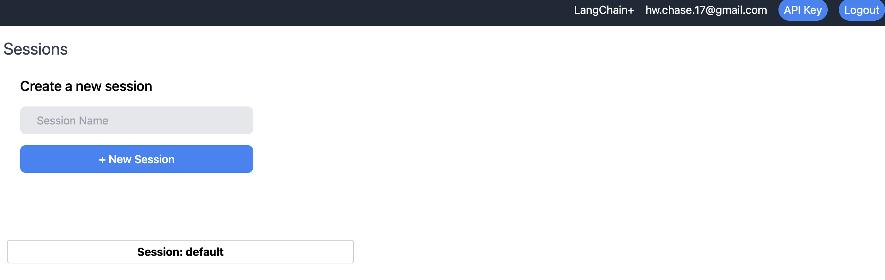
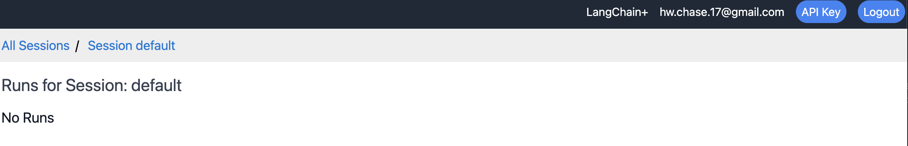
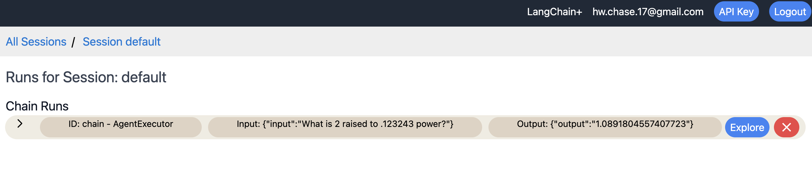
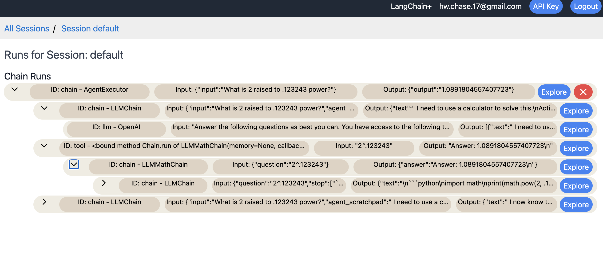
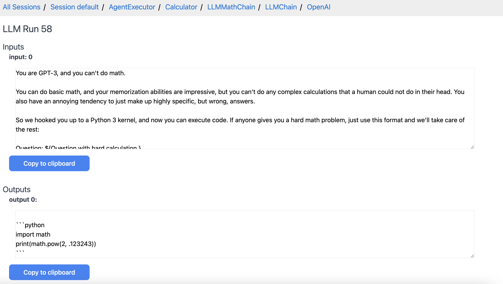

# Tracing

By enabling tracing in your LangChain runs, you’ll be able to more effectively visualize, step through, and debug your chains and agents.

First, you should install tracing and set up your environment properly.
You can use either a locally hosted version of this (uses Docker) or a cloud hosted version (in closed alpha).
If you're interested in using the hosted platform, please fill out the form [here](https://forms.gle/tRCEMSeopZf6TE3b6).


- [Locally Hosted Setup](./tracing/local_installation.md)
- [Cloud Hosted Setup](./tracing/hosted_installation.md)

## Tracing Walkthrough

When you first access the UI, you should see a page with your tracing sessions. 
An initial one "default" should already be created for you. 
A session is just a way to group traces together. 
If you click on a session, it will take you to a page with no recorded traces that says "No Runs." 
You can create a new session with the new session form.



If we click on the `default` session, we can see that to start we have no traces stored.



If we now start running chains and agents with tracing enabled, we will see data show up here.
To do so, we can run [this notebook](tracing/agent_with_tracing.ipynb) as an example.
After running it, we will see an initial trace show up.



From here we can explore the trace at a high level by clicking on the arrow to show nested runs.
We can keep on clicking further and further down to explore deeper and deeper.



We can also click on the "Explore" button of the top level run to dive even deeper. 
Here, we can see the inputs and outputs in full, as well as all the nested traces.


We can keep on exploring each of these nested traces in more detail.
For example, here is the lowest level trace with the exact inputs/outputs to the LLM.



## Changing Sessions
1. To initially record traces to a session other than `"default"`, you can set the `LANGCHAIN_SESSION` environment variable to the name of the session you want to record to:

```python
import os
os.environ["LANGCHAIN_HANDLER"] = "langchain"
os.environ["LANGCHAIN_SESSION"] = "my_session" # Make sure this session actually exists. You can create a new session in the UI.
```

2. To switch sessions mid-script or mid-notebook, do NOT set the `LANGCHAIN_SESSION` environment variable. Instead: `langchain.set_tracing_callback_manager(session_name="my_session")`
