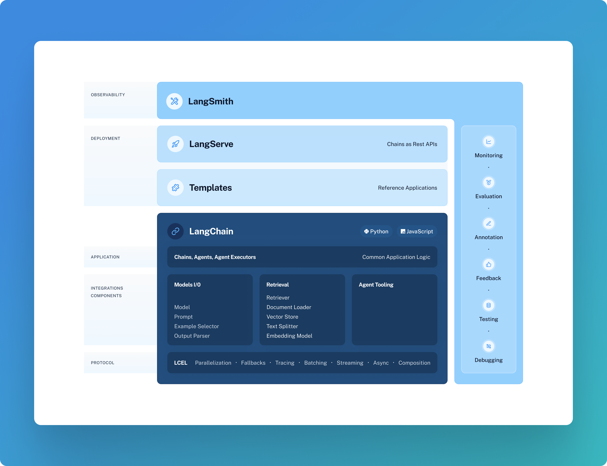

# 🦜🍎️ LangChain Core

[](https://pepy.tech/project/langchain_core)
[](https://opensource.org/licenses/MIT)

## Quick Install

```bash
pip install langchain-core
```

## What is it?

LangChain Core contains the base abstractions that power the rest of the LangChain ecosystem. 
These abstractions are designed to be as modular and simple as possible. 
Examples of these abstractions include those for language models, document loaders, embedding models, vectorstores, retrievers, and more. 
The benefit of having these abstractions is that any provider can implement the required interface and then easily be used in the rest of the LangChain ecosystem.

For full documentation see the [API reference](https://api.python.langchain.com/en/stable/core_api_reference.html).

## What is LangChain Expression Language?

LangChain Core also contains LangChain Expression Language, or LCEL, a runtime that allows users to compose arbitrary sequences together and get several benefits that are important when building LLM applications. 
We call these sequences “runnables”.

All runnables expose the same interface with single-invocation, batch, streaming and async methods. 
This design is useful because it is not enough to have a single sync interface when building an LLM application.  
Batch is needed for efficient processing of many inputs.
Streaming (and streaming of intermediate steps) is needed to show the user that progress is being made. 
Async interfaces are nice when moving into production. 
Rather than having to write multiple implementations for all of those, LCEL allows you to write a runnable once and invoke it in many different ways.

For more check out the [LCEL docs](https://python.langchain.com/docs/expression_language/).



## 📕 Releases & Versioning

`langchain-core` is currently on version `0.1.x`.

As `langchain-core` contains the base abstractions and runtime for the whole LangChain ecosystem, we will communicate any breaking changes with advance notice and version bumps. The exception for this is anything in `langchain_core.beta`. The reason for `langchain_core.beta` is that given the rate of change of the field, being able to move quickly is still a priority, and this module is our attempt to do so.

Minor version increases will occur for:

- Breaking changes for any public interfaces NOT in `langchain_core.beta`

Patch version increases will occur for:

- Bug fixes
- New features
- Any changes to private interfaces
- Any changes to `langchain_core.beta`

## 💁 Contributing

As an open-source project in a rapidly developing field, we are extremely open to contributions, whether it be in the form of a new feature, improved infrastructure, or better documentation.

For detailed information on how to contribute, see [here](../../.github/CONTRIBUTING.md).