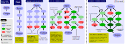

# Graph of Thoughts (GoT)

<p align="center">
  
</p>

This is the official implementation of [Graph of Thoughts: Solving Elaborate Problems with Large Language Models](https://arxiv.org/pdf/2308.09687.pdf).  
This framework gives you the ability to solve complex problems by modeling them as a Graph of Operations (GoO), which is automatically executed with a Large Language Model (LLM) as the engine.  
This framework is designed to be flexible and extensible, allowing you to not only solve problems using the new GoT approach, but also to implement GoOs resembling previous approaches like CoT or ToT.

## Setup Guide

In order to use this framework, you need to have a working installation of Python 3.8 or newer.

### Installing GoT

Before running either of the following two installation methods, make sure to activate your Python environment (if any) beforehand.  
If you are a user and you just want to use `graph_of_thoughts`, you can install it directly from PyPI:
```bash
pip install graph_of_thoughts
```
If you are a developer and you want to modify the code, you can install it in editable mode from source:
```bash
git clone https://github.com/spcl/graph-of-thoughts.git
cd graph-of-thoughts
pip install -e .
```

### Configuring the LLM

In order to use the framework, you need to have access to an LLM.
Please follow the instructions in the [Controller README](graph_of_thoughts/controller/README.md) to configure the LLM of your choice.

## Quick Start

The following code snippet shows how to use the framework to solve the sorting problem for a list of 32 numbers using a CoT-like approach.  
Make sure you have followed the [Setup Guide](#setup-guide) before running the code.

```python
from examples.sorting.sorting_032 import SortingPrompter, SortingParser, utils
from graph_of_thoughts import controller, language_models, operations

# Problem input

to_be_sorted = "[0, 2, 6, 3, 8, 7, 1, 1, 6, 7, 7, 7, 7, 9, 3, 0, 1, 7, 9, 1, 3, 5, 1, 3, 6, 4, 5, 4, 7, 3, 5, 7]"

# Create the Graph of Operations
gop = operations.GraphOfOperations()
gop.append_operation(operations.Generate())
gop.append_operation(operations.Score(scoring_function=utils.num_errors))
gop.append_operation(operations.GroundTruth(utils.test_sorting))

# Configure the Language Model (Assumes config.json is in the current directory with OpenAI API key)
lm = language_models.ChatGPT("config.json", model_name="chatgpt")

# Create the Controller
ctrl = controller.Controller(
  lm, 
  gop, 
  SortingPrompter(), 
  SortingParser(),
  # The following dictionary is used to configure the initial thought state
  {
    "original": to_be_sorted,
    "current": "",
    "method": "cot"
  }
)

# Run the Controller and generate the output graph
ctrl.run()
ctrl.output_graph("output_cot.json")
```

To run the more sophisticated GoT approach, you can use the following code snippet.

```python
from examples.sorting.sorting_032 import SortingPrompter, SortingParser, got, utils
from graph_of_thoughts import controller, language_models, operations

# Problem input

to_be_sorted = "[0, 2, 6, 3, 8, 7, 1, 1, 6, 7, 7, 7, 7, 9, 3, 0, 1, 7, 9, 1, 3, 5, 1, 3, 6, 4, 5, 4, 7, 3, 5, 7]"

# Retrieve the Graph of Operations
gop = got()

# Configure the Language Model (Assumes config.json is in the current directory with OpenAI API key)
lm = language_models.ChatGPT("config.json", model_name="chatgpt")

# Create the Controller
ctrl = controller.Controller(
  lm, 
  gop, 
  SortingPrompter(), 
  SortingParser(),
  # The following dictionary is used to configure the initial thought state
  {
    "original": to_be_sorted,
    "current": "",
    "phase": 0,
    "method": "got"
  }
)

# Run the Controller and generate the output graph
ctrl.run()
ctrl.output_graph("output_got.json")
```
You can compare the two results by inspecting the output graphs `output_cot.json` and `output_got.json`.  
The final thought states' scores indicate the number of errors in the sorted list.

## Documentation
The paper gives a high-level overview of the framework and its components.  
In order to understand the framework in more detail, you can read the documentation of the individual modules.  
Especially the [Controller](graph_of_thoughts/controller/README.md) and [Operations](graph_of_thoughts/operations/README.md) modules are important for understanding how to make the most out of the framework.  
We took extra care to fully document the code, so that you can easily understand how it works and how to extend it.

## Examples

The [examples](examples) directory contains several examples of problems that can be solved using the framework, including the ones presented in the paper.  
It is a great starting point for learning how to use the framework to solve real problems.  
Each example contains a `README.md` file with instructions on how to run it and play with it. The code is fully documented and should be easy to follow.
You can also run the examples straight from the main directory. Note that the results will be stored in the respective examples sub-directory.

Try for instance:
```bash
python -m examples.sorting.sorting_032
python -m examples.keyword_counting.keyword_counting
```
## Paper Results

You can run the experiments from the paper by following the instructions in the [examples](examples) directory.  
However, if you just want to inspect and replot the results, you can use the [paper](paper) directory.

## Citations

If you find this repository valuable, please give it a star!  
Got any questions or feedback? Feel free to reach out to [nils.blach@inf.ethz.ch](mailto:nils.blach@inf.ethz.ch) or open an issue.  
Using this in your work? Please reference us using the provided citation:

```bibtex
@misc{besta2023got,
  title = {{Graph of Thoughts: Solving Elaborate Problems with Large Language Models}},
  author = {Besta, Maciej and Blach, Nils and Kubicek, Ales and Gerstenberger, Robert and Gianinazzi, Lukas and Gajda, Joanna and Lehmann, Tomasz and Podstawski, Micha{\l} and Niewiadomski, Hubert and Nyczyk, Piotr and Hoefler, Torsten},
  year = 2023,
  eprinttype = {arXiv},
  eprint = {2308.09687}
}
```
