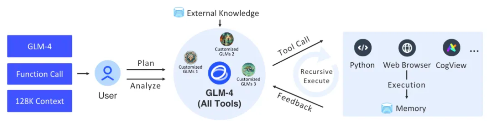

#   🔗 LangChain-GLM


## Project Overview
This project utilizes the foundational components of LangChain to implement a comprehensive framework
that supports intelligent agents and related tasks. The core is built on Zhiyuan AI's latest 
GLM-4 All Tools. Through Zhiyuan AI's API interface, it can autonomously understand user intentions,
plan complex instructions, and invoke one or more tools (such as web browsers, Python interpreters, 
and text-to-image models) to accomplish intricate tasks.



> Fig. | The overall process of GLM-4 All Tools and custom GLMs (agents).

## Project Structure

| Package Path                                                       | Description                                                   |
| ------------------------------------------------------------------ | ------------------------------------------------------------- |
| [agent_toolkits](https://github.com/MetaGLM/langchain-zhipuai/tree/main/langchain_glm/agent_toolkits) | Platform tool AdapterAllTool adapter, a platform adapter tool that provides a unified interface for various tools, aiming for seamless integration and execution across different platforms. This tool adapts to specific platform parameters to ensure compatibility and consistent output. |
| [agents](https://github.com/MetaGLM/langchain-zhipuai/tree/main/langchain_glm/agents) | Encapsulates the input, output, agent sessions, tool parameters, and tool execution strategies for the AgentExecutor. |
| [callbacks](https://github.com/MetaGLM/langchain-zhipuai/tree/main/langchain_glm/callbacks) | Abstracts some interactive events during the AgentExecutor process, displaying information through events. |
| [chat_models](https://github.com/MetaGLM/langchain-zhipuai/tree/main/langchain_glm/chat_models) | A wrapper layer for the Zhipu AI SDK, providing integration with LangChain's BaseChatModel and formatting input and output as message bodies. |
| [embeddings](https://github.com/MetaGLM/langchain-zhipuai/tree/main/langchain_glm/embeddings) | A wrapper layer for the Zhipu AI SDK, providing integration with LangChain's Embeddings. |
| [utils](https://github.com/MetaGLM/langchain-zhipuai/tree/main/langchain_glm/utils) | Various session tools.                                         |


## Usage

- Install from the repository
  https://github.com/MetaGLM/langchain-glm/releases
- Install directly from the source using pip
  ```bash
  pip install git+https://github.com/MetaGLM/langchain-glm.git -v
  ```
- Install from PyPI
  ```bash
  pip install langchain-glm
  ```

> Before using, please set the environment variable `ZHIPUAI_API_KEY` with the value of your Zhipu AI API Key.

#### Tool Usage
- Set environment variables
```python
import getpass
import os

os.environ["ZHIPUAI_API_KEY"] = getpass.getpass()

```
```python
from langchain_glm import ChatZhipuAI
llm = ChatZhipuAI(model="glm-4")
```


- example tools:
```python
from langchain_core.tools import tool

@tool
def multiply(first_int: int, second_int: int) -> int:
    """Multiply two integers together."""
    return first_int * second_int

@tool
def add(first_int: int, second_int: int) -> int:
    "Add two integers."
    return first_int + second_int

@tool
def exponentiate(base: int, exponent: int) -> int:
    "Exponentiate the base to the exponent power."
    return base**exponent
```
- Build Chain
Bind tools to the language model and invoke:
```python
from operator import itemgetter
from typing import Dict, List, Union

from langchain_core.messages import AIMessage
from langchain_core.runnables import (
    Runnable,
    RunnableLambda,
    RunnableMap,
    RunnablePassthrough,
)

tools = [multiply, exponentiate, add]
llm_with_tools = llm.bind_tools(tools)
tool_map = {tool.name: tool for tool in tools}


def call_tools(msg: AIMessage) -> Runnable:
    """Simple sequential tool calling helper."""
    tool_map = {tool.name: tool for tool in tools}
    tool_calls = msg.tool_calls.copy()
    for tool_call in tool_calls:
        tool_call["output"] = tool_map[tool_call["name"]].invoke(tool_call["args"])
    return tool_calls


chain = llm_with_tools | call_tools
```

- invoke
```python
chain.invoke(
    "What's 23 times 7"
)
```

#### Example Code

- Agent Executor
  Our `glm-4-alltools` model provides platform tools. With `ZhipuAIAllToolsRunnable`, you can easily set up an executor to run multiple tools.

  `code_interpreter`: Use `sandbox` to specify the code sandbox environment.
    - Default = auto, which automatically uses the sandbox environment to execute code.
    - Set `sandbox = none` to disable the sandbox environment.

  `web_browser`: Use `web_browser` to specify the browser tool.
  `drawing_tool`: Use `drawing_tool` to specify the drawing tool.


```python

from langchain_glm.agents.zhipuai_all_tools import ZhipuAIAllToolsRunnable
agent_executor = ZhipuAIAllToolsRunnable.create_agent_executor(
    model_name="glm-4-alltools",
    tools=[
        {"type": "code_interpreter", "code_interpreter": {"sandbox": "none"}},
        {"type": "web_browser"},
        {"type": "drawing_tool"},
        multiply, exponentiate, add
    ],
)

```


- Execute `agent_executor` and Print Results
  This section uses an agent to run a shell command and prints the output once available. It checks the result type and prints the relevant information.
  The `invoke` method returns an asynchronous iterator that can handle the agent's output.
  You can call the `invoke` method multiple times, with each call returning a new iterator.
  `ZhipuAIAllToolsRunnable` automatically handles state saving and recovery. Some state information is stored within the instance.
  You can access the status of `intermediate_steps` through the `callback` attribute.


```python
from langchain_glm.agents.zhipuai_all_tools.base import (
    AllToolsAction, 
    AllToolsActionToolEnd,
    AllToolsActionToolStart,
    AllToolsFinish, 
    AllToolsLLMStatus
)
from langchain_glm.callbacks.agent_callback_handler import AgentStatus


chat_iterator = agent_executor.invoke(
    chat_input="What's 23 times 7, and what's five times 18 and add a million plus a billion and cube thirty-seven"
)
async for item in chat_iterator:
    if isinstance(item, AllToolsAction):
        print("AllToolsAction:" + str(item.to_json()))
    elif isinstance(item, AllToolsFinish):
        print("AllToolsFinish:" + str(item.to_json()))
    elif isinstance(item, AllToolsActionToolStart):
        print("AllToolsActionToolStart:" + str(item.to_json()))
    elif isinstance(item, AllToolsActionToolEnd):
        print("AllToolsActionToolEnd:" + str(item.to_json()))
    elif isinstance(item, AllToolsLLMStatus):
        if item.status == AgentStatus.llm_end:
            print("llm_end:" + item.text)
```

## Integrated Demo
We provide an integrated demo that you can run directly to see the results.
- Install dependencies
```shell
fastapi = "~0.109.2"
sse_starlette = "~1.8.2" 
uvicorn = ">=0.27.0.post1"
# webui
streamlit = "1.34.0"
streamlit-option-menu = "0.3.12"
streamlit-antd-components = "0.3.1"
streamlit-chatbox = "1.1.12.post4"
streamlit-modal = "0.1.0"
streamlit-aggrid = "1.0.5"
streamlit-extras = "0.4.2"
```

- server[server.py](tests/assistant/server/server.py)
```shell
python tests/assistant/server/server.py
```

- client[start_chat.py](tests/assistant/start_chat.py)
```shell
python tests/assistant/start_chat.py
```

> show


https://github.com/MetaGLM/langchain-zhipuai/assets/16206043/06863f9c-cd03-4a74-b76a-daa315718104
