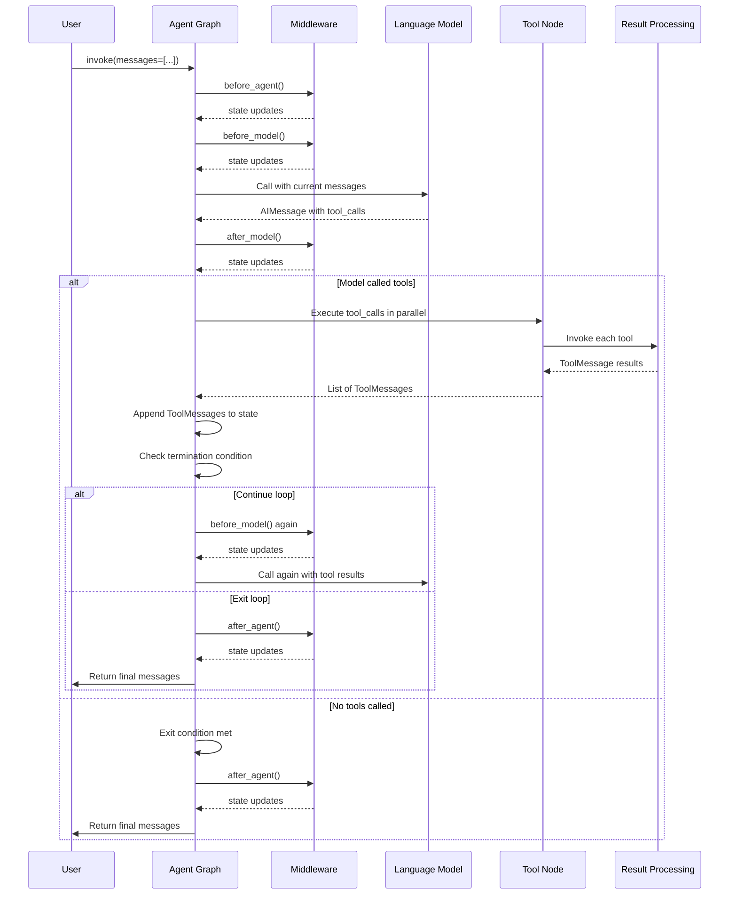
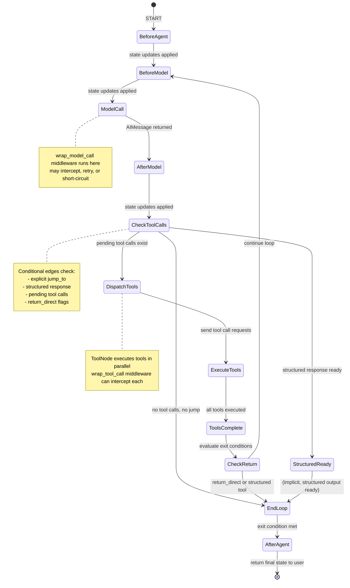

## Overview

Agent execution in LangChain follows a structured, state-driven loop orchestrated by a LangGraph StateGraph. The agent repeatedly invokes a language model, processes tool calls, and decides whether to continue the loop or terminate based on model output, tool execution results, and middleware directives.

### Core Execution Pattern

The agent execution flow consists of five main phases:

1. **Initialization** – User input arrives and enters the graph via START
2. **Model Call** – The language model is invoked with the current message state
3. **Tool Dispatch & Execution** – Model-requested tools are executed in parallel or sequentially
4. **Result Processing** – Tool results are wrapped in `ToolMessage` objects and added to state
5. **Termination Check** – The loop exits or cycles based on tool calls in the model response and configured stop conditions



Flow showing user input, middleware hooks, model invocation, tool execution, and loop termination.

## Agent State

The agent maintains a typed `AgentState` dictionary that accumulates execution history and configuration:

### State Structure

```python
class AgentState(TypedDict, Generic[ResponseT]):
    """State schema for the agent."""
    
    messages: Required[Annotated[list[AnyMessage], add_messages]]
    jump_to: NotRequired[Annotated[JumpTo | None, EphemeralValue, PrivateStateAttr]]
    structured_response: NotRequired[Annotated[ResponseT, OmitFromInput]]
```

**Key fields:**

- **`messages`**: A reducer-based list of all messages in the conversation. Uses `add_messages` to accumulate `UserMessage`, `AIMessage`, and `ToolMessage` objects rather than replacing them. This forms the conversation history passed to the model on each iteration.

- **`jump_to`**: An ephemeral middleware control field (not persisted) used by `before_model` and `after_model` hooks to redirect execution to `'tools'`, `'model'`, or `'end'` nodes, overriding the default loop logic.

- **`structured_response`**: When `response_format` is configured on the agent, this field holds the parsed structured output from the last model invocation or tool call. Cleared explicitly when a new iteration begins without a structured response.

### Message Encoding

Messages flow through the system as `langchain_core.messages` objects:

- **`AIMessage`**: Emitted by the model, may contain `tool_calls` (list of dicts with `id`, `name`, `args`).
- **`ToolMessage`**: Result of tool execution, carries `tool_call_id` to link it back to the model's request, `name` of the tool, and `content` with the tool's output.
- **`UserMessage`**, **`SystemMessage`**: User and system prompts; system message is prepended at model call time.

## Model Request and Response

### ModelRequest

Before invoking the model, the agent constructs a `ModelRequest` object that encapsulates all inputs:

```python
@dataclass(init=False)
class ModelRequest(Generic[ContextT]):
    model: BaseChatModel
    messages: list[AnyMessage]  # excluding system message
    system_message: SystemMessage | None
    tool_choice: Any | None
    tools: list[BaseTool | dict[str, Any]]
    response_format: ResponseFormat[Any] | None
    state: AgentState[Any]
    runtime: Runtime[ContextT]
    model_settings: dict[str, Any] = field(default_factory=dict)
```

The request is passed to `wrap_model_call` middleware handlers so they can intercept, retry, modify, or cache the model call before invoking the actual model.

### ModelResponse

The core model execution returns a `ModelResponse`:

```python
@dataclass
class ModelResponse(Generic[ResponseT]):
    result: list[BaseMessage]
    structured_response: ResponseT | None = None
```

The `result` list typically contains a single `AIMessage`, but may include additional `ToolMessage` objects if a structured output tool was invoked. The `structured_response` field holds the parsed schema when `response_format` is configured.

### Extended Model Response

Middleware can return an `ExtendedModelResponse` to attach an optional `Command` for additional state updates:

```python
@dataclass
class ExtendedModelResponse(Generic[ResponseT]):
    model_response: ModelResponse[ResponseT]
    command: Command[Any] | None = None
```

Commands are applied via the graph's reducers, so messages in commands are **added alongside** (not replacing) the model response messages.

## Middleware Integration

The agent execution pipeline is instrumented with middleware hooks that run at specific lifecycle points, enabling cross-cutting concerns like logging, caching, error handling, and dynamic tool injection.

### Hook Lifecycle

Middleware methods are invoked at these phases:

1. **`before_agent(state, runtime) -> dict | None`** – Runs once at the very start, before model initialization. Useful for setup or initial state configuration.

2. **`before_model(state, runtime) -> dict | None`** – Runs before each model invocation, including after tool execution. Middleware can modify the state or jump to `'tools'`, `'model'`, or `'end'`.

3. **`wrap_model_call(request, handler) -> ModelResponse | AIMessage | ExtendedModelResponse`** – Intercepts the actual model call. Middleware receives a handler callback, can invoke it multiple times (for retry logic), skip it (for short-circuit caching), or modify the request before calling. Executes as part of the model node, before `after_model`.

4. **`after_model(state, runtime) -> dict | None`** – Runs after the model returns and messages are added to state. Middleware can inject synthetic `ToolMessage` objects, modify state, or jump.

5. **`after_agent(state, runtime) -> dict | None`** – Runs once at the very end, after the loop exits. Useful for final cleanup, summarization, or post-processing before returning to the user.

### Middleware Composition

Multiple middleware instances are chained in registration order. For hooks like `before_model`, each middleware runs sequentially, with state updates flowing forward. For `wrap_model_call`, middleware compose as nested handlers, with the first in the list becoming the outermost layer that wraps all subsequent middleware.

**Middleware tool calls:**

Middleware can register additional tools via the `tools` class attribute. These are merged into the `ToolNode` and are available for the model to call.

**Middleware jump control:**

A middleware's `before_model` or `after_model` method can use the `@hook_config(can_jump_to=['tools', 'model', 'end'])` decorator to declare which destinations it may jump to. If a method sets `state['jump_to'] = 'end'`, the graph will exit the loop immediately rather than continue to tools or another model iteration.

## Loop Control and Termination

The agent loop is governed by conditional edges that inspect the model's `AIMessage` and the current state. Termination conditions are checked after the model returns and after tool execution completes.

### Model-to-Tools Decision (_make_model_to_tools_edge)

After the model is invoked, the graph checks whether to dispatch tools:

1. **Explicit Jump**: If `state['jump_to']` is set by middleware, use that destination.
2. **No AIMessage**: If the message list is empty or corrupted, exit.
3. **No Tool Calls**: If the last `AIMessage` has an empty `tool_calls` list, exit the loop (model decided not to use tools).
4. **Pending Tool Calls**: Filter out tool calls that have already been executed (matched by `tool_call_id`) and structured output tool calls. If pending calls remain, dispatch them as `Send` commands to the tools node.
5. **Synthetic Tool Messages**: If an `AIMessage` has tool calls but all have been executed or are structured, the loop jumps back to the model to process injected `ToolMessage` results.
6. **Structured Response Ready**: If `state['structured_response']` is now populated (a structured output tool was executed), exit.

### Tools-to-Model Decision (_make_tools_to_model_edge)

After tool execution completes:

1. **No AIMessage**: If the message list is corrupted, jump to model for recovery.
2. **Return Direct Tools**: If all executed client-side tools have `return_direct=True`, exit the loop immediately.
3. **Structured Output Executed**: If any executed tool is a structured output tool, exit (the response is ready).
4. **Default**: Continue the loop, jumping back to `before_model` so the model can process tool results.

### Model-to-Model Decision (_make_model_to_model_edge)

When structured output tools are configured but no regular tools exist, the model invokes itself in a loop until a structured response is successfully parsed:

1. **Explicit Jump**: Check `state['jump_to']`.
2. **Structured Response Ready**: If `state['structured_response']` is set, exit.
3. **Default**: Jump back to model to retry (e.g., after a structured output validation error).

### Termination Conditions Summary

The loop terminates when any of these are true:

- Model does not call any tools (`tool_calls` is empty).
- Model jumps via middleware to `'end'`.
- All pending tool calls are structured output tool calls (response is ready).
- A structured output tool is executed (response is ready).
- A tool with `return_direct=True` is executed.
- An explicit exception is raised and not caught.

## Tool Execution

When the model requests tools, the `ToolNode` executes them. This node is responsible for:

1. **Receiving tool calls**: Unpacked from the latest `AIMessage`.
2. **Looking up tools**: By name in the `tools_by_name` registry.
3. **Parallel execution**: Tools are invoked concurrently when possible.
4. **Wrapping results**: Each tool result becomes a `ToolMessage`.

### Tool Call Request and Response

Tools are invoked via the `wrap_tool_call` middleware interception point:

```python
class ToolCallRequest:
    tool_call: dict  # {"id": "...", "name": "...", "args": {...}}
    tool: BaseTool
    state: AgentState[Any]
    runtime: Runtime[ContextT]
```

Middleware can intercept with `wrap_tool_call(request, handler)` to:
- Retry on failure (call `handler` multiple times).
- Validate or modify arguments.
- Cache results.
- Skip execution (return a synthetic `ToolMessage`).
- Throw custom exceptions.

The handler returns a `ToolMessage` or `Command` that is added to state.

### Structured Output Tools

When `response_format` is configured with `ToolStrategy`, a synthetic tool is created for each schema in the response format. These tools encode the structured output as arguments. When invoked:

1. The tool call is intercepted in the model output handler.
2. Arguments are parsed and validated against the schema.
3. The parsed object is stored in `state['structured_response']`.
4. A `ToolMessage` is synthesized to acknowledge the call.
5. The loop terminates (structured response is ready).

If validation fails and `handle_errors` is configured on the strategy, a synthetic `ToolMessage` with an error is injected, and the loop continues so the model can retry.

## Graph Structure

The agent graph is built dynamically by `create_agent()` with nodes and conditional edges:

### Nodes

- **`model`**: Invokes the language model with middleware hooks; returns a `Command` updating `messages` and optionally `structured_response`.
- **`tools`** (optional): Present only if tools are configured; executes tool calls in parallel and returns `ToolMessage` objects.
- **`<middleware>.before_agent`**: Middleware's `before_agent` hook; runs once at start.
- **`<middleware>.before_model`**: Middleware's `before_model` hook; runs before each model invocation.
- **`<middleware>.after_model`**: Middleware's `after_model` hook; runs after each model invocation.
- **`<middleware>.after_agent`**: Middleware's `after_agent` hook; runs once at end.

### Entry, Loop, and Exit Points

- **Entry Node** (START → ?): First node to run, determined by middleware presence. If middleware has `before_agent`, it runs first. Otherwise, if middleware has `before_model`, that runs first. Otherwise, jump straight to `model`.

- **Loop Entry Node** (tools → ?): Where the loop jumps back after tool execution. Typically `before_model` if present, else `model`.

- **Loop Exit Node** (model → ?): Where the conditional edge for tool dispatch originates. Typically the last `after_model` middleware if present, else `model`.

- **Exit Node** (?→ END): Last node to run before returning to user. If middleware has `after_agent`, that runs last. Otherwise, exit immediately.

### Conditional Edges

- **Model-to-Tools/Loop**: From `loop_exit_node`, decide whether to dispatch tools, continue the loop, or exit, based on the model's tool calls and structured response state.
- **Tools-to-Model/Loop**: From `tools` node, decide whether to continue the loop or exit, based on tool results and `return_direct` flags.
- **Middleware Jumps**: From any middleware node with a `can_jump_to` configuration, conditionally route based on `state['jump_to']`.

## Structured Output Processing

When `response_format` is supplied to `create_agent()`, the agent handles structured output via one of two strategies:

### Tool Strategy

A synthetic tool is added for each schema in the response format. The model is encouraged to call this tool to provide structured output.

**Flow:**
1. Model is bound with the structured output tool.
2. When model invokes the tool, the agent parses arguments against the schema.
3. If valid, parse result → `state['structured_response']`, synthesize `ToolMessage`.
4. If invalid and `handle_errors=True`, inject error message, model retries.
5. Loop exits when structured output is successfully parsed.

**Advantages:** Works with any model; validates at parse time.

**Disadvantages:** Requires an extra model invocation.

### Provider Strategy

The model's native structured output API (e.g., OpenAI's `response_format`) is used directly.

**Flow:**
1. Model is configured with provider-specific structured output parameters.
2. Model returns structured data in its response (no tool call).
3. Agent parses the model's output against the schema.
4. Loop exits; no tool invocation needed.

**Advantages:** Faster (one invocation); native support.

**Disadvantages:** Provider-specific; not available for all models.

**Auto-Detection:**
When `response_format` is a raw schema, `create_agent()` auto-detects the best strategy at graph compile time based on model capabilities. If the model supports provider strategy, use it; otherwise fall back to tool strategy.

## Callbacks and Monitoring

At each major step, LangGraph fires callbacks and traces to `langsmith` for monitoring and debugging:

- **Before model call**: `before_model` hooks, then `wrap_model_call` invocation.
- **After model call**: Model response added to state, then `after_model` hooks.
- **Tool execution**: Each tool call wrapped by `wrap_tool_call` hooks.
- **State updates**: Every `Command` returned from a node updates the graph state.

Middleware can configure a `trace_policy` to shape what is recorded (e.g., `omit_payload` to drop sensitive data from traces while preserving timing and node names).

## Message Accumulation and State Reducers

The `messages` field uses a reducer function (`add_messages`) to accumulate rather than replace. This means:

- When a node returns `{"messages": [new_msg]}`, the `add_messages` reducer **appends** `new_msg` to the existing list.
- Calling the model multiple times does not lose prior conversation history.
- Each `ToolMessage` is appended after its corresponding tool execution.
- The full conversation is always visible to the next model invocation.

Other state fields like `structured_response` and `jump_to` are replaced, not accumulated.

## Error Handling

### Model Invocation Errors

Exceptions during model invocation propagate unless `wrap_model_call` middleware catches them. A middleware can implement retry logic by catching exceptions and calling the handler again with a modified request.

### Tool Execution Errors

By default, exceptions during tool execution propagate. The `ToolNode` accepts a `handle_tool_errors` parameter to return error messages instead of crashing. Middleware can wrap tools with `wrap_tool_call` to implement custom error strategies.

### Structured Output Validation Errors

If a structured output tool's arguments fail to parse:
1. If `handle_errors=True` on the `ToolStrategy`, synthesize a `ToolMessage` with the error.
2. If `handle_errors=False`, raise `StructuredOutputValidationError`.
3. The loop continues (or exits) based on the strategy configuration.

## State Machine View



State machine showing the progression from agent start through model invocation, tool dispatch, loop evaluation, and final exit.

## Integration with Related Components

- **Middleware** (`/openwiki/middleware.md`): Details on how middleware hooks compose and intercept at each phase.
- **Structured Output** (`/openwiki/structured-output.md`): In-depth guide to response formats, strategies, and schema validation.
- **Messages** (`/openwiki/messages.md`): Message types, serialization, and conversation management.
- **Agent Factory** (`/openwiki/agent-factory.md`): How `create_agent()` constructs the StateGraph from configuration.

## Configuration and Operations

### Recursion Limit

The graph is compiled with `recursion_limit=9_999` to allow very long agent loops (hundreds of tool calls). This prevents premature termination while still protecting against infinite loops.

### Checkpointing and Interrupts

The agent graph can be compiled with a `Checkpointer` to persist state between invocations, and `interrupt_before`/`interrupt_after` lists to pause execution at specific nodes for human-in-the-loop workflows.

### Debug Mode

Passing `debug=True` to `create_agent()` enables verbose logging of node execution, state updates, and edge traversals, useful for understanding the control flow during development.

## Example: Multi-Turn Agent with Tool Retry

```python
from langchain.agents import create_agent, AgentMiddleware
from langchain.agents.middleware.types import ModelRequest

class RetryMiddleware(AgentMiddleware):
    def wrap_model_call(self, request, handler):
        for attempt in range(3):
            try:
                response = handler(request)
                # Check if response has tool calls
                if response.result and response.result[0].tool_calls:
                    return response
                # No tool calls on success, return
                return response
            except Exception as e:
                if attempt == 2:
                    raise
                # Retry by calling handler again

agent = create_agent(
    model="anthropic:claude-sonnet-4-5-20250929",
    tools=[my_tool1, my_tool2],
    middleware=[RetryMiddleware()],
    system_prompt="You are a helpful assistant that uses tools."
)

# Invoke with a user message; loop runs until no tools are called or error occurs
result = agent.invoke({"messages": [{"role": "user", "content": "Help me with X"}]})
for msg in result["messages"]:
    print(f"{msg.type}: {msg.content}")
```

This example shows how middleware intercepts the model call to implement retry logic that re-invokes the handler on failure.
