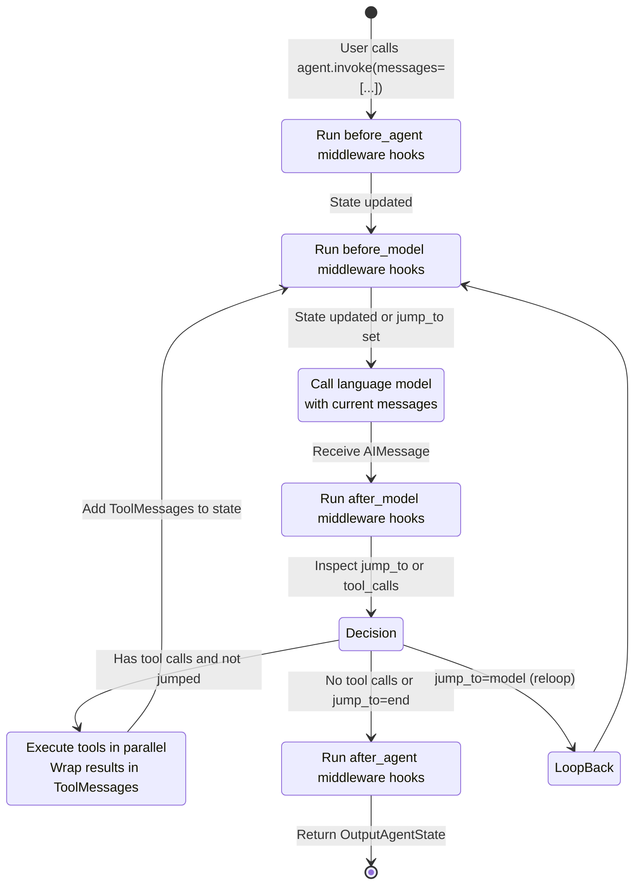

## Overview

LangChain is organized as a **three-layer architecture** designed to separate concerns across abstraction, orchestration, and integration:

1. **langchain-core**: Stable base abstractions for language models, tools, messages, runnables, and prompt templates. This layer is provider-agnostic and defines the contracts that the rest of the ecosystem implements.

2. **langchain** (langchain-v1): High-level agent orchestration, middleware composition, and the Agent Factory. Built on top of LangGraph and langchain-core, it provides the primary user-facing interface for building agents and applications.

3. **partners**: Provider-specific integrations (OpenAI, Anthropic, Ollama, etc.). Each partner package implements the core abstractions (BaseChatModel, embeddings, tools) and is released independently.

This structure enables model interoperability, stable versioning, and independent provider evolution while keeping core abstractions stable across all implementations.

## Dependency Flow

<!-- openwiki: mermaid parse failed and this diagram was converted to a text fence so it does not break rendering. Fix the diagram source and restore the mermaid fence. Parser error: Heuristic: an unescaped angle bracket inside a label breaks rendering; rephrase the label. -->
```text
graph TB
    User["User Applications"]
    
    User -->|imports from| LangChain["langchain<br/>(Orchestration & Agents)<br/>v1.4.0"]
    User -->|may use directly| Core["langchain-core<br/>(Base Abstractions)<br/>v1.6.1"]
    
    LangChain -->|depends on| Core
    LangChain -->|depends on| LangGraph["LangGraph<br/>(State Graph Engine)"]
    
    Partners["Partner Packages<br/>(langchain-openai,<br/>langchain-anthropic, etc.)"]
    Partners -->|implement| Core
    
    User -->|optionally imports| Partners
    LangChain -->|uses| Partners
    
    Classic["langchain-classic<br/>(Legacy)<br/>v1.0.8"]
    Classic -->|depends on| Core
    
    style Core fill:#2d5016,stroke:#4a7c2c,color:#fff
    style LangChain fill:#1f3a70,stroke:#3d5a96,color:#fff
    style Partners fill:#5a3a1a,stroke:#7d5c3c,color:#fff
    style Classic fill:#4a4a4a,stroke:#666,color:#fff
    style LangGraph fill:#3d3d5c,stroke:#555,color:#fff
```

Users typically import from `langchain` (the actively maintained package) to access agents and high-level orchestration. The `langchain-core` layer is available for direct use when building custom implementations. Partner packages are loaded on-demand (often implicitly via `init_chat_model`) and are released independently from the core. `langchain-classic` (legacy) is maintained for backward compatibility but should not be used in new projects.

## Three-Layer Architecture

### Layer 1: langchain-core (Stable Base Abstractions)

**Owns**: Base classes and protocols that define the contract for all LangChain ecosystem implementations.

**Key responsibilities**:

- **Runnable Protocol**: The foundational abstraction for all composable units. `Runnable[Input, Output]` defines `invoke()`, `stream()`, `batch()`, and async variants. All language models, tools, chains, and transformers implement this interface.
  
- **BaseChatModel & LanguageModelInput**: Abstract base for chat models. All provider implementations (ChatOpenAI, ChatAnthropic, etc.) extend this class. Handles message encoding, token streaming, structured output marshaling, and token counting.

- **Messages and Message Types**: The canonical message representation (AIMessage, ToolMessage, UserMessage, SystemMessage, etc.). Enables a unified protocol for model interaction regardless of provider.

- **Tools (BaseTool)**: Abstraction for executable tools. Supports sync/async invocation, schema generation, and structured argument parsing.

- **Prompts, Output Parsers, and Retrievers**: Base abstractions for prompt templates, structured output parsing, and document retrieval—all are Runnables.

- **Callbacks and Tracing**: Callback manager infrastructure for instrumentation, logging, and integration with LangSmith.

**Stability guarantee**: langchain-core follows a strict semantic versioning policy with advance notice of breaking changes. Core abstractions are stable across major versions.

**Location**: `/libs/core/langchain_core/`

### Layer 2: langchain (Agent Orchestration and High-Level APIs)

**Owns**: The Agent Factory, agent middleware system, high-level chat model factory, and LangGraph-based agent execution orchestration.

**Key responsibilities**:

- **Agent Factory (`create_agent()`)**: Constructs a compiled LangGraph state machine that orchestrates the agentic loop. Handles model invocation, tool binding, structured output parsing, and middleware composition. Returns a runnable that accepts messages and yields model responses and tool calls.

- **Agent Middleware System**: Pluggable hooks (`wrap_model_call`, `wrap_tool_call`) for injecting logic at model, tool, and lifecycle boundaries. Middleware composes vertically and can modify request state, rewrite tools dynamically, intercept model responses, and control loop flow.

- **Init Chat Model (`init_chat_model()`)**: Factory function that dynamically loads and instantiates chat models by provider name and model identifier (e.g., `"openai:gpt-4o"`). Handles provider discovery, dependency management, and configuration injection.

- **Structured Output and Response Formatting**: Abstractions for specifying desired output formats (JSON schemas, Pydantic models, tools) and marshaling model responses into typed Python objects.

- **Agent State Management**: The `AgentState` schema, message accumulation with reducers, and ephemeral control fields (e.g., `jump_to` for middleware-driven routing).

**Dependencies**:
- Requires langchain-core for abstractions (Runnable, BaseChatModel, tools, messages)
- Requires LangGraph for state management and graph compilation
- Partner packages loaded on-demand via init_chat_model

**Location**: `/libs/langchain_v1/langchain/agents/`, `/libs/langchain_v1/langchain/chat_models/`

### Layer 3: Partner Integrations (Provider-Specific Implementations)

**Owns**: Each partner package implements core abstractions for a specific model provider or service.

**Common structure**:

- **Chat Models** (e.g., `ChatOpenAI`): Extend `BaseChatModel`, wrap provider API, handle authentication, token counting, streaming, and cost tracking.
- **Embeddings** (e.g., `OpenAIEmbeddings`): Implement embedding model interface.
- **Tools**: Provider-specific tool wrappers and utilities.
- **Structured Output Support**: Provider-specific strategies for enforcing output schemas (e.g., function calling, JSON mode).

**Examples**: langchain-openai, langchain-anthropic, langchain-ollama, langchain-groq, langchain-mistralai

**Release policy**: Partner packages are versioned independently. A partner package update does not require updates to langchain or langchain-core, and vice versa. Each partner manages its own API version pinning and compatibility.

**Location**: `/libs/partners/<provider>/langchain_<provider>/`

---

## Component Interactions

### Chat Model Resolution and Instantiation

The `init_chat_model()` function provides the primary user-facing entry point for chat models:

<!-- openwiki: mermaid parse failed and this diagram was converted to a text fence so it does not break rendering. Fix the diagram source and restore the mermaid fence. Parser error: Heuristic: an unescaped angle bracket inside a label breaks rendering; rephrase the label. -->
```text
sequenceDiagram
    participant User
    participant InitCM as init_chat_model()
    participant Registry as Provider Registry
    participant Partner as Partner Package
    participant Model as ChatOpenAI

    User->>InitCM: init_chat_model(identifier="openai:gpt-4o",<br/>api_key=...)
    InitCM->>InitCM: Parse identifier to provider, model_name
    InitCM->>Registry: Lookup provider config
    Registry-->>InitCM: (module, class, factory_fn)
    InitCM->>Partner: Import langchain_openai
    Partner-->>InitCM: ChatOpenAI class
    InitCM->>Model: factory_fn(ChatOpenAI, model="gpt-4o",<br/>api_key=...)
    Model-->>InitCM: Initialized model instance
    InitCM-->>User: BaseChatModel (ChatOpenAI)
```

The resolution process is lazy: `init_chat_model()` only imports the partner package when the user requests that provider, avoiding hard dependencies.

### Agent Creation and Graph Construction

When `create_agent()` is called, the factory builds a LangGraph state machine:

<!-- openwiki: mermaid parse failed and this diagram was converted to a text fence so it does not break rendering. Fix the diagram source and restore the mermaid fence. Parser error: Heuristic: an unescaped angle bracket inside a label breaks rendering; rephrase the label. -->
```text
sequenceDiagram
    participant User
    participant Factory as Agent Factory
    participant StateGraph as LangGraph<br/>StateGraph
    participant Middleware as Middleware Stack
    participant Graph as Compiled Graph

    User->>Factory: create_agent(model, tools, middleware=[...])
    Factory->>Factory: Merge middleware state schemas
    Factory->>StateGraph: new StateGraph(merged_AgentState)
    Factory->>StateGraph: add_node("model", model_node)
    Factory->>StateGraph: add_node("tools", tool_node)
    Factory->>StateGraph: add_edge(START, entry_node)
    
    Factory->>Middleware: Compose wrap_model_call layers
    Factory->>Middleware: Compose wrap_tool_call layers
    
    Factory->>StateGraph: set_entry_point(entry_node)
    Factory->>StateGraph: add_conditional_edges(after_model_node,<br/>route_to_tools_or_exit)
    
    Factory->>Graph: compile()
    Graph-->>Factory: CompiledStateGraph
    Factory-->>User: Runnable agent
```

The compiled graph is a `Runnable[InputAgentState, OutputAgentState]`. Users invoke it with a list of messages; the agent orchestrates the model-tool loop internally.

### Agent Execution Loop

Once compiled and invoked, the agent follows this sequence:



The `jump_to` field enables middleware to override routing (e.g., exit early, restart the model, skip tools). The `messages` field accumulates all messages (user, assistant, tool results) using the `add_messages` reducer, providing full conversation history to each model invocation.

---

## Key Architectural Patterns

### Runnable Composition

All composable units (models, chains, tools, prompt templates) implement the `Runnable` protocol. This enables seamless composition:

```python
# langchain-core defines the pattern
chain = prompt | model | output_parser

# Works regardless of provider
model = init_chat_model("openai:gpt-4o")  # ChatOpenAI
model = init_chat_model("anthropic:claude-3")  # ChatAnthropic
```

Providers implement `BaseChatModel` (a Runnable), and the composition works identically.

### Middleware as Composable Hooks

The Agent Factory supports multiple middleware layers, each implementing one or more hooks:

- `wrap_model_call(request, handler)`: Intercept and modify model requests, rewrite tools, post-process responses, or implement retry logic.
- `wrap_tool_call(request, handler)`: Intercept tool invocations, implement custom execution, or handle dynamic tools.
- Lifecycle hooks: `before_agent`, `before_model`, `after_model`, `after_agent`.

Middleware is composed as a stack (inner → outer), enabling concerns like observability, safety, or logging to be added orthogonally.

### Provider Abstraction

Partners implement `BaseChatModel` but are free to extend it with provider-specific features. The core interface remains stable:

```python
class BaseChatModel(Runnable[LanguageModelInput, AIMessage]):
    def invoke(self, input: LanguageModelInput) -> AIMessage: ...
    async def ainvoke(self, ...) -> AIMessage: ...
    def stream(self, input: LanguageModelInput) -> Iterator[AIMessageChunk]: ...
```

Provider-specific structured output, cost tracking, and streaming options are layered on top without breaking the core contract. This allows users to swap models with minimal code changes.

### Stable Core, Fluid Orchestration

The core layer (langchain-core) is intentionally minimal and stable. Orchestration logic, middleware, and high-level patterns live in the langchain layer, which can evolve more rapidly. Partners remain independent, allowing rapid integration of new providers without coordinating core or langchain releases.

---

## Versioning and Release Policy

- **langchain-core** (`v1.6.1`): Stable base abstractions. Major version bumps are rare and announced in advance. Deprecations carry multiple minor versions of notice. This is the "least-moving" part of the ecosystem.

- **langchain** (`v1.4.0`): Main user-facing package. Minor versions may add new agent patterns, middleware types, or orchestration improvements. Patch versions fix bugs. Requires specific langchain-core version (e.g., `>=1.6.0,<2.0.0`).

- **langchain-classic** (`v1.0.8`): Legacy package for backward compatibility. Provides old chains, `langchain-community` re-exports, and deprecated APIs. New projects should use `langchain` instead.

- **Partner packages**: Independent versioning. langchain-openai, langchain-anthropic, etc., release on their own schedules. Partners declare dependencies on langchain-core (required) and optionally langchain (optional, only if they provide middleware or agent-specific features).

---

## Key Files and Symbols

### langchain-core

- `Runnable[Input, Output]` (`/libs/core/langchain_core/runnables/base.py`): The foundational protocol for all composable units. Defines `invoke()`, `stream()`, `batch()`, and async variants.

- `BaseChatModel` (`/libs/core/langchain_core/language_models/chat_models.py`): Abstract base for all chat models. Providers extend this class.

- `BaseTool` (`/libs/core/langchain_core/tools/`): Abstract base for tools. Enables schema generation, structured argument parsing, and sync/async execution.

- Messages (`/libs/core/langchain_core/messages/`): `AIMessage`, `ToolMessage`, `UserMessage`, `SystemMessage`, etc. Form the canonical message representation.

### langchain

- `create_agent()` (`/libs/langchain_v1/langchain/agents/factory.py`): Constructs the agent graph. Accepts model, tools, middleware, and returns a compiled Runnable.

- `init_chat_model()` (`/libs/langchain_v1/langchain/chat_models/base.py`): Factory function for dynamically loading chat models by provider identifier.

- `AgentMiddleware` (`/libs/langchain_v1/langchain/agents/middleware/types.py`): Base class for middleware. Users subclass this to implement custom hooks.

- `AgentState` (`/libs/langchain_v1/langchain/agents/middleware/types.py`): TypedDict defining the agent's state schema. Extensible via middleware `state_schema` attribute.

### Partners

- `ChatOpenAI` (`/libs/partners/openai/langchain_openai/chat_models/base.py`): Extends BaseChatModel, wraps the OpenAI API, handles streaming and structured output.

- Similar implementations exist for Anthropic, Groq, Ollama, Mistral, and other providers.

---

## Extension Points

### Implementing a Custom Model Provider

To add a new provider (e.g., a private LLM service):

1. Create a new package: `langchain_myprovider/`
2. Extend `BaseChatModel` with your API client
3. Implement required methods: `_generate()` (or `_stream()` for streaming support), `_llm_type`, `model_parameters`
4. Optionally add middleware for provider-specific features
5. Register in `init_chat_model()` by PR to langchain (or publish independently and users can instantiate directly)

### Implementing Middleware

To add cross-cutting concerns (logging, rate-limiting, validation):

1. Extend `AgentMiddleware`
2. Implement one or more hooks: `wrap_model_call()`, `wrap_tool_call()`, `before_agent()`, `after_agent()`, etc.
3. Optionally declare a `state_schema` to extend the agent's state
4. Pass to `create_agent(middleware=[...])`

Middleware stacks vertically; each layer can wrap the next, enabling composition of unrelated concerns.

### Custom Tools

Tools are Runnables and can be defined as Python functions annotated with `@tool` or by extending `BaseTool`:

```python
from langchain_core.tools import BaseTool

class MyTool(BaseTool):
    name = "my_tool"
    description = "Does something useful"
    
    def _run(self, arg: str) -> str:
        return f"Result for {arg}"
```

Tools are bound to agents at creation time and made available to the model for invocation.

---

## Dependency Summary

| Package | Depends On | Role |
|---------|-----------|------|
| **langchain-core** | langsmith, httpx, pydantic | Base abstractions; stable |
| **langchain** | langchain-core, langgraph, pydantic | Agent orchestration; user-facing |
| **langchain-classic** | langchain-core, langchain-text-splitters, pydantic | Legacy chains and community re-exports |
| **langchain-openai** | langchain-core, openai SDK | OpenAI integration (ChatOpenAI, embeddings) |
| **langchain-anthropic** | langchain-core, anthropic SDK | Anthropic integration (ChatAnthropic) |
| **langchain-ollama** | langchain-core, ollama SDK | Ollama integration (ChatOllama) |
| **langchain-groq** | langchain-core, groq SDK | Groq integration (ChatGroq) |

Partners only depend on langchain-core (the abstractions), not langchain (the orchestration), enabling independent release cycles.
