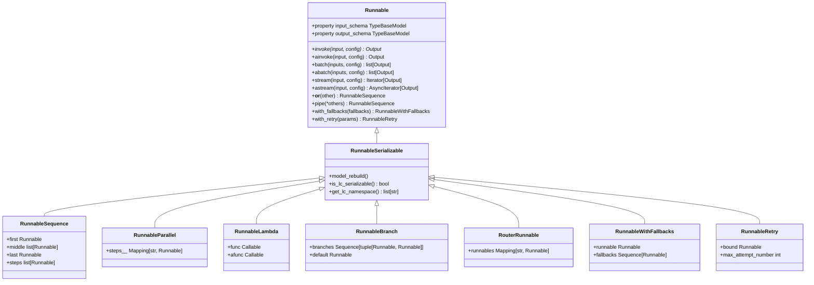
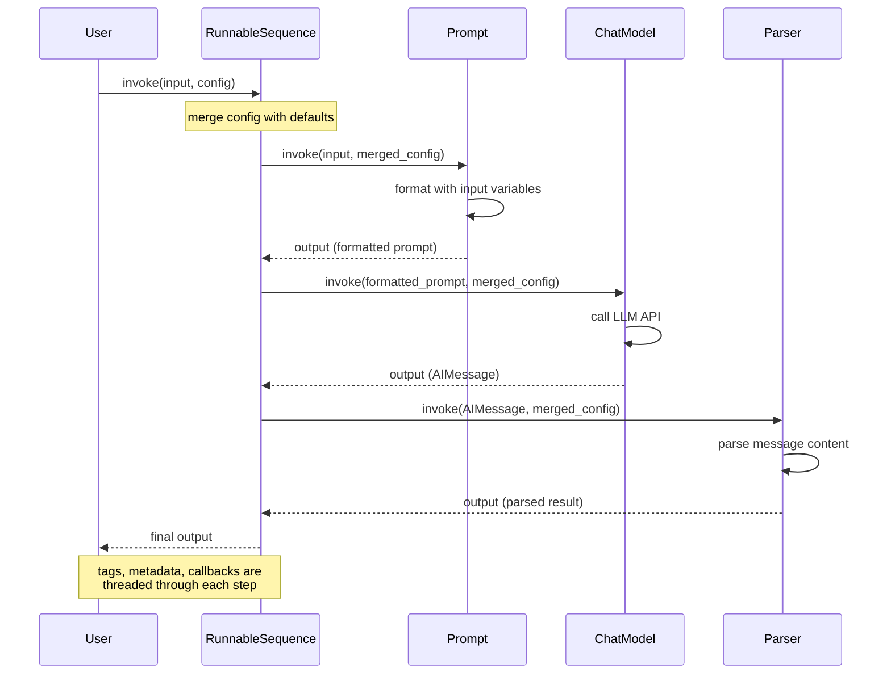

## Overview

**Runnable** is the fundamental abstraction in LangChain's core layer. It defines a serializable, composable interface that every LLM component—prompts, models, tools, chains, output parsers—must implement. A `Runnable` is a unit of work that transforms input into output through five core operations: synchronous invoke, asynchronous invoke, batch processing, streaming, and introspection of input/output schemas.

The **LangChain Expression Language (LCEL)** leverages Runnables to build chains declaratively using composition operators. Any chain built from Runnables automatically inherits sync, async, batch, and streaming support without additional implementation. This unifies execution patterns and enables sophisticated control flows—sequential piping (`|`), parallel forking (`+`), branching, fallback handling, and retry logic—all composable as first-class operations.

## Core Runnable Protocol

**Location**: `repo://libs/core/langchain_core/runnables/base.py#L133-L265`

The `Runnable` abstract base class defines the contract for all components. A Runnable is generic over input and output types (`Runnable[Input, Output]`) and must implement the abstract `invoke` method. All other execution methods have default implementations that subclasses can override for optimization.

### Key Responsibilities

1. **Invoke**: Execute a single input synchronously and return a single output.
2. **Batch**: Process multiple inputs in parallel (default uses thread pool, subclasses can optimize).
3. **Stream**: Yield partial outputs as they are produced (default calls invoke once; specialized for streaming models).
4. **Async variants**: Asynchronous versions of invoke, batch, and stream (default delegates to sync via executor; subclasses implement natively).
5. **Schema introspection**: Expose input type, output type, and configuration schema as Pydantic models for validation and tooling.
6. **Composition**: Support chaining with other Runnables via operators and methods.

### Synchronous Methods

**`invoke(input, config=None)`** (`repo://libs/core/langchain_core/runnables/base.py#L885-L906`) is the abstract core method:

```python
@abstractmethod
def invoke(
    self,
    input: Input,
    config: RunnableConfig | None = None,
    **kwargs: Any,
) -> Output:
    """Transform a single input into an output."""
```

- **Must be implemented** by all subclasses.
- Accepts optional `RunnableConfig` for tags, metadata, callbacks, recursion limits, and configurable parameters.
- Returns a single output.

**`batch(inputs, config=None, return_exceptions=False)`** (`repo://libs/core/langchain_core/runnables/base.py#L931-L975`) processes multiple inputs:

```python
def batch(
    self,
    inputs: list[Input],
    config: RunnableConfig | list[RunnableConfig] | None = None,
    *,
    return_exceptions: bool = False,
    **kwargs: Any | None,
) -> list[Output]:
    """Default implementation runs invoke in parallel using a thread pool executor."""
```

- **Default**: Calls `invoke` for each input in parallel via `ThreadPoolExecutor`.
- Accepts a single config (applied to all) or a list of configs (one per input).
- If `return_exceptions=True`, exceptions are returned as-is in the output list; otherwise, they are raised.
- Subclasses override for batching-aware backends (e.g., LLMs with batch API support).

**`batch_as_completed(inputs, config=None, return_exceptions=False)`** yields results as they complete, useful for streaming partial results while processing.

**`stream(input, config=None)`** (`repo://libs/core/langchain_core/runnables/base.py#L1194-L1213`) yields partial outputs:

```python
def stream(
    self,
    input: Input,
    config: RunnableConfig | None = None,
    **kwargs: Any | None,
) -> Iterator[Output]:
    """Default implementation of stream, which calls invoke."""
```

- **Default**: Yields one full output from `invoke`.
- **Specialized implementations** (e.g., chat models, token-streaming parsers) yield chunks as they arrive.
- Enables responsive UX by progressive output display.

### Asynchronous Methods

**`ainvoke(input, config=None)`** (`repo://libs/core/langchain_core/runnables/base.py#L908-L929`) is the async variant:

```python
async def ainvoke(
    self,
    input: Input,
    config: RunnableConfig | None = None,
    **kwargs: Any,
) -> Output:
    """Transform a single input into an output."""
```

- **Default**: Delegates to sync `invoke` via `run_in_executor`.
- **Subclasses override** for native async (e.g., async API calls).

**`abatch(inputs, config=None, return_exceptions=False)`** (`repo://libs/core/langchain_core/runnables/base.py#L1066-L1112`) batches async:

```python
async def abatch(
    self,
    inputs: list[Input],
    config: RunnableConfig | list[RunnableConfig] | None = None,
    *,
    return_exceptions: bool = False,
    **kwargs: Any | None,
) -> list[Output]:
    """Default implementation runs ainvoke in parallel using asyncio.gather."""
```

- Calls `ainvoke` for each input concurrently.
- Respects `max_concurrency` from config to limit parallelism.

**`abatch_as_completed(inputs, config=None, return_exceptions=False)`** yields completed async results as they finish.

**`astream(input, config=None)`** (`repo://libs/core/langchain_core/runnables/base.py#L1215-L1234`) is the async streaming variant:

```python
async def astream(
    self,
    input: Input,
    config: RunnableConfig | None = None,
    **kwargs: Any | None,
) -> AsyncIterator[Output]:
    """Default implementation of astream, which calls ainvoke."""
```

- **Default**: Yields one output from `ainvoke`.
- **Specialized** for streaming backends.

### Schema Introspection

**`input_schema` / `output_schema`** (`repo://libs/core/langchain_core/runnables/base.py#L374-L527`) expose the input and output types as Pydantic models:

```python
@property
def input_schema(self) -> TypeBaseModel:
    """The type of input this Runnable accepts specified as a Pydantic model."""
    return self.get_input_schema()

@property
def output_schema(self) -> TypeBaseModel:
    """The type of output this Runnable produces specified as a Pydantic model."""
    return self.get_output_schema()
```

- Inferred from generic type parameters or implementer-provided type hints.
- Can be converted to JSON Schema for API documentation, validation, and tools.

**`config_schema(include=None)`** returns a Pydantic model for configuration fields marked as configurable via `configurable_fields()` or `configurable_alternatives()`.

## Composition Operators and Methods

The heart of LCEL is declarative composition. Runnables are chained together using operators and methods that create new composite Runnables.

### Sequential Composition: Pipe Operator `|`

**`__or__(other)` / `__ror__(other)`** (`repo://libs/core/langchain_core/runnables/base.py#L648-L722`) creates a `RunnableSequence`:

```python
def __or__(self, other):
    """Runnable "or" operator. Compose this Runnable with another to create RunnableSequence."""
    return RunnableSequence(self, coerce_to_runnable(other))
```

**Example**:
```python
from langchain_core.runnables import RunnableLambda
from langchain_core.prompts import PromptTemplate
from langchain_core.output_parsers import StrOutputParser

prompt = PromptTemplate.from_template("Tell me about {topic}")
model = ChatOpenAI()
parser = StrOutputParser()

chain = prompt | model | parser
result = chain.invoke({"topic": "machine learning"})
# result is a string, the parsed model output
```

- `other` can be another `Runnable`, a callable, a dict (coerced to `RunnableParallel`), or any `RunnableLike`.
- Automatically flattens nested `RunnableSequence` for efficiency.
- The output of the left side becomes the input to the right side.

**`pipe(*others, name=None)`** (`repo://libs/core/langchain_core/runnables/base.py#L724-L771`) is the explicit method form:

```python
sequence = runnable_1.pipe(runnable_2, runnable_3)
# Equivalent to: runnable_1 | runnable_2 | runnable_3
```

### Parallel Composition: Fork with Dict

**Dict literal** or **`RunnableParallel`** (`repo://libs/core/langchain_core/runnables/base.py#L3864-L3990`) invokes multiple Runnables concurrently with the same input:

```python
from langchain_core.runnables import RunnableParallel

# Via dict literal in a sequence
sequence = input_runnable | {
    "branch_a": runnable_a,
    "branch_b": runnable_b,
}

# Explicit RunnableParallel
parallel = RunnableParallel(
    result1=runnable_1,
    result2=runnable_2,
)
```

- All runnables receive the same input.
- Results are collected into a dict with user-specified keys.
- Execution is parallel via `asyncio.gather` or thread pool.
- Useful for processing branches in parallel: multi-chain retrieval, multi-aspect analysis, etc.

### Sequencing with RunnableSequence

**Location**: `repo://libs/core/langchain_core/runnables/base.py#L3075-L3235`

`RunnableSequence` is the composition engine for sequential execution. It chains multiple `Runnable` objects where each output feeds into the next input. The `first`, `middle`, and `last` attributes store the steps; the sequence automatically optimizes batch and stream operations by calling each step's batch/stream method in order.

```python
from langchain_core.runnables import RunnableSequence

sequence = RunnableSequence(
    first=prompt,
    middle=[some_runnable],
    last=parser,
)

# Equivalent to: prompt | some_runnable | parser
```

**Key behavior**:
- **Batching**: Each step in the sequence is called with the batch of inputs from the previous step. If a step's batch is optimized (e.g., for an LLM API), the entire chain benefits.
- **Streaming**: If all steps implement `transform` (streaming input → streaming output), the sequence streams end-to-end. Otherwise, streaming begins after the last blocking step.
- **Async**: Async variants call each step's async method in order via `asyncio.gather` for parallelizable steps within the chain.

### Branching: RunnableBranch

**Location**: `repo://libs/core/langchain_core/runnables/branch.py#L43-L150`

`RunnableBranch` selects and runs one of several branches based on a condition:

```python
from langchain_core.runnables import RunnableBranch

branch = RunnableBranch(
    (lambda x: isinstance(x, str), lambda x: x.upper()),
    (lambda x: isinstance(x, int), lambda x: x + 1),
    lambda x: "default",  # fallback if no condition matches
)

branch.invoke("hello")  # "HELLO"
branch.invoke(42)       # 43
branch.invoke(None)     # "default"
```

- Takes a list of `(condition, runnable)` tuples and a default runnable.
- Conditions are Runnables or callables returning bool.
- At invoke time, the first condition that returns `True` is selected; its runnable is executed on the input.
- If no condition matches, the default runnable is run.
- Conditions are evaluated sequentially; use judiciously for complex logic.

### Routing: RouterRunnable

**Location**: `repo://libs/core/langchain_core/runnables/router.py#L46-L150`

`RouterRunnable` routes to a runnable by key:

```python
from langchain_core.runnables import RouterRunnable

router = RouterRunnable(runnables={
    "math": math_chain,
    "text": text_chain,
})

router.invoke({"key": "math", "input": "2 + 2"})  # Uses math_chain
```

- Input is a dict with `"key"` (string identifying the route) and `"input"` (the actual data).
- The selected runnable processes the input.
- Useful for dispatch tables and multi-expert architectures.

### Fallback and Retry

**Fallbacks**: `RunnableWithFallbacks` (`repo://libs/core/langchain_core/runnables/fallbacks.py#L37-L150`)

```python
from langchain_core.runnables import RunnableWithFallbacks

model = ChatOpenAI().with_fallbacks([ChatAnthropic(), ChatCohere()])
# Try ChatOpenAI first, then ChatAnthropic, then ChatCohere if prior ones fail.

result = model.invoke("Hello")  # Returns first successful result
```

- Executes the primary runnable.
- If it fails with an exception in `exceptions_to_handle`, tries the next fallback.
- Proceeds until one succeeds or all fail.
- Optionally passes exceptions to fallbacks for adaptive recovery.

**Retry**: `RunnableRetry` (`repo://libs/core/langchain_core/runnables/retry.py#L48-L150`)

```python
runnable = ChatOpenAI().with_retry(
    retry_if_exception_type=(APIError,),
    stop_after_attempt=3,
    wait_exponential_jitter=True,
)
# Retries on APIError up to 3 times with exponential backoff + jitter.
```

- Uses `tenacity` for retry logic.
- Configurable stop conditions, wait strategies, and exception types.
- Best applied to individual runnables (e.g., LLM calls) rather than entire chains.

## RunnableConfig: Threading Context

**Location**: `repo://libs/core/langchain_core/runnables/config.py#L57-L129`

`RunnableConfig` is a `TypedDict` that carries execution context through the chain:

```python
class RunnableConfig(TypedDict, total=False):
    tags: list[str]              # For filtering runs, grouping telemetry
    metadata: dict[str, Any]     # Arbitrary metadata (JSON-serializable)
    callbacks: Callbacks         # Lifecycle handlers (on_start, on_end, on_error, etc.)
    run_name: str                # Name for tracing/logging
    max_concurrency: int | None  # Limit parallel execution
    recursion_limit: int         # Prevent infinite recursion (default 25)
    configurable: dict[str, Any] # Runtime config overrides for configurable fields
    run_id: uuid.UUID | None     # Unique execution ID
```

- **Propagation**: Config is threaded through child runnables via context variables (`var_child_runnable_config`) and explicit parameter passing.
- **Merging**: Configs are merged when passed down (e.g., tags accumulate: parent tags + child tags).
- **Callbacks**: Attached callbacks receive hooks for all intermediate steps, enabling observability and custom logic.
- **Configurable fields**: The `configurable` dict supplies runtime values for fields marked with `configurable_fields()` or `configurable_alternatives()`, enabling dynamic behavior.

## Core Runnable Types

### RunnableLambda

**Location**: `repo://libs/core/langchain_core/runnables/base.py#L4703-L4850`

`RunnableLambda` wraps a Python callable into a `Runnable`:

```python
from langchain_core.runnables import RunnableLambda

def add_one(x: int) -> int:
    return x + 1

runnable = RunnableLambda(add_one)
runnable.invoke(1)  # 2

# Async support
async def add_one_async(x: int) -> int:
    return x + 1

runnable = RunnableLambda(add_one, afunc=add_one_async)
await runnable.ainvoke(1)  # 2
```

- Ideal for wrapping custom logic, data transformations, and simple operations.
- If a lambda returns a `Runnable`, that runnable is automatically invoked.
- Does not support streaming by default (use `RunnableGenerator` for streaming lambdas).
- Automatically detects async callables and provides native async support.

### RunnableGenerator

Wraps generator functions (sync or async) to create streaming runnables.

### RunnableParallel

Already described above; runs multiple runnables concurrently on the same input and collects results into a dict.

### RunnableMap (Alias for RunnableParallel)

Synonymous with `RunnableParallel`.

### RunnablePassthrough

**Location**: `repo://libs/core/langchain_core/runnables/passthrough.py`

Passes input through unchanged, useful in parallel branches to preserve input for later steps.

```python
from langchain_core.runnables import RunnablePassthrough

chain = prompt | {
    "original_input": RunnablePassthrough(),
    "model_output": model,
}
# Output: {"original_input": <input>, "model_output": <model result>}
```

### RunnablePick

Selects specific keys from dict output:

```python
chain | RunnablePick("key_a")  # Output only "key_a"
# Or: chain.pick(["key_a", "key_b"])
```

### RunnableAssign

Adds new fields to dict output by invoking additional runnables:

```python
chain.assign(new_field=some_runnable)
# Output now includes original fields + new_field
```

## Runnable Hierarchy

The following diagram shows the core Runnable class hierarchy:



Class hierarchy of core Runnable types and their relationships.

## Execution Flow: Invoke and Config Propagation

The following diagram shows how a config and execution flow through a composed chain:



Execution flow through a sequential composition with config propagation.

## RunnableLike and Type Coercion

**Location**: `repo://libs/core/langchain_core/runnables/base.py#L6608-L6664`

`RunnableLike` is a union type that accepts anything composable:

```python
RunnableLike = (
    Runnable[Input, Output]
    | Callable[[Input], Output]
    | Callable[[Input], Awaitable[Output]]
    | Callable[[Iterator[Input]], Iterator[Output]]
    | Callable[[AsyncIterator[Input]], AsyncIterator[Output]]
    | Mapping[str, Any]
)
```

**`coerce_to_runnable(thing)`** converts any `RunnableLike` into a `Runnable`:

```python
def coerce_to_runnable(thing: RunnableLike) -> Runnable:
    """Coerce a Runnable-like object into a Runnable."""
    if isinstance(thing, Runnable):
        return thing  # Already a Runnable
    if is_async_generator(thing) or inspect.isgeneratorfunction(thing):
        return RunnableGenerator(thing)  # Wrap generators
    if callable(thing):
        return RunnableLambda(thing)  # Wrap functions
    if isinstance(thing, dict):
        return RunnableParallel(thing)  # Coerce dicts to parallel
    raise TypeError("...")  # Unsupported type
```

This enables the intuitive syntax: `prompt | my_function | {"field": another_function}`. Each element is automatically coerced to a Runnable.

## Configuration and Extensibility

### Configurable Fields

**`configurable_fields(**fields)`** marks fields as runtime-configurable:

```python
from langchain_core.runnables import ConfigurableField

model = ChatOpenAI(
    model="gpt-4"
).configurable_fields(
    model=ConfigurableField(
        id="model_name",
        name="Model Name",
        description="The model to use",
    )
)

# At runtime, override the model:
result = model.invoke(
    "Hello",
    config={"configurable": {"model_name": "gpt-3.5-turbo"}}
)
```

- Fields are exposed in `config_schema()`.
- Runtime values are applied before invoke.

### Callbacks and Tracing

Runnables integrate with the callback system via `RunnableConfig`:

```python
from langchain_core.tracers import ConsoleCallbackHandler

chain.invoke(
    input,
    config={
        "callbacks": [ConsoleCallbackHandler()],
        "tags": ["production", "query"],
        "metadata": {"user_id": 123},
    }
)
```

Callbacks receive hooks for:
- `on_runnable_start`: When a step begins
- `on_runnable_end`: When a step completes successfully
- `on_runnable_error`: When a step fails
- `on_llm_new_token`: Token-by-token streaming
- And many others

This enables real-time monitoring, custom logging, user attribution, and performance tracking.

## All Components Are Runnables

A key design principle: **everything is a Runnable**. This includes:

- **Prompts** (`PromptTemplate`, `ChatPromptTemplate`): Format input variables into messages.
- **Chat Models** (`ChatOpenAI`, `ChatAnthropic`): Invoke LLM APIs.
- **Output Parsers** (`JsonOutputParser`, `StrOutputParser`): Parse model output into structured types.
- **Retrievers** (`VectorStoreRetriever`, `BM25Retriever`): Fetch relevant documents.
- **Tools** (`BaseTool`): Callable functions with schemas.
- **Chains**: Composite runnables built from other runnables.
- **Agents**: Orchestrate tools and runnables in feedback loops.

Because all are Runnables, any can be composed with any other via `|`, parallelized, retried, and monitored uniformly.

## Simple Example: Prompt → Model → Parser Chain

```python
from langchain_core.prompts import PromptTemplate
from langchain_core.chat_models import ChatOpenAI
from langchain_core.output_parsers import JsonOutputParser

# Define input schema
class TopicInfo(BaseModel):
    topic: str
    examples: list[str]

# Create the chain
prompt = PromptTemplate.from_template(
    "Provide 3 examples of {topic} in JSON format:\n"
    "{format_instructions}"
)
model = ChatOpenAI(model="gpt-4")
parser = JsonOutputParser(pydantic_object=TopicInfo)

chain = prompt | model | parser

# Invoke
result = chain.invoke({
    "topic": "machine learning algorithms",
    "format_instructions": parser.get_format_instructions(),
})
# result is a TopicInfo instance with topic and examples

# Batch
results = chain.batch([
    {"topic": "AI", ...},
    {"topic": "NLP", ...},
    {"topic": "Vision", ...},
])
# results is a list of TopicInfo instances, processed in parallel

# Stream
for chunk in chain.stream({"topic": "Reinforcement Learning", ...}):
    print(chunk)  # Yields intermediate outputs as they arrive
```

## Key Invariants and Design Patterns

### Serializability

All core Runnables are serializable via LangChain's serialization system. This enables:
- Saving chains to JSON or YAML for deployment
- Reproducing chains from persisted configs
- Sharing chain definitions across services

### Immutability and Fluent API

Composition methods (`with_fallbacks`, `with_retry`, `pick`, `assign`, etc.) return new `Runnable` instances; they do not mutate the original. This enables safe chaining and allows reuse of components.

### Type Transparency

Input and output types are exposed and enforced:
- `input_schema` validates input before invoke
- `output_schema` documents expected output for tools and UIs
- JSON schema generation enables API/OpenAPI documentation

### Lazy Execution

Chains are constructed lazily—composing with `|` does not execute anything. Execution happens only on `invoke`, `batch`, `stream`, or async variants.

### Streaming as a First-Class Concern

Streaming is not an afterthought; it is a core execution mode. Every Runnable exposes `stream` and `astream`, enabling responsive and incremental output.

### Concurrency and Parallelism

Batch operations use thread pools or asyncio concurrency to process inputs in parallel. Config controls parallelism via `max_concurrency`. Async methods are first-class, enabling high-concurrency server deployments.
