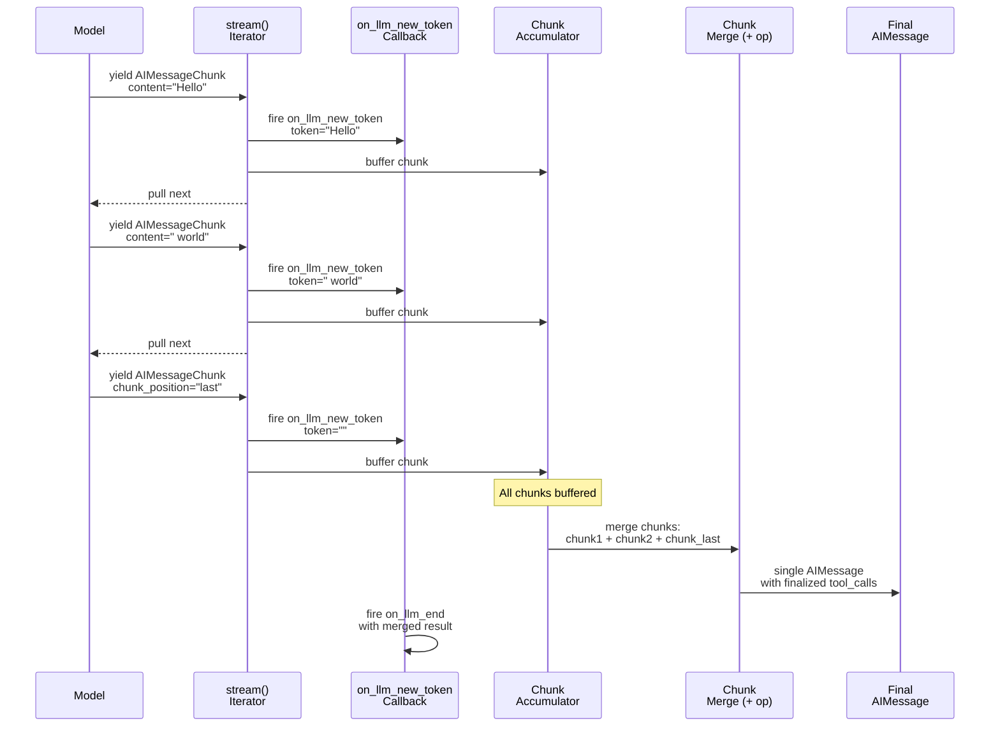

## Overview

**Streaming** is the mechanism by which LangChain delivers model output incrementally, token by token, rather than waiting for the entire response. This enables real-time feedback in web UIs, console displays, and other user-facing contexts, and forms the foundation for building responsive applications that do not block on model latency.

Instead of blocking with `invoke()` until a full response is ready, applications call `stream()` or `astream()` and receive a sequence of partial outputs as they arrive from the model. Each chunk is an `AIMessageChunk` carrying delta content. Callbacks intercept these chunks via the `on_llm_new_token` event, making it possible to observe, log, or react to each token without collecting the entire response first.

Streaming flows through chains—prompts, models, output parsers, and other runnables—preserving incremental output delivery at each stage. By composition, a chain automatically supports streaming if all its components do. This page documents the mechanics of streaming across components, the trade-offs versus non-streaming invoke, and how to integrate streaming into applications.

## Synchronous Streaming: stream()

**Location**: `repo://libs/core/langchain_core/language_models/chat_models.py#L727-L856`

`BaseChatModel.stream()` is the primary synchronous streaming entry point. It yields `AIMessageChunk` objects as they are produced by the underlying model, with incremental content—a single token, a fragment of JSON, or a structured block update.

### Control Flow

1. **Check if streaming is implemented**: `_should_stream()` determines whether the model supports streaming. It checks:
   - Whether `_stream()` is implemented on the model (not inherited from base)
   - Whether streaming is explicitly disabled via `disable_streaming`, `stream=False`, or `streaming=False` on the model
   - Whether an explicit `stream=True` kwarg is passed
   - Whether a streaming callback handler is attached to the model
   
   If streaming is not supported, `stream()` falls back to `invoke()` and yields one complete result cast to `AIMessageChunk`.

2. **Initialize callbacks**: A `CallbackManager` is configured from the provided `RunnableConfig`, binding callbacks, tags, and metadata for tracing and observability.

3. **Fire on_chat_model_start**: The callback lifecycle begins with `on_chat_model_start`, signaling that LLM invocation is beginning. This event is fired before the first token is yielded.

4. **Acquire rate limit**: If a rate limiter is attached to the model, `stream()` acquires a permit before beginning, blocking until the rate limit allows.

5. **Iterate model chunks**: For each `ChatGenerationChunk` from the underlying `_stream()` implementation:
   - The chunk's message ID is set to a unique run ID (prefixed with `LC_ID_PREFIX`) if not already present, ensuring traceability.
   - Response metadata (model provider, latency, token usage, etc.) is computed and attached via `_gen_info_and_msg_metadata()`.
   - If the model's output version is "v1" (content-block structured format), content is transformed to content blocks and indexed.
   - **on_llm_new_token is fired** with the chunk's content and the full chunk object, allowing callbacks to observe or buffer each token.
   - The chunk message is cast to `AIMessageChunk` and yielded immediately to the caller.
   - Chunks are accumulated in memory for later aggregation.

6. **Yield final "last" chunk**: After the model finishes, if no explicit `chunk_position="last"` was set, an empty chunk with `chunk_position="last"` is yielded. This signals to parsers and consumers that the stream is complete and that `tool_call_chunks` should be finalized into complete `tool_calls`.

7. **Callback lifecycle closes**: If successful, `on_llm_end` fires with a merged `ChatGeneration` containing all chunks. If an exception occurs, `on_llm_error` fires with partial accumulation, allowing callbacks to observe failures before the exception is re-raised.

### Fallback Behavior

If the model does not implement streaming (checked via `_should_stream(async_api=False)`), `stream()` delegates to `invoke()` and yields a single result cast to `AIMessageChunk`. This ensures all models provide a consistent streaming interface, even if only non-streaming invoke is available.

## Asynchronous Streaming: astream()

**Location**: `repo://libs/core/langchain_core/language_models/chat_models.py#L858-L991`

`BaseChatModel.astream()` is the async variant of `stream()`, mirroring the synchronous logic but using async/await and `AsyncCallbackManager`.

**Key differences**:
- Uses `await` for callback events (`await run_manager.on_llm_new_token(...)`, `await run_manager.on_llm_end(...)`)
- Iterates via `async for chunk in self._astream(...)`
- Acquires rate limit via `await self.rate_limiter.aacquire(blocking=True)`

The async streaming protocol is identical to sync: check `_should_stream(async_api=True)`, initialize callbacks, yield chunks immediately as they arrive, fire callbacks per token, finalize tool call chunks on the "last" signal.

### Async/Await Patterns

Applications using `astream()` should consume the async iterator in a loop:

```python
async for chunk in model.astream(messages):
    # Process chunk immediately
    print(chunk.content, end="", flush=True)

# OR collect chunks for later processing
chunks = []
async for chunk in model.astream(messages):
    chunks.append(chunk)
final_message = sum(chunks)  # Merge via + operator
```

## Message Chunks: Types and Composition

**Location**: `repo://libs/core/langchain_core/messages/ai.py#L418-L536`

During streaming, models emit **chunk variants** of standard message types. All chunk types inherit from `BaseMessageChunk` and are designed to be **mergeable** via the `+` operator, enabling efficient aggregation of streaming output.

### Message Chunk Types

Each core message type has a corresponding chunk variant:

- **`AIMessageChunk`**: Emitted by chat models during streaming. Contains:
  - `content`: String or list of content blocks (delta for that step).
  - `tool_call_chunks`: List of `ToolCallChunk` objects (incomplete tool calls being streamed).
  - `chunk_position`: Optional `"last"` sentinel signaling stream completion.
  - `response_metadata`: Model metadata (latency, provider, usage counts, etc.).

- **`HumanMessageChunk`**: Represents incremental user input. Used in streaming scenarios where user messages arrive in chunks (e.g., real-time voice transcription or chunked uploads).

- **`SystemMessageChunk`**: Represents incremental system prompt updates. Less common than AIMessageChunk but available for consistency.

- **`ToolMessageChunk`**: Represents incremental tool results. Supports streaming tool outputs that arrive in chunks (e.g., file downloads, streaming API responses).

All chunk types support the `+` operator for merging, making them composable at any level of a streaming pipeline.

### AIMessageChunk Structure

`AIMessageChunk` is the message type yielded during streaming. Unlike `AIMessage`, it represents a **partial, incremental update** to a conversation message and supports merging via the `+` operator.

**Fields**:
- **content**: String or list of content blocks (when `output_version="v1"`). During streaming, each chunk contains only the new token(s) or delta for that step. Content accumulates across chunks: text chunks concatenate, JSON chunks may append partial objects or arrays.
- **tool_call_chunks**: List of `ToolCallChunk` objects (incomplete tool calls being streamed). These are progressively updated as the model produces call ID, function name, and argument JSON. Arguments are accumulated and parsed incrementally via `parse_partial_json()`.
- **chunk_position**: Optional sentinel; when set to `"last"`, indicates the final chunk in the stream, triggering finalization of tool calls and reasoning blocks. When this chunk is aggregated, `tool_call_chunks` are parsed into complete `tool_calls` and `invalid_tool_calls` via the `init_tool_calls()` validator.
- **response_metadata**: Model-specific metadata (latency, model_provider, usage counters, finish reason, etc.) attached by the streaming handler. Metadata is merged across chunks, with usage counts summed.

### Merging Chunks via the + Operator

Streaming chunks accumulate via the `+` operator (implemented in `add_ai_message_chunks()`), which:

1. **Merges content**: Text content is concatenated; structured content blocks are merged according to block type.
2. **Concatenates tool_call arguments**: Arguments from tool_call_chunks are appended progressively, enabling incremental JSON parsing.
3. **Combines metadata**: Response metadata and usage counts are merged; for duplicated keys, later values override (except usage, which is summed).
4. **Preserves chunk_position**: If any chunk in the merge has `chunk_position="last"`, the result marks position as "last", triggering tool call finalization.
5. **Selects best ID**: The chunk ID is chosen by rank: provider-assigned (non-`LC_*` prefixed) > `LC_run_*` > `lc_*` auto IDs.

A complete `AIMessage` with finalized `tool_calls` (not chunks) is reconstructed when chunks are merged or when the "last" signal is received:

```python
# Accumulate chunks
chunks = []
async for chunk in model.astream(messages):
    chunks.append(chunk)
    
# Merge all chunks into one message
final_message = chunks[0]
for chunk in chunks[1:]:
    final_message = final_message + chunk
    
# tool_calls are now complete ToolCall objects, not ToolCallChunk
for tool_call in final_message.tool_calls:
    print(tool_call["name"], tool_call["args"])
```

### Chunk Composition Flow

The following diagram shows how chunks flow through a streaming pipeline and merge into complete messages:



The diagram shows how token-by-token chunks are yielded immediately, callbacks are fired for real-time observation, and final aggregation occurs only at the end.

## Token-Level Streaming in Action

Streaming operates at the **token level**, not the message level. Here's how tokens flow through a typical streaming sequence:

### Text Token Streaming

```python
# Model generates: "The capital of France is Paris"

from langchain_core.callbacks import StreamingStdOutCallbackHandler

messages = [HumanMessage("What is the capital of France?")]
callback = StreamingStdOutCallbackHandler()

for chunk in model.stream(messages, config=RunnableConfig(callbacks=[callback])):
    # Each iteration receives one chunk
    # Chunks might be: "The", " capital", " of", " France", " is", " Paris"
    # callback.on_llm_new_token fires for each, writing to stdout immediately
    
    # chunk.content is the token string
    # chunk.tool_call_chunks is empty (no tools called)
    # chunk.response_metadata has model latency, provider, etc.
    pass
```

The `StreamingStdOutCallbackHandler` writes each token to stdout immediately, producing real-time text output without waiting for the full response.

### Tool Call Streaming

Tool call arguments stream across multiple chunks:

```python
# Model generates a tool call with JSON args: 
# get_weather(city="Paris", unit="celsius")

chunks = []
async for chunk in model.astream(messages):
    chunks.append(chunk)
    
    # Each chunk might contain partial tool call data:
    # Chunk 1: tool_call_chunks=[{"id": "tc1", "name": "get_weather", "args": ""}]
    # Chunk 2: tool_call_chunks=[{"id": "tc1", "name": "get_weather", "args": "{\"ci"}]
    # Chunk 3: tool_call_chunks=[{"id": "tc1", "name": "get_weather", "args": "...ty\":\"Paris\",\"unit\":"}]
    # Chunk 4: tool_call_chunks=[{"id": "tc1", "name": "get_weather", "args": "...\"celsius\"}"]
    # Chunk 5 (last): chunk_position="last" triggers finalization
    
    if chunk.tool_call_chunks:
        for tc in chunk.tool_call_chunks:
            # parse_partial_json handles incomplete JSON gracefully
            args = parse_partial_json(tc.get("args", ""))
            print(f"Tool: {tc['name']}, partial args: {args}")

# Merge to get final message with complete tool_calls
final_message = sum(chunks[1:], chunks[0])
for tool_call in final_message.tool_calls:
    print(f"Final: {tool_call['name']}({tool_call['args']})")
```

At each step, callbacks and custom handlers can observe partial tool call construction, enabling real-time visibility into tool invocation even before arguments are complete.

## Callback Integration: on_llm_new_token

**Location**: `repo://libs/core/langchain_core/callbacks/base.py#L65-L88`

The `on_llm_new_token` callback fires for each token or chunk during streaming, enabling real-time observation and logging.

### Callback Signature

```python
def on_llm_new_token(
    self,
    token: str | list[str | dict[str, Any]],
    *,
    chunk: GenerationChunk | ChatGenerationChunk | None = None,
    run_id: UUID,
    parent_run_id: UUID | None = None,
    tags: list[str] | None = None,
    **kwargs: Any,
) -> Any:
```

- **token**: The string token or list of content blocks (when output_version="v1"). For text streaming, this is a single word or subword; for structured output, this is a list of content block dicts with `type`, `text`, `reasoning`, `tool_call_chunk`, etc.
- **chunk**: The full `ChatGenerationChunk` carrying metadata, message ID, response metadata, and tool_call_chunks. This allows callbacks to inspect the complete chunk structure, not just the token.
- **run_id**: Unique identifier for this streaming run, used for tracing and correlation with parent operations.
- **parent_run_id**: ID of the parent run (chain or agent) that invoked this model.
- **tags**: Inheritable tags from the calling context, useful for filtering or routing callbacks.

### Built-in: StreamingStdOutCallbackHandler

```python
from langchain_core.callbacks import StreamingStdOutCallbackHandler

callback = StreamingStdOutCallbackHandler()

# Callbacks are passed via RunnableConfig
for chunk in model.stream(
    messages,
    config=RunnableConfig(callbacks=[callback])
):
    pass  # callback prints each token to stdout
```

The `StreamingStdOutCallbackHandler` implements `on_llm_new_token` to write tokens to `sys.stdout` immediately, making streaming output visible in real-time without buffering.

### Custom Streaming Callbacks

Create custom callbacks by subclassing `BaseCallbackHandler`:

```python
from langchain_core.callbacks import BaseCallbackHandler
from typing import Any

class MyStreamingCallback(BaseCallbackHandler):
    def on_llm_new_token(self, token: str, **kwargs: Any) -> None:
        # Send token to WebSocket, log to database, etc.
        websocket.send_json({"token": token})
    
    def on_llm_end(self, response, **kwargs: Any) -> None:
        # Final response complete
        websocket.send_json({"status": "complete"})
    
    def on_llm_error(self, error: Exception, **kwargs: Any) -> None:
        # Error occurred during streaming
        websocket.send_json({"error": str(error)})
```

### LangSmith Integration

LangSmith automatically captures streaming via callbacks. When you use `stream()` with LangSmith callbacks attached:

1. **run_id** from `on_llm_new_token` is used to trace the streaming operation.
2. Each token fires `on_llm_new_token`, allowing LangSmith to record token-level granularity.
3. `on_llm_end` provides the final merged result, allowing LangSmith to record total latency and token counts.
4. If streaming fails, `on_llm_error` records the failure with partial results.

LangSmith projects these traces in the UI as token-by-token progress, enabling real-time observability of model streaming behavior.

## Streaming Through Chains

Streaming flows through chains composed of runnables (prompts, models, parsers). The streaming protocol is implemented at each stage via the `stream()` and `transform()` methods on `Runnable`.

### Default Behavior

**Location**: `repo://libs/core/langchain_core/runnables/base.py#L1194-L1235`

By default, `Runnable.stream()` yields one full output from `invoke()`. Subclasses that support streaming override `stream()` or `transform()` to yield chunks. The `transform()` method is the core streaming interface: it accepts an iterator of inputs and yields an iterator of outputs, enabling stateful transformations.

### Streaming through RunnableSequence

**Location**: `repo://libs/core/langchain_core/runnables/base.py#L3075-L3320`

`RunnableSequence` (a chain created with the `|` operator) automatically supports streaming if:

1. **All upstream components implement transform**: The `transform()` method maps streaming input to streaming output, enabling end-to-end streaming without buffering.
2. **The last component produces chunks**: Output parsers and models implement `transform()` to yield partial results.

If any component does not implement `transform()`, streaming begins only after that component completes (blocking point). Multiple blocking components create multiple buffering points, but the final output still streams from the last component if it supports streaming.

**Important**: `RunnableLambda` does not implement `transform()` by default, so it acts as a blocking component. For custom logic with streaming, subclass `Runnable` and override `transform()`.

### Streaming Example: Model → Parser

```python
from langchain_openai import ChatOpenAI
from langchain_core.output_parsers import StrOutputParser

model = ChatOpenAI()
parser = StrOutputParser()
chain = model | parser

# stream yields parser outputs incrementally as tokens arrive
for chunk in chain.stream("What is 2+2?"):
    print(chunk, end="", flush=True)
```

When `model.stream()` yields chunks, the parser's `transform()` (inherited from `BaseTransformOutputParser`) consumes each chunk and yields its transformation. Text parsers (like `StrOutputParser`) extract text from `AIMessageChunk` and yield strings directly; JSON parsers yield partial JSON objects as they become parseable via `parse_partial_json()`.

### Streaming Mechanics: _transform_stream_with_config

**Location**: `repo://libs/core/langchain_core/runnables/base.py#L2502-L2599`

The `_transform_stream_with_config()` helper manages streaming with callbacks. It:

1. **Tees the input iterator** so the first element can be inspected for tracing without consuming it.
2. **Fires on_chain_start** before the transformer begins, signaling the start of a streaming chain operation.
3. **Invokes the transformer function** with the remaining input iterator and child callbacks.
4. **Yields chunks immediately** as the transformer produces them, enabling responsive streaming.
5. **Accumulates outputs** for the on_chain_end callback, optionally merging chunks via `+` if supported.
6. **Fires on_chain_end or on_chain_error** at completion, providing final merged output or exception context.

This mechanism ensures streaming callbacks fire for each chunk and that parent run managers know when a chain's streaming is complete.

## Streaming via stream_events: ChatModelStream

**Location**: `repo://libs/core/langchain_core/language_models/chat_model_stream.py`

For advanced use cases requiring detailed event granularity, `BaseChatModel.stream_events(version="v3")` returns a `ChatModelStream` object that exposes **typed projection properties** (`.text`, `.tool_calls`, `.usage`, `.reasoning`, `.output`) which accumulate protocol events as they arrive.

### Structured Event Streaming

Unlike token streaming (`stream()`), which yields tokens, `stream_events()` yields **protocol events**—structured objects representing model state changes:

- **text-delta**: Incremental text generation
- **reasoning-delta**: Incremental reasoning/thinking content (when supported)
- **tool_call_chunk**: Partial tool call with accumulated arguments
- **usage**: Token usage update (input, output, cached, etc.)

### Pull-Based Backpressure

The `ChatModelStream` and its projections (`.text`, `.tool_calls`, etc.) implement **pull-based backpressure** via the `SyncProjection` and `AsyncProjection` classes. When a consumer reads from a projection and catches up to the buffer:

1. The projection calls `_request_more()` to pull additional events from the producer (the model/graph).
2. The producer resumes and generates the next batch of events.
3. The projection buffers events and yields them to the consumer.

This backpressure mechanism prevents unbounded memory growth: the producer only generates events as the consumer requests them. Unlike callback-driven streaming (which delivers all tokens as fast as the model produces them), pull-based streaming allows the consumer to set the pace.

**Example: Consuming with backpressure**

```python
# Pull events on demand; producer waits if no consumer is pulling
for event in model.stream_events(messages, version="v3"):
    if should_stop_early():
        break  # Producer stops; no buffered events accumulate
    process_event(event)

# Or consume a specific projection with type safety
stream = model.stream_events(messages, version="v3")
for text_delta in stream.text:  # Only text events
    print(text_delta)
```

## Streaming in Agent Execution

**Location**: `repo://libs/langchain_v1/tests/unit_tests/agents/test_agent_streaming.py`

Agents created via `create_agent()` support streaming execution via `stream_events(version="v3")` on the returned agent graph. This enables real-time visibility into:

### Agent-Level Streaming

- **Tool calls**: Each tool call is tracked as it's generated, with its ID, name, and arguments accumulating incrementally.
- **Tool outputs**: When tools emit output deltas (via `runtime.emit_output_delta()`), these are visible in the stream as they arrive.
- **Messages**: The full conversation history updates as the agent runs, with each turn visible immediately.
- **Subgraphs**: When agent tools invoke nested agents, subgraph handles expose their own tool call projections, enabling hierarchical visibility.

### Tool Output Streaming

Tools can emit output deltas mid-execution:

```python
from langchain_core.tools import tool
from langchain.tools import ToolRuntime

@tool
def long_running_task(query: str, runtime: ToolRuntime) -> str:
    """A task that streams output as it runs."""
    for chunk in process_incrementally(query):
        # Emit partial output immediately
        runtime.emit_output_delta(chunk)
    
    # Return final result
    return compute_final_result(query)

# When streaming the agent:
for item in agent.stream_events({"messages": [HumanMessage("go")]}, version="v3"):
    if item.get("type") == "tool_output_delta":
        print(f"Tool emitted: {item['content']}")
```

The agent stream captures these deltas in real-time, making them visible to observers before the tool completes.

### Agentic Loop Streaming

The agent execution loop itself can be streamed:

```python
from langchain.agents import create_agent

agent = create_agent(model, tools)

# Stream events from the agent graph
for event in agent.stream_events(
    {"messages": [HumanMessage("Question")]}, 
    version="v3"
):
    # Event types: "on_llm_start", "on_llm_new_token", "on_tool_start", 
    # "on_tool_end", "on_chain_end", custom events, etc.
    if event["type"] == "on_llm_new_token":
        print(f"Token: {event['content']}")
    elif event["type"] == "on_tool_start":
        print(f"Tool: {event['tool']}")
    elif event["type"] == "on_tool_end":
        print(f"Tool result: {event['output']}")
```

### Tool Call Streaming with Projections

The most convenient way to stream agent execution is via projections:

```python
run = agent.stream_events({"messages": [HumanMessage("go")]}, version="v3")

# Stream tool calls as they're generated
for tool_call in run.tool_calls:
    print(f"Tool call: {tool_call.tool_name}")
    print(f"Args: {tool_call.args}")
    
    # Stream tool output deltas if the tool emits them
    for output_delta in tool_call.output_deltas:
        print(f"Output: {output_delta}")

# Also available: run.messages, run.text, run.usage, run.output
```

### Hierarchical Agent Streaming

When agents invoke sub-agents via tools:

```python
# Outer agent calls a tool that delegates to an inner agent
for event in outer_agent.stream_events({...}, version="v3"):
    if event_type == "subgraph":
        # A sub-agent ran; access its projections
        subgraph = event["subgraph"]
        for inner_tool_call in subgraph.tool_calls:
            print(f"Inner tool: {inner_tool_call.tool_name}")
```

Streaming hierarchical agents allows observing both the outer loop (which tools the outer agent calls) and inner loops (which tools nested agents call), providing full visibility into complex agent compositions.

## Memory and Latency Trade-offs: stream() vs invoke()

### invoke()

- **Latency**: Waits for the entire model response before returning. Introduces latency equal to the full model generation time.
- **Memory**: No intermediate storage required; only the final message is held in memory.
- **Responsiveness**: Blocks the calling thread/coroutine until complete. Users see no output until the response is fully generated.
- **Use case**: Batch processing, when a complete response is needed upfront before proceeding to the next step.

### stream()

- **Latency**: Yields the first token as soon as available; responsive to user. Time to first token (TTFT) is minimized.
- **Memory**: Requires buffering of accumulated chunks if the caller collects them. However, because chunks are yielded immediately, the caller can process and discard each chunk without holding the entire response.
- **Responsiveness**: Non-blocking; enables progressive display. Users see output appearing in real-time.
- **Use case**: Web UIs, console applications, user-facing interactions where real-time feedback improves UX.

### Streaming Does Not Add Latency

In practice, streaming does not add significant latency compared to invoke; the model produces tokens at the same rate. The difference is **when tokens are delivered to the caller**. Stream delivery is preferable for interactive applications because users see output appearing in real-time rather than a blank screen until the full response is ready.

### Backpressure and Memory Implications

When streaming with `stream()`:

- **Callback-driven delivery**: Tokens are yielded as fast as the model produces them. If the caller is slow to consume, tokens accumulate in the accumulator list within `stream()` until the loop ends or yields.
- **No unbounded growth**: The chunk accumulator is only used for the final `on_llm_end` callback; chunks are yielded immediately before accumulating. Thus, memory overhead is proportional to the response size, not model speed.
- **Consumer pacing**: Slow consumers (e.g., writing to disk) do not create backpressure; they simply process tokens as yielded.

When streaming with `stream_events()` (v3):

- **Pull-based backpressure**: The producer (model/graph) only generates events as the consumer requests them via the projection iterator. This naturally paces the producer to the consumer.
- **Bounded buffering**: The projection buffers events only until the consumer reads them. A slow consumer will naturally slow the producer, preventing unbounded memory growth.
- **Multiple independent consumers**: Multiple `for` loops over different projections (e.g., `.text` and `.tool_calls`) can replay all events from the buffer, supporting diverse consumption patterns without re-running the model.

## Best Practices for Streaming

1. **Flush output immediately**: When displaying streaming output in web or terminal, flush buffers after each chunk to ensure immediate visibility.

2. **Handle partial JSON carefully**: JSON parsers should use `parse_partial_json()` to extract complete structures from partial JSON as tokens arrive, rather than waiting for the full response.

3. **Merge chunks for final use**: If you need the complete response, collect chunks and merge them via `+`:
   ```python
   chunks = [chunk for chunk in model.stream(messages)]
   final = chunks[0]
   for chunk in chunks[1:]:
       final = final + chunk
   ```

4. **Use callbacks for side effects**: Implement `on_llm_new_token` for logging, metrics, and webhooks rather than processing each yielded chunk in the loop. Callbacks decouple application logic from streaming concerns.

5. **Respect backpressure**: When using `stream_events()`, let the consumer pace the producer. Don't artificially speed up event generation.

6. **Disable streaming selectively**: For long-running operations or when you need predictable latency, use `invoke()` instead of `stream()`, or pass `stream=False` to override the default.

7. **Test both sync and async paths**: Streaming behavior may differ between `stream()` and `astream()` depending on model implementation and callback executors. Test both for your use case.

8. **Observe tool calls incrementally**: When tools are involved, use `on_llm_new_token` with full `chunk` inspection to see tool call arguments accumulating, enabling early detection of tool invocation intent before arguments are complete.

9. **Use `stream_events()` for complex workflows**: For agents, hierarchical tools, and workflows with multiple streaming sources, prefer `stream_events(version="v3")` for precise event-level control and pull-based backpressure.
