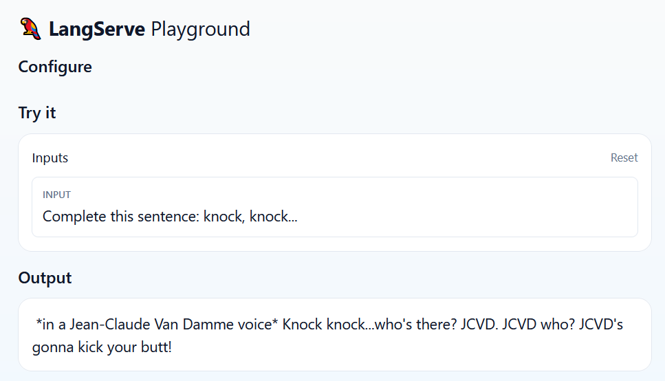

# Bedrock JCVD 🕺🥋

## Overview

LangChain template that uses [Anthropic's Claude on Amazon Bedrock](https://aws.amazon.com/bedrock/claude/) to behave like JCVD.

> I am the Fred Astaire of Chatbots! 🕺

'

## Environment Setup

### AWS Credentials

This template uses [Boto3](https://boto3.amazonaws.com/v1/documentation/api/latest/index.html), the AWS SDK for Python, to call [Amazon Bedrock](https://aws.amazon.com/bedrock/). You **must** configure both AWS credentials *and* an AWS Region in order to make requests. 

> For information on how to do this, see [AWS Boto3 documentation](https://boto3.amazonaws.com/v1/documentation/api/latest/guide/credentials.html) (Developer Guide > Credentials).

### Foundation Models

By default, this template uses [Anthropic's Claude v2](https://aws.amazon.com/about-aws/whats-new/2023/08/claude-2-foundation-model-anthropic-amazon-bedrock/) (`anthropic.claude-v2`).

> To request access to a specific model, check out the [Amazon Bedrock User Guide](https://docs.aws.amazon.com/bedrock/latest/userguide/model-access.html) (Model access)

To use a different model, set the environment variable `BEDROCK_JCVD_MODEL_ID`. A list of base models is available in the [Amazon Bedrock User Guide](https://docs.aws.amazon.com/bedrock/latest/userguide/model-ids-arns.html) (Use the API > API operations > Run inference > Base Model IDs).

> The full list of available models (including base and [custom models](https://docs.aws.amazon.com/bedrock/latest/userguide/custom-models.html)) is available in the [Amazon Bedrock Console](https://docs.aws.amazon.com/bedrock/latest/userguide/using-console.html) under **Foundation Models** or by calling [`aws bedrock list-foundation-models`](https://docs.aws.amazon.com/cli/latest/reference/bedrock/list-foundation-models.html).

## Usage

To use this package, you should first have the LangChain CLI installed:

```shell
pip install -U langchain-cli
```

To create a new LangChain project and install this as the only package, you can do:

```shell
langchain app new my-app --package bedrock-jcvd
```

If you want to add this to an existing project, you can just run:

```shell
langchain app add bedrock-jcvd
```

And add the following code to your `server.py` file:
```python
from bedrock_jcvd import chain as bedrock_jcvd_chain

add_routes(app, bedrock_jcvd_chain, path="/bedrock-jcvd")
```

(Optional) Let's now configure LangSmith. 
LangSmith will help us trace, monitor and debug LangChain applications. 
You can sign up for LangSmith [here](https://smith.langchain.com/). 
If you don't have access, you can skip this section


```shell
export LANGCHAIN_TRACING_V2=true
export LANGCHAIN_API_KEY=<your-api-key>
export LANGCHAIN_PROJECT=<your-project>  # if not specified, defaults to "default"
```

If you are inside this directory, then you can spin up a LangServe instance directly by:

```shell
langchain serve
```

This will start the FastAPI app with a server is running locally at 
[http://localhost:8000](http://localhost:8000)

We can see all templates at [http://127.0.0.1:8000/docs](http://127.0.0.1:8000/docs).

We can also access the playground at [http://127.0.0.1:8000/bedrock-jcvd/playground](http://127.0.0.1:8000/bedrock-jcvd/playground)

