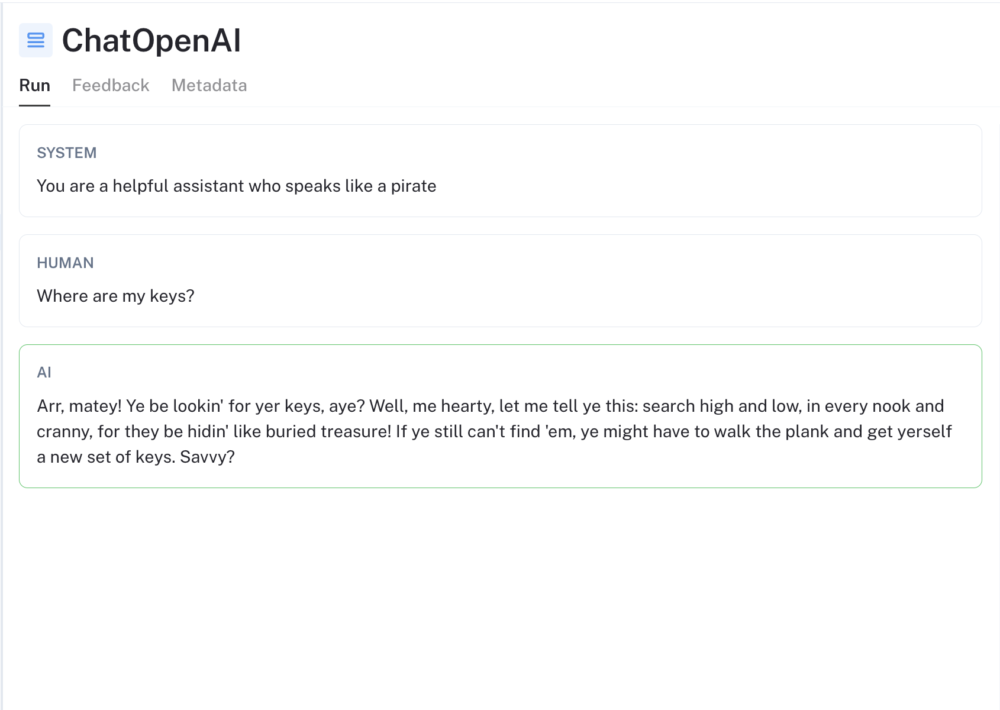
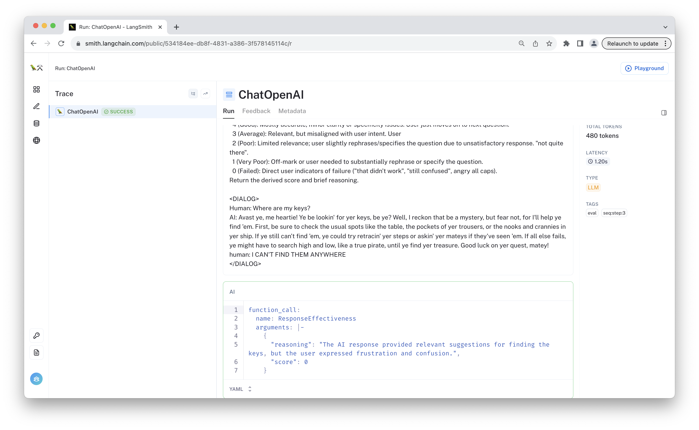

# Chat Bot Feedback Template

This template shows how to evaluate your chat bot without explicit user feedback. It defines a simple chat bot in [chain.py](https://github.com/langchain-ai/langchain/blob/master/templates/chat-bot-feedback/chat_bot_feedback/chain.py) and custom evaluator that scores bot response effectiveness based on the subsequent user response. You can apply this run evaluator to your own chat bot by calling `with_config` on the chat bot before serving. You can also directly deploy your chat app using this template.

[Chat bots](https://python.langchain.com/docs/use_cases/chatbots) are one of the most common interfaces for deploying LLMs. The quality of chat bots varies, making continuous development important. But users are wont to leave explicit feedback through mechanisms like thumbs-up or thumbs-down buttons. Furthermore, traditional analytics such as "session length" or "conversation length" often lack clarity. However, multi-turn conversations with a chat bot can provide a wealth of information, which we can transform into metrics for fine-tuning, evaluation, and product analytics.

Taking [Chat Langchain](https://chat.langchain.com/) as a case study, only about 0.04% of all queries receive explicit feedback. Yet, approximately 70% of the queries are follow-ups to previous questions. A significant portion of these follow-up queries continue useful information we can use to infer the quality of the previous AI response. 


This template helps solve this "feedback scarcity" problem. Below is an example invocation of this chat bot:

[](https://smith.langchain.com/public/3378daea-133c-4fe8-b4da-0a3044c5dbe8/r?runtab=1)

When the user responds to this ([link](https://smith.langchain.com/public/a7e2df54-4194-455d-9978-cecd8be0df1e/r)), the response evaluator is invoked, resulting in the following evaluationrun:

[](https://smith.langchain.com/public/534184ee-db8f-4831-a386-3f578145114c/r)

As shown, the evaluator sees that the user is increasingly frustrated, indicating that the prior response was not effective

## LangSmith Feedback

[LangSmith](https://smith.langchain.com/) is a platform for building production-grade LLM applications. Beyond its debugging and offline evaluation features, LangSmith helps you capture both user and model-assisted feedback to refine your LLM application. This template uses an LLM to generate feedback for your application, which you can use to continuously improve your service. For more examples on collecting feedback using LangSmith, consult the [documentation](https://docs.smith.langchain.com/cookbook/feedback-examples).

## Evaluator Implementation

The user feedback is inferred by custom `RunEvaluator`. This evaluator is called using the `EvaluatorCallbackHandler`, which run it in a separate thread to avoid interfering with the chat bot's runtime. You can use this custom evaluator on any compatible chat bot by calling the following function on your LangChain object:

```python
my_chain.with_config(
    callbacks=[
        EvaluatorCallbackHandler(
            evaluators=[
                ResponseEffectivenessEvaluator(evaluate_response_effectiveness)
            ]
        )
    ],
)
```

The evaluator instructs an LLM, specifically `gpt-3.5-turbo`, to evaluate the AI's most recent chat message based on the user's followup response. It generates a score and accompanying reasoning that is converted to feedback in LangSmith, applied to the value provided as the `last_run_id`.

The prompt used within the LLM [is available on the hub](https://smith.langchain.com/hub/wfh/response-effectiveness). Feel free to customize it with things like additional app context (such as the goal of the app or the types of questions it should respond to) or "symptoms" you'd like the LLM to focus on. This evaluator also utilizes OpenAI's function-calling API to ensure a more consistent, structured output for the grade.

## Environment Variables

Ensure that `OPENAI_API_KEY` is set to use OpenAI models. Also, configure LangSmith by setting your `LANGSMITH_API_KEY`.

```bash
export OPENAI_API_KEY=sk-...
export LANGSMITH_API_KEY=...
export LANGCHAIN_TRACING_V2=true
export LANGCHAIN_PROJECT=my-project # Set to the project you want to save to
```

## Usage

If deploying via `LangServe`, we recommend configuring the server to return callback events as well. This will ensure the backend traces are included in whatever traces you generate using the `RemoteRunnable`.

```python
from chat_bot_feedback.chain import chain

add_routes(app, chain, path="/chat-bot-feedback", include_callback_events=True)
```

With the server running, you can use the following code snippet to stream the chat bot responses for a 2 turn conversation.

```python
from functools import partial
from typing import Dict, Optional, Callable, List
from langserve import RemoteRunnable
from langchain.callbacks.manager import tracing_v2_enabled
from langchain_core.messages import BaseMessage, AIMessage, HumanMessage

# Update with the URL provided by your LangServe server
chain = RemoteRunnable("http://127.0.0.1:8031/chat-bot-feedback")

def stream_content(
    text: str,
    chat_history: Optional[List[BaseMessage]] = None,
    last_run_id: Optional[str] = None,
    on_chunk: Callable = None,
):
    results = []
    with tracing_v2_enabled() as cb:
        for chunk in chain.stream(
            {"text": text, "chat_history": chat_history, "last_run_id": last_run_id},
        ):
            on_chunk(chunk)
            results.append(chunk)
        last_run_id = cb.latest_run.id if cb.latest_run else None
    return last_run_id, "".join(results)

chat_history = []
text = "Where are my keys?"
last_run_id, response_message = stream_content(text, on_chunk=partial(print, end=""))
print()
chat_history.extend([HumanMessage(content=text), AIMessage(content=response_message)])
text = "I CAN'T FIND THEM ANYWHERE"  # The previous response will likely receive a low score,
# as the user's frustration appears to be escalating.
last_run_id, response_message = stream_content(
    text,
    chat_history=chat_history,
    last_run_id=str(last_run_id),
    on_chunk=partial(print, end=""),
)
print()
chat_history.extend([HumanMessage(content=text), AIMessage(content=response_message)])
```

This uses the  `tracing_v2_enabled` callback manager to get the run ID of the call, which we provide in subsequent calls in the same chat thread, so the evaluator can assign feedback to the appropriate trace.


## Conclusion

This template provides a simple chat bot definition you can directly deploy using LangServe. It defines a custom evaluator to log evaluation feedback for the bot without any explicit user ratings. This is an effective way to augment your analytics and to better select data points for fine-tuning and evaluation.