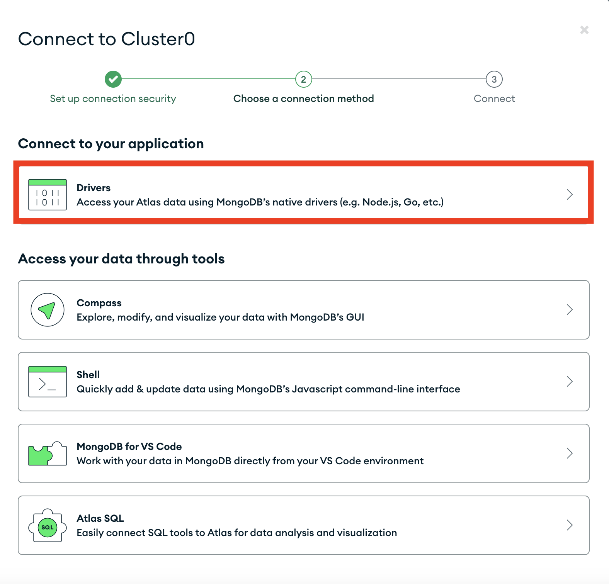
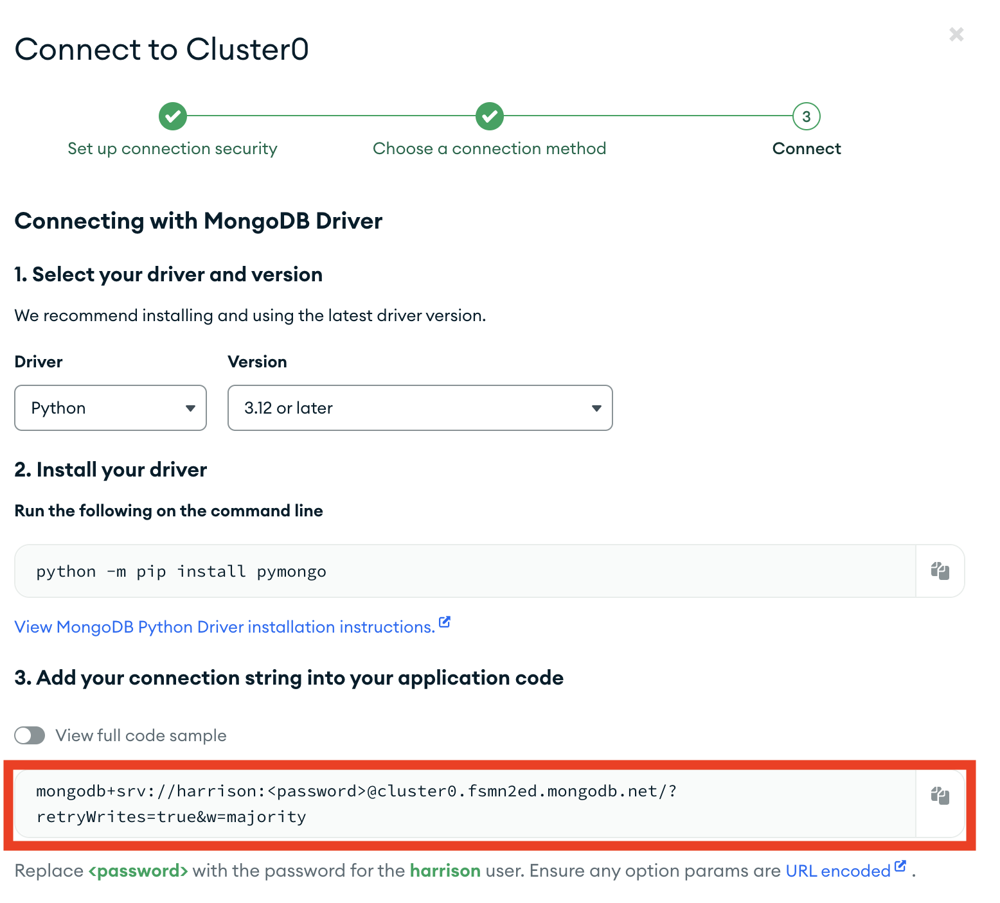
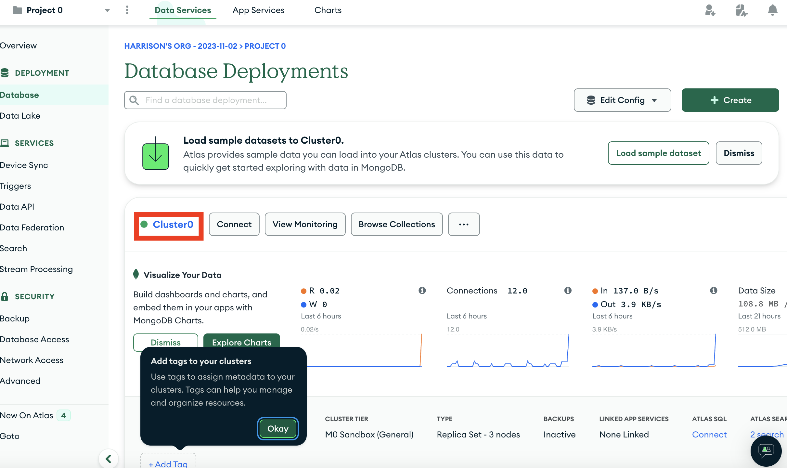
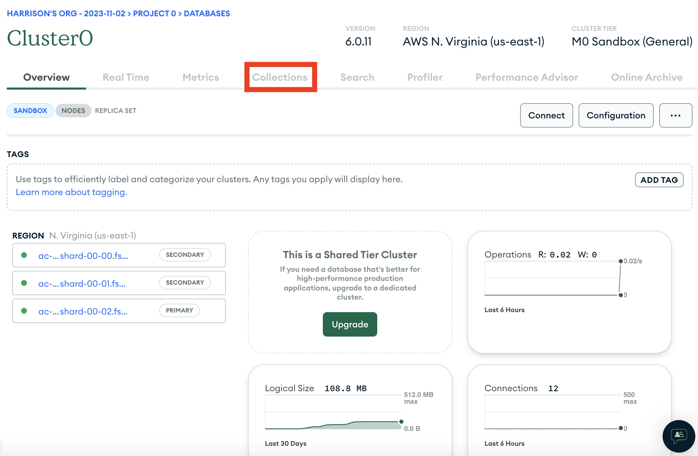
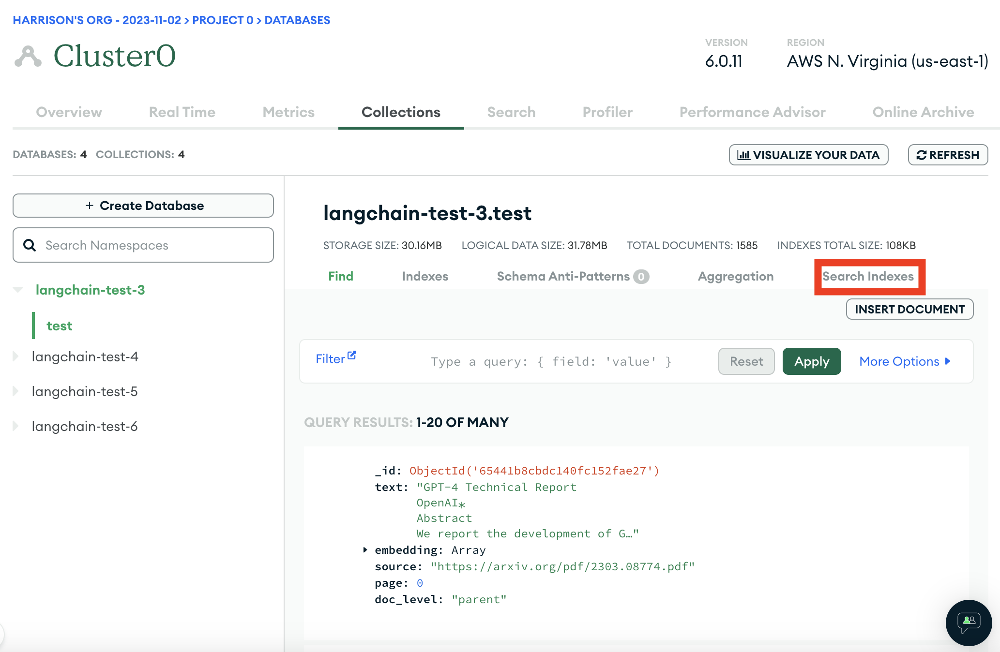
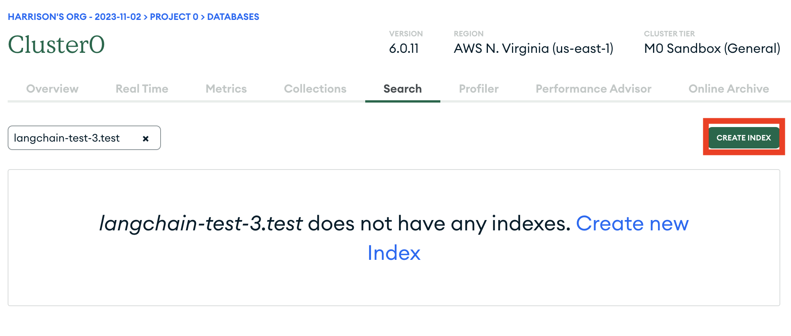
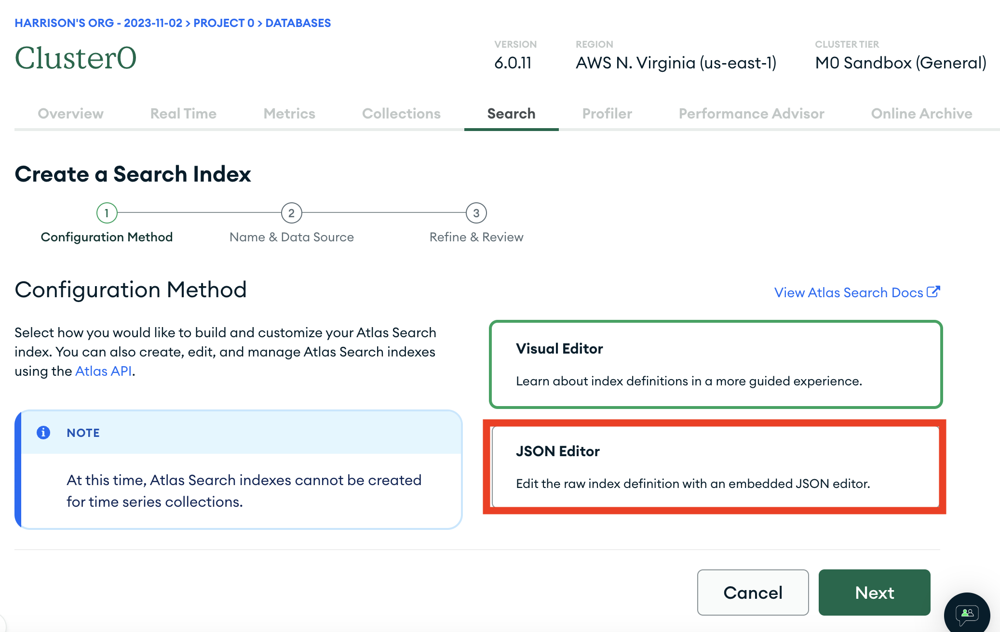
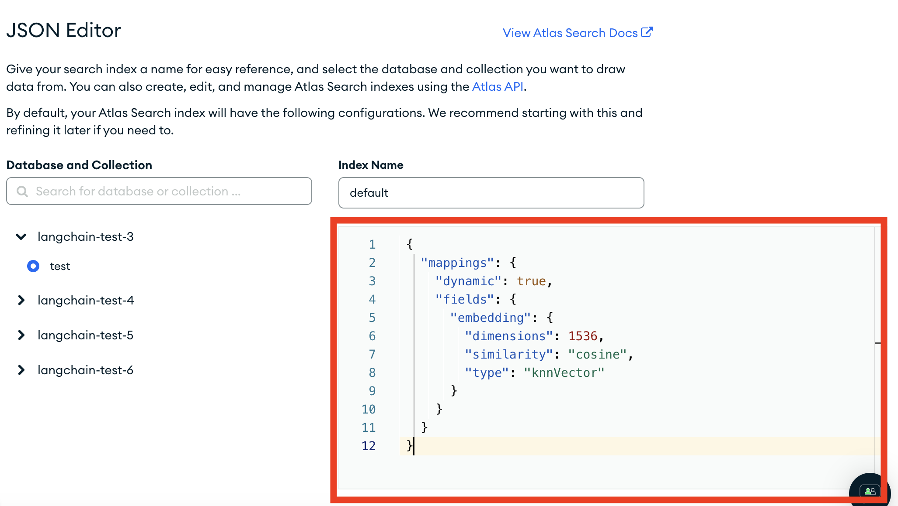

# rag-mongo

This template performs RAG using MongoDB and OpenAI.

## Environment Setup

You should export two environment variables, one being your MongoDB URI, the other being your OpenAI API KEY.
If you do not have a MongoDB URI, see the `Setup Mongo` section at the bottom for instructions on how to do so.

```shell
export MONGO_URI=...
export OPENAI_API_KEY=...
```

## Usage

To use this package, you should first have the LangChain CLI installed:

```shell
pip install -U langchain-cli
```

To create a new LangChain project and install this as the only package, you can do:

```shell
langchain app new my-app --package rag-mongo
```

If you want to add this to an existing project, you can just run:

```shell
langchain app add rag-mongo
```

And add the following code to your `server.py` file:
```python
from rag_mongo import chain as rag_mongo_chain

add_routes(app, rag_mongo_chain, path="/rag-mongo")
```

If you want to set up an ingestion pipeline, you can add the following code to your `server.py` file:
```python
from rag_mongo import ingest as rag_mongo_ingest

add_routes(app, rag_mongo_ingest, path="/rag-mongo-ingest")
```

(Optional) Let's now configure LangSmith. 
LangSmith will help us trace, monitor and debug LangChain applications. 
You can sign up for LangSmith [here](https://smith.langchain.com/). 
If you don't have access, you can skip this section


```shell
export LANGCHAIN_TRACING_V2=true
export LANGCHAIN_API_KEY=<your-api-key>
export LANGCHAIN_PROJECT=<your-project>  # if not specified, defaults to "default"
```

If you DO NOT already have a Mongo Search Index you want to connect to, see `MongoDB Setup` section below before proceeding.

If you DO have a MongoDB Search index you want to connect to, edit the connection details in `rag_mongo/chain.py`

If you are inside this directory, then you can spin up a LangServe instance directly by:

```shell
langchain serve
```

This will start the FastAPI app with a server is running locally at 
[http://localhost:8000](http://localhost:8000)

We can see all templates at [http://127.0.0.1:8000/docs](http://127.0.0.1:8000/docs)
We can access the playground at [http://127.0.0.1:8000/rag-mongo/playground](http://127.0.0.1:8000/rag-mongo/playground)  

We can access the template from code with:

```python
from langserve.client import RemoteRunnable

runnable = RemoteRunnable("http://localhost:8000/rag-mongo")
```

For additional context, please refer to [this notebook](https://colab.research.google.com/drive/1cr2HBAHyBmwKUerJq2if0JaNhy-hIq7I#scrollTo=TZp7_CBfxTOB).


## MongoDB Setup

Use this step if you need to setup your MongoDB account and ingest data.
We will first follow the standard MongoDB Atlas setup instructions [here](https://www.mongodb.com/docs/atlas/getting-started/).

1. Create an account (if not already done)
2. Create a new project (if not already done)
3. Locate your MongoDB URI.

This can be done by going to the deployement overview page and connecting to you database


We then look at the drivers available



Among which we will see our URI listed



Let's then set that as an environment variable locally:

```shell
export MONGO_URI=...
```

4. Let's also set an environment variable for OpenAI (which we will use as an LLM)

```shell
export OPENAI_API_KEY=...
```

5. Let's now ingest some data! We can do that by moving into this directory and running the code in `ingest.py`, eg:

```shell
python ingest.py
```

Note that you can (and should!) change this to ingest data of your choice

6. We now need to set up a vector index on our data.

We can first connect to the cluster where our database lives



We can then navigate to where all our collections are listed



We can then find the collection we want and look at the search indexes for that collection



That should likely be empty, and we want to create a new one:



We will use the JSON editor to create it



And we will paste the following JSON in:

```text
 {
   "mappings": {
     "dynamic": true,
     "fields": {
       "embedding": {
         "dimensions": 1536,
         "similarity": "cosine",
         "type": "knnVector"
       }
     }
   }
 }
```


From there, hit "Next" and then "Create Search Index". It will take a little bit but you should then have an index over your data!