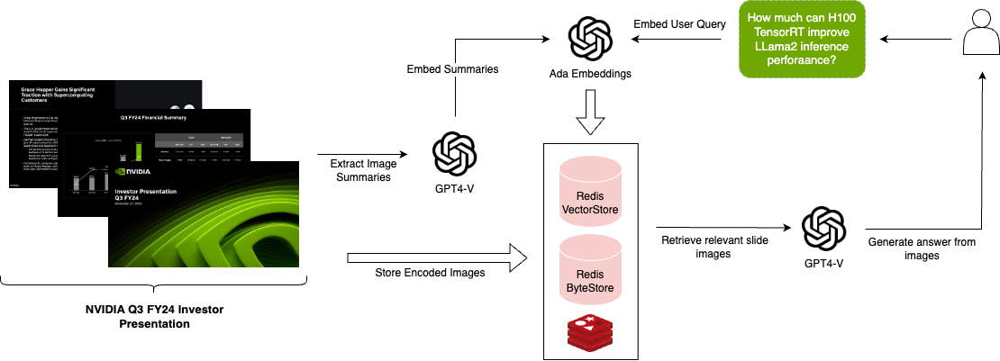

# rag-redis-multi-modal-multi-vector

Multi-modal LLMs enable visual assistants that can perform question-answering about images.

This template create a visual assistant for slide decks, which often contain visuals such as graphs or figures.

It uses GPT-4V to create image summaries for each slide, embeds the summaries, and stores them in Redis.

Given a question, relevant slides are retrieved and passed to GPT-4V for answer synthesis.



## Input

Supply a slide deck as PDF in the `/docs` directory. 

By default, this template has a slide deck about recent earnings from NVIDIA.

Example questions to ask can be:
```
1/ how much can H100 TensorRT improve LLama2 inference performance?
2/ what is the % change in GPU accelerated applications from 2020 to 2023?
```

To create an index of the slide deck, run:
```
poetry install
poetry shell
python ingest.py
```

## Storage

Here is the process the template will use to create an index of the slides (see [blog](https://blog.langchain.dev/multi-modal-rag-template/)):

* Extract the slides as a collection of images
* Use GPT-4V to summarize each image
* Embed the image summaries using text embeddings with a link to the original images
* Retrieve relevant image based on similarity between the image summary and the user input question
* Pass those images to GPT-4V for answer synthesis

### Redis
This template uses [Redis](https://redis.com) to power the [MultiVectorRetriever](https://python.langchain.com/docs/modules/data_connection/retrievers/multi_vector) including:
- Redis as the [VectorStore](https://python.langchain.com/docs/integrations/vectorstores/redis) (to store + index image summary embeddings)
- Redis as the [ByteStore](https://python.langchain.com/docs/integrations/stores/redis) (to store images)

Make sure to deploy a Redis instance either in the [cloud](https://redis.com/try-free) (free) or locally with [docker](https://redis.io/docs/install/install-stack/docker/).

This will give you an accessible Redis endpoint that you can use as a URL. If deploying locally, simply use `redis://localhost:6379`.


## LLM

The app will retrieve images based on similarity between the text input and the image summary (text), and pass the images to GPT-4V for answer synthesis.

## Environment Setup

Set the `OPENAI_API_KEY` environment variable to access the OpenAI GPT-4V.

Set `REDIS_URL` environment variable to access your Redis database.

## Usage

To use this package, you should first have the LangChain CLI installed:

```shell
pip install -U langchain-cli
```

To create a new LangChain project and install this as the only package, you can do:

```shell
langchain app new my-app --package rag-redis-multi-modal-multi-vector
```

If you want to add this to an existing project, you can just run:

```shell
langchain app add rag-redis-multi-modal-multi-vector
```

And add the following code to your `server.py` file:
```python
from rag_redis_multi_modal_multi_vector import chain as rag_redis_multi_modal_chain_mv

add_routes(app, rag_redis_multi_modal_chain_mv, path="/rag-redis-multi-modal-multi-vector")
```

(Optional) Let's now configure LangSmith. 
LangSmith will help us trace, monitor and debug LangChain applications. 
You can sign up for LangSmith [here](https://smith.langchain.com/). 
If you don't have access, you can skip this section

```shell
export LANGCHAIN_TRACING_V2=true
export LANGCHAIN_API_KEY=<your-api-key>
export LANGCHAIN_PROJECT=<your-project>  # if not specified, defaults to "default"
```

If you are inside this directory, then you can spin up a LangServe instance directly by:

```shell
langchain serve
```

This will start the FastAPI app with a server is running locally at 
[http://localhost:8000](http://localhost:8000)

We can see all templates at [http://127.0.0.1:8000/docs](http://127.0.0.1:8000/docs)
We can access the playground at [http://127.0.0.1:8000/rag-redis-multi-modal-multi-vector/playground](http://127.0.0.1:8000/rag-redis-multi-modal-multi-vector/playground)  

We can access the template from code with:

```python
from langserve.client import RemoteRunnable

runnable = RemoteRunnable("http://localhost:8000/rag-redis-multi-modal-multi-vector")
```
